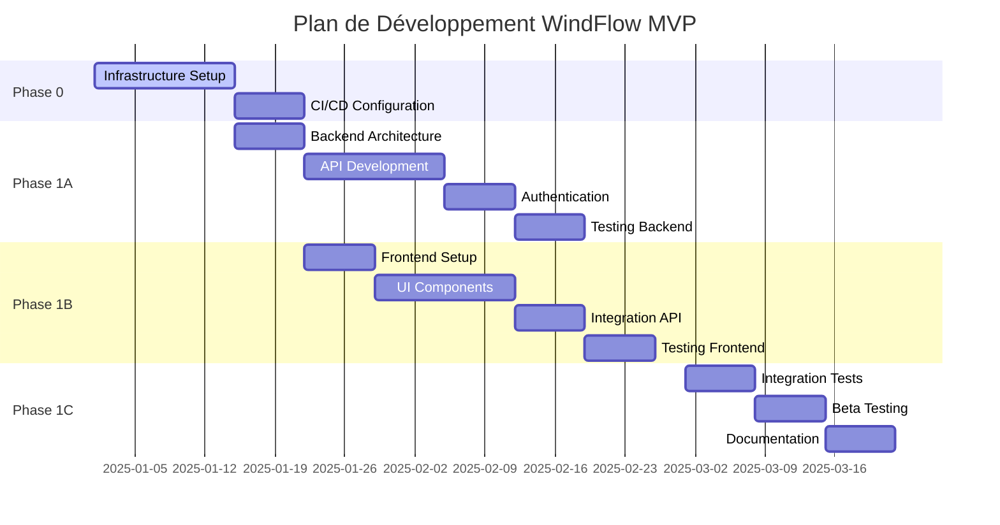

# Plan de Démarrage Rapide - WindFlow

**Version :** 1.0  
**Date :** 29/09/2025  
**Objectif :** Développer un MVP fonctionnel de WindFlow en 12 semaines

## Vue d'Ensemble

Ce document définit la stratégie de démarrage rapide pour WindFlow, un outil web intelligent de déploiement de containers Docker. L'objectif est de créer un MVP fonctionnel et déployable en 3 mois, validant les concepts core tout en posant des fondations solides pour le développement futur.

## Philosophie de Développement

### Principes Directeurs

**🎯 MVP First**
- Se concentrer sur les fonctionnalités essentielles uniquement
- Valider rapidement le product-market fit
- Itération rapide basée sur les retours utilisateurs

**🏗️ Fondations Solides**
- Architecture scalable dès le départ
- Code qualité avec tests automatisés
- Documentation continue et complète

**🚀 Time-to-Market Optimisé**
- Développement en parallèle frontend/backend
- Automatisation maximale (CI/CD, tests, déploiement)
- Décisions techniques pragmatiques

## Phase 0 : Préparation et Infrastructure (Semaines 1-2)

### Objectif Principal
Mettre en place l'environnement de développement et l'infrastructure de base pour permettre un développement efficace.

### 📋 Actions Critiques

#### 1. Setup Repository et Gestion de Code

**Structure du Repository :**
```
windflow/
├── backend/                 # API FastAPI
│   ├── app/
│   ├── tests/
│   ├── migrations/
│   └── requirements.txt
├── frontend/               # Interface Vue.js
│   ├── src/
│   ├── tests/
│   └── package.json
├── infrastructure/         # Docker, Kubernetes, etc.
│   ├── docker/
│   ├── k8s/
│   └── terraform/
├── docs/                   # Documentation technique
├── scripts/                # Scripts d'automatisation
└── docker-compose.yml     # Environnement de dev local
```

**Git Workflow :**
- Branches feature avec PR/MR obligatoires
- Protection de la branche main
- Conventional commits pour changelogs automatiques
- Git hooks pour tests pré-commit

#### 2. CI/CD Pipeline

**GitHub Actions / GitLab CI :**
```yaml
# Pipeline stages
- lint: ESLint, Black, Flake8
- test: Tests unitaires, intégration
- security: Bandit, npm audit
- build: Docker images
- deploy: Dev/staging automatique
```

**Qualité Code :**
- Coverage minimum 80%
- SonarQube pour analyse statique
- Dependabot pour mises à jour sécurité
- Pre-commit hooks configurés

#### 3. Infrastructure de Développement Local

**Docker Compose Services :**
```yaml
services:
  postgres:     # Base de données principale
  redis:        # Cache et sessions
  vault:        # Gestion des secrets
  backend:      # API FastAPI
  frontend:     # Vue.js dev server
  nginx:        # Reverse proxy
```

**Scripts d'Initialisation :**
- `make setup` : Installation complète environnement
- `make dev` : Lancement environnement de développement
- `make test` : Exécution de tous les tests
- `make clean` : Nettoyage environnement

### ✅ Critères de Validation Phase 0

- [ ] Repository configuré avec CI/CD fonctionnel
- [ ] Environnement local Docker Compose opérationnel
- [ ] Pipeline de tests automatisés en place
- [ ] Documentation technique initialisée
- [ ] Équipe formée aux outils et processus

**Durée :** 2 semaines  
**Ressources :** 1 DevOps Engineer + 1 Lead Developer

---

## Phase 1A : Backend Fondamental (Semaines 3-6)

### Objectif Principal
Développer une API REST robuste avec authentification, base de données, et fonctionnalités CRUD essentielles.

### 🏗️ Architecture Backend

#### Stack Technique

**Core Framework :**
- Python 3.11+ avec FastAPI
- SQLAlchemy 2.0 avec modèles async
- Alembic pour migrations de base
- Pydantic v2 pour validation données

**Base de Données :**
- PostgreSQL 15+ comme base principale
- Redis pour cache et sessions
- Connexions poolées pour performance

**Sécurité :**
- JWT avec refresh tokens (PyJWT)
- HashiCorp Vault pour secrets
- Middleware de sécurité (CORS, rate limiting)

#### Modèles de Données Essentiels

```python
# Modèles Core MVP
class User(Base):
    id: UUID
    email: str
    username: str
    hashed_password: str
    is_active: bool
    organization_id: UUID

class Organization(Base):
    id: UUID
    name: str
    domain: str
    settings: JSON

class Target(Base):
    id: UUID
    name: str
    host: str
    type: TargetType  # DOCKER, VM, PHYSICAL
    credentials: JSON  # Encrypted
    status: TargetStatus

class Stack(Base):
    id: UUID
    name: str
    template: JSON  # Docker Compose YAML
    organization_id: UUID
    
class Deployment(Base):
    id: UUID
    stack_id: UUID
    target_id: UUID
    status: DeploymentStatus
    deployed_at: datetime
```

#### API Endpoints MVP

**Authentification :**
```python
POST /auth/login          # JWT login
POST /auth/refresh        # Token refresh
POST /auth/logout         # Logout
GET  /auth/me             # User profile
```

**Gestion des Cibles :**
```python
GET    /targets           # Liste serveurs
POST   /targets           # Ajouter serveur
GET    /targets/{id}      # Détails serveur
PUT    /targets/{id}      # Modifier serveur
DELETE /targets/{id}      # Supprimer serveur
POST   /targets/{id}/test # Tester connexion
```

**Gestion des Stacks :**
```python
GET    /stacks            # Liste stacks
POST   /stacks            # Créer stack
GET    /stacks/{id}       # Détails stack
PUT    /stacks/{id}       # Modifier stack
DELETE /stacks/{id}       # Supprimer stack
```

**Déploiements :**
```python
POST   /stacks/{id}/deploy/{target_id}  # Déployer
GET    /deployments                     # Liste déploiements
GET    /deployments/{id}                # Détails déploiement
DELETE /deployments/{id}                # Arrêter déploiement
GET    /deployments/{id}/logs           # Logs déploiement
```

### 🔐 Authentification et Sécurité

#### JWT Implementation
```python
# Configuration JWT
JWT_SECRET_KEY = Vault.get_secret("jwt_secret")
JWT_ALGORITHM = "HS256"
ACCESS_TOKEN_EXPIRE_MINUTES = 15
REFRESH_TOKEN_EXPIRE_DAYS = 30

# Middleware de sécurité
- Rate limiting : 100 req/min par IP
- CORS configuré pour frontend only
- Headers de sécurité (HSTS, CSP, etc.)
- Validation stricte des inputs
```

#### Gestion des Secrets
- HashiCorp Vault pour secrets sensibles
- Chiffrement AES-256 pour credentials serveurs
- Rotation automatique des clés JWT
- Audit trail de tous les accès secrets

### 📊 Persistence et Performance

#### Configuration Base de Données
```python
# SQLAlchemy configuration
DATABASE_URL = "postgresql+asyncpg://..."
POOL_SIZE = 20
MAX_OVERFLOW = 30
POOL_RECYCLE = 3600

# Redis configuration  
REDIS_URL = "redis://..."
CACHE_TTL = 300  # 5 minutes
SESSION_TTL = 1800  # 30 minutes
```

#### Optimisations Performance
- Connexions async avec asyncpg
- Cache Redis pour requêtes fréquentes
- Pagination automatique (limit/offset)
- Indexation optimale des requêtes

### ✅ Critères de Validation Phase 1A

- [ ] API REST complète et documentée (OpenAPI)
- [ ] Authentification JWT sécurisée fonctionnelle
- [ ] CRUD complet pour toutes les entités MVP
- [ ] Tests unitaires > 80% coverage
- [ ] Tests d'intégration sur tous les endpoints
- [ ] Performance : < 200ms response time (p95)

**Durée :** 4 semaines  
**Ressources :** 1 Lead Backend Developer + 1 Backend Developer

---

## Phase 1B : Frontend Minimal Viable (Semaines 7-10)

### Objectif Principal
Développer une interface utilisateur moderne, intuitive et responsive qui exploite pleinement l'API backend.

### 🎨 Architecture Frontend

#### Stack Technique

**Core Framework :**
- Vue.js 3 avec Composition API
- TypeScript pour type safety
- Vite comme build tool et dev server
- Vue Router pour navigation SPA

**State Management :**
- Pinia pour gestion d'état
- TanStack Query pour cache API
- Axios pour requêtes HTTP

**UI/UX :**
- Tailwind CSS pour styling
- Headless UI pour composants accessibles
- Vue Use pour utilities composables
- Iconify pour système d'icônes

#### Structure de l'Application

```
frontend/src/
├── components/          # Composants réutilisables
│   ├── ui/             # Design system
│   ├── forms/          # Formulaires
│   └── layout/         # Layout components
├── views/              # Pages/vues principales
│   ├── auth/          # Login, register
│   ├── dashboard/     # Tableau de bord
│   ├── targets/       # Gestion serveurs
│   ├── stacks/        # Gestion stacks
│   └── deployments/   # Suivi déploiements
├── stores/             # Pinia stores
├── services/           # API services
├── composables/        # Vue composables
├── types/              # TypeScript types
└── utils/              # Utilitaires
```

#### Design System Minimaliste

**Palette de Couleurs :**
```css
:root {
  --color-primary: #3b82f6;      /* Blue 500 */
  --color-primary-dark: #1d4ed8;  /* Blue 700 */
  --color-success: #10b981;       /* Emerald 500 */
  --color-warning: #f59e0b;       /* Amber 500 */
  --color-error: #ef4444;         /* Red 500 */
  --color-gray-50: #f9fafb;
  --color-gray-900: #111827;
}
```

**Composants UI Essentiels :**
- Button (variants: primary, secondary, danger)
- Input (text, password, email, textarea)
- Select (single, multiple, searchable)
- Modal (confirmation, forms)
- Toast (notifications)
- Table (avec pagination, tri, filtres)
- Card (containers de contenu)
- Tabs (navigation secondaire)

### 🔐 Authentification Frontend

#### Flow d'Authentification
```typescript
// Service d'authentification
class AuthService {
  async login(credentials: LoginCredentials): Promise<AuthResponse>
  async logout(): Promise<void>
  async refreshToken(): Promise<string>
  async getCurrentUser(): Promise<User>
}

// Store Pinia
const useAuthStore = defineStore('auth', () => {
  const user = ref<User | null>(null)
  const isAuthenticated = computed(() => !!user.value)
  const token = ref<string | null>(null)
  
  // Actions et getters...
})
```

#### Protection des Routes
- Route guards avec Vue Router
- Redirection automatique si non authentifié
- Gestion des permissions par rôle
- Refresh automatique des tokens

### 📱 Interfaces Utilisateur MVP

#### 1. Dashboard Principal
**Composants :**
- Vue d'ensemble des métriques (serveurs, stacks, déploiements)
- Liste des déploiements récents
- Statut en temps réel des serveurs
- Accès rapide aux actions fréquentes

**Fonctionnalités :**
- Rafraîchissement automatique des données
- Graphiques simples (métriques de base)
- Notifications temps réel
- Navigation rapide

#### 2. Gestion des Serveurs Cibles
**Pages :**
- Liste des serveurs avec filtres et recherche
- Formulaire d'ajout/édition de serveur
- Page de détails avec tests de connexion
- Configuration des credentials

**Fonctionnalités :**
- Test de connexion en temps réel
- Import en masse (CSV)
- Groupes de serveurs
- Monitoring de statut

#### 3. Gestion des Stacks
**Pages :**
- Bibliothèque de templates
- Éditeur de stack (YAML)
- Aperçu des configurations
- Historique des versions

**Fonctionnalités :**
- Templates prédéfinis (WordPress, LAMP, etc.)
- Validation YAML en temps réel
- Preview des services
- Clonage de stacks existantes

#### 4. Déploiements
**Pages :**
- Liste des déploiements actifs
- Détails de déploiement avec logs
- Interface de déploiement guidé
- Gestion des rollbacks

**Fonctionnalités :**
- Logs en streaming
- Déploiement one-click
- Monitoring de santé
- Alertes automatiques

### 🔄 Gestion d'État et API

#### Stores Pinia
```typescript
// Store pour serveurs cibles
export const useTargetsStore = defineStore('targets', () => {
  const targets = ref<Target[]>([])
  const loading = ref(false)
  
  const fetchTargets = async () => {
    loading.value = true
    try {
      targets.value = await targetsApi.getAll()
    } finally {
      loading.value = false
    }
  }
  
  return { targets, loading, fetchTargets }
})
```

#### Services API
```typescript
// Service pour gestion des stacks
class StacksService {
  async getStacks(): Promise<Stack[]>
  async createStack(stack: CreateStackDto): Promise<Stack>
  async updateStack(id: string, stack: UpdateStackDto): Promise<Stack>
  async deleteStack(id: string): Promise<void>
  async deployStack(stackId: string, targetId: string): Promise<Deployment>
}
```

### 🔔 Notifications et WebSocket

#### Système de Notifications
- Toast notifications pour actions utilisateur
- Notifications push pour événements critiques
- Centre de notifications persistant
- Préférences de notification par utilisateur

#### Communication Temps Réel
```typescript
// WebSocket connection pour updates live
const useWebSocket = () => {
  const socket = ref<WebSocket | null>(null)
  
  const connect = () => {
    socket.value = new WebSocket(`ws://localhost:8000/ws`)
    socket.value.onmessage = handleMessage
  }
  
  const handleMessage = (event: MessageEvent) => {
    const data = JSON.parse(event.data)
    // Update stores selon le type de message
  }
}
```

### ✅ Critères de Validation Phase 1B

- [ ] Interface utilisateur complète et responsive
- [ ] Authentification et navigation sécurisées
- [ ] CRUD fonctionnel pour toutes les entités
- [ ] Tests end-to-end avec Cypress
- [ ] Performance : < 3s loading initial, < 1s navigation
- [ ] Accessibility WCAG 2.1 niveau AA
- [ ] Support navigateurs modernes (Chrome, Firefox, Safari, Edge)

**Durée :** 4 semaines  
**Ressources :** 1 Lead Frontend Developer + 1 Frontend Developer

---

## Phase 1C : Déploiement et Validation (Semaines 11-12)

### Objectif Principal
Finaliser l'intégration, déployer en environnement de test, et valider le MVP avec des utilisateurs beta.

### 🔗 Intégration et Tests

#### Tests End-to-End
```typescript
// Cypress tests critiques
describe('Déploiement Stack Complète', () => {
  it('doit pouvoir déployer une stack LAMP', () => {
    cy.login('admin@test.com', 'password')
    cy.visit('/stacks')
    cy.get('[data-cy=create-stack]').click()
    cy.selectTemplate('LAMP Stack')
    cy.get('[data-cy=stack-name]').type('Mon LAMP')
    cy.get('[data-cy=submit]').click()
    
    cy.get('[data-cy=deploy-button]').click()
    cy.selectTarget('Serveur Test')
    cy.get('[data-cy=confirm-deploy]').click()
    
    cy.contains('Déploiement réussi', { timeout: 60000 })
  })
})
```

#### Tests de Charge
- Artillery.js pour tests de montée en charge API
- Lighthouse pour performance frontend
- Tests de stress base de données
- Monitoring mémoire et CPU

### 🚀 Déploiement Production-Ready

#### Infrastructure de Déploiement
```yaml
# docker-compose.prod.yml
version: '3.8'
services:
  nginx:
    image: nginx:alpine
    volumes:
      - ./nginx.conf:/etc/nginx/nginx.conf
    depends_on:
      - backend
      - frontend

  backend:
    build: ./backend
    environment:
      - DATABASE_URL=${DATABASE_URL}
      - REDIS_URL=${REDIS_URL}
      - VAULT_URL=${VAULT_URL}
    depends_on:
      - postgres
      - redis

  frontend:
    build: ./frontend
    environment:
      - VITE_API_BASE_URL=${API_BASE_URL}

  postgres:
    image: postgres:15
    environment:
      - POSTGRES_DB=${POSTGRES_DB}
      - POSTGRES_USER=${POSTGRES_USER}
      - POSTGRES_PASSWORD=${POSTGRES_PASSWORD}
    volumes:
      - postgres_data:/var/lib/postgresql/data

  redis:
    image: redis:7-alpine
    command: redis-server --requirepass ${REDIS_PASSWORD}

  vault:
    image: vault:latest
    environment:
      - VAULT_DEV_ROOT_TOKEN_ID=${VAULT_ROOT_TOKEN}
    cap_add:
      - IPC_LOCK
```

#### Configuration Sécurisée
- Variables d'environnement pour tous les secrets
- TLS/HTTPS obligatoire en production
- Headers de sécurité configurés
- Rate limiting et DDoS protection
- Backup automatique base de données

### 📊 Monitoring et Observabilité

#### Métriques Applicatives
```python
# Prometheus metrics dans FastAPI
from prometheus_client import Counter, Histogram, Gauge

REQUEST_COUNT = Counter('http_requests_total', 'Total HTTP requests', ['method', 'endpoint'])
REQUEST_DURATION = Histogram('http_request_duration_seconds', 'HTTP request duration')
ACTIVE_DEPLOYMENTS = Gauge('active_deployments_total', 'Number of active deployments')
```

#### Health Checks
```python
# Endpoints de santé
@app.get("/health")
async def health_check():
    return {
        "status": "healthy",
        "timestamp": datetime.now(),
        "database": await check_database(),
        "redis": await check_redis(),
        "vault": await check_vault()
    }
```

### 🧪 Tests avec Utilisateurs Beta

#### Programme Beta Test
**Profils Cibles :**
- 5 développeurs freelance (usage personnel)
- 3 startups (équipes 2-5 personnes)
- 2 PME (équipes 10-20 personnes)

**Scenarios de Test :**
1. **Onboarding complet** (inscription → premier déploiement)
2. **Déploiement stack complexe** (multi-services avec base de données)
3. **Gestion multi-environnements** (dev/staging/prod)
4. **Utilisation quotidienne** (monitoring, logs, rollbacks)

**Métriques de Validation :**
- Time to First Deployment < 15 minutes
- Success Rate > 95% pour déploiements simples
- User Satisfaction Score > 4/5
- Bug Critical = 0, Bug Major < 3

### 📚 Documentation Utilisateur

#### Guide de Démarrage Rapide
1. **Installation et Configuration**
   - Prérequis système
   - Installation via Docker Compose
   - Configuration initiale

2. **Premier Déploiement**
   - Ajout d'un serveur cible
   - Sélection d'une stack template
   - Déploiement guidé step-by-step

3. **Fonctionnalités Avancées**
   - Création de templates personnalisés
   - Monitoring et alerting
   - Gestion des utilisateurs

#### Documentation API
- OpenAPI/Swagger automatique
- Exemples d'utilisation curl
- SDKs pour langages populaires
- Postman collection

### ✅ Critères de Validation MVP Final

#### Fonctionnels
- [ ] Déploiement stack Docker Compose en < 5 minutes
- [ ] Interface web responsive et intuitive
- [ ] API REST complète et documentée
- [ ] Authentification sécurisée fonctionnelle
- [ ] 10+ beta testeurs actifs et satisfaits

#### Techniques
- [ ] Tests automatisés > 80% coverage
- [ ] Performance API < 200ms (p95)
- [ ] Performance frontend < 3s chargement initial
- [ ] Sécurité : audit externe réussi
- [ ] Déploiement production automatisé

#### Business
- [ ] Feedback utilisateurs positif (NPS > 7)
- [ ] Time to First Value < 15 minutes
- [ ] Support 24/7 basic en place
- [ ] Roadmap Phase 2 validée avec utilisateurs

**Durée :** 2 semaines  
**Ressources :** Équipe complète (4 personnes)

---

## Budget et Ressources

### Équipe Minimale Requise

**Lead Backend Developer (Python/FastAPI) :**
- Sénior avec expérience API REST scalables
- Compétences : PostgreSQL, Redis, Docker, JWT
- Responsabilité : Architecture backend, API, sécurité

**Frontend Developer (Vue.js/TypeScript) :**
- Expérience SPA modernes et TypeScript
- Compétences : Vue 3, Pinia, Tailwind CSS, tests
- Responsabilité : Interface utilisateur, UX/UI

**DevOps Engineer :**
- Expert Docker, CI/CD, monitoring
- Compétences : Kubernetes, Terraform, observabilité
- Responsabilité : Infrastructure, déploiement, monitoring

**Product Owner :**
- Expérience produits DevOps/Infrastructure
- Compétences : UX, définition besoins, priorisation
- Responsabilité : Vision produit, validation utilisateurs

### Budget Détaillé (12 semaines)

| Poste | Coût Mensuel | Total 3 mois |
|-------|-------------|--------------|
| Lead Backend Developer | €8,000 | €24,000 |
| Frontend Developer | €6,000 | €18,000 |
| DevOps Engineer | €7,000 | €21,000 |
| Product Owner | €5,000 | €15,000 |
| **Total Salaires** | **€26,000** | **€78,000** |

| Infrastructure | Coût Total |
|----------------|------------|
| Cloud hosting (dev/staging) | €3,000 |
| Outils développement (licences) | €2,000 |
| Services externes (monitoring, etc.) | €1,000 |
| **Total Infrastructure** | **€6,000** |

| Autres Coûts | Coût Total |
|-------------|------------|
| Audit sécurité externe | €5,000 |
| Tests utilisateurs beta | €2,000 |
| Documentation/Design | €3,000 |
| **Total Autres** | **€10,000** |

**Budget Total MVP : €94,000**

### Timeline Détaillée



## Risques et Mitigation

### Risques Techniques

**Performance Backend :**
- *Risque* : Latence API > 200ms avec charge
- *Mitigation* : Tests de charge réguliers, optimisation DB, cache Redis
- *Plan B* : Migration vers architecture microservices

**Complexité Frontend :**
- *Risque* : État complexe difficile à maintenir
- *Mitigation* : Architecture claire avec Pinia, tests unitaires
- *Plan B* : Simplification UX, refactoring progressif

**Intégration Docker :**
- *Risque* : Problèmes de déploiement sur différents environnements
- *Mitigation* : Tests multi-plateformes, containers standardisés
- *Plan B* : Support environnements virtuels classiques

### Risques Projet

**Retard Timeline :**
- *Risque* : Dépassement des 12 semaines
- *Mitigation* : Sprints hebdomadaires, priorisation stricte
- *Plan B* : Réduction périmètre fonctionnel MVP

**Qualité Équipe :**
- *Risque* : Compétences insuffisantes sur stack technique
- *Mitigation* : Formation intensive, mentoring senior
- *Plan B* : Recrutement développeurs expérimentés

**Budget Dépassement :**
- *Risque* : Coûts supérieurs à €100K
- *Mitigation* : Suivi hebdomadaire, optimisation cloud
- *Plan B* : Négociation délais ou réduction périmètre

## Métriques de Succès

### KPIs Techniques

**Performance :**
- API Response Time < 200ms (p95)
- Frontend Load Time < 3s
- Database Query Time < 50ms (p95)
- Test Coverage > 80%

**Fiabilité :**
- Uptime > 99.5%
- Deployment Success Rate > 95%
- Error Rate < 1%
- Mean Time to Recovery < 5 minutes

### KPIs Business

**Adoption :**
- 10+ beta testeurs actifs
- Time to First Deployment < 15 minutes
- User Satisfaction Score > 4/5
- Feature Usage Rate > 70%

**Validation :**
- Product-Market Fit Score > 40%
- Beta User Retention > 80%
- Positive Feedback > 75%
- Willingness to Pay > 60%

## Next Steps Post-MVP

### Phase 2 Préparation

**Intelligence Artificielle :**
- Intégration LiteLLM pour génération automatique
- Optimisation IA des configurations
- Suggestions intelligentes

**Orchestration Avancée :**
- Support Kubernetes natif
- Docker Swarm pour multi-containers
- Provisioning automatique VMs

**Marketplace :**
- Templates communautaires
- Système de rating et reviews
- Contributions open source

### Financement Série A

**Objectifs :**
- Lever €8M - €12M
- Équipe 25+ personnes
- Expansion commerciale Europe
- R&D intelligence artificielle

---

**Auteur :** Équipe WindFlow  
**Validation :** Product Owner, CTO  
**Révision :** Mensuelle  
**Next Review :** 15/01/2025
