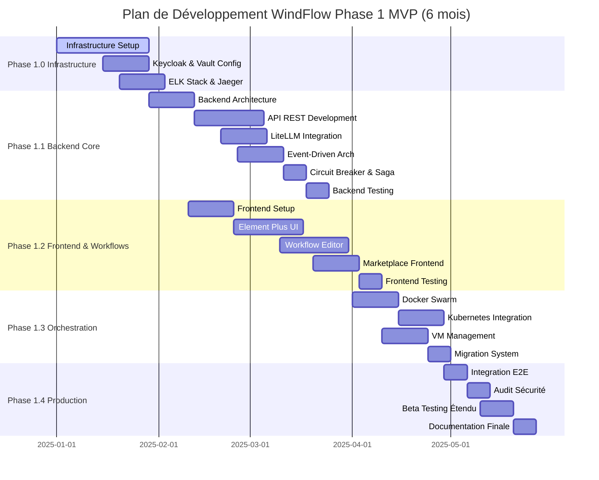

# Phase 1 : Plan de Développement MVP - WindFlow

**Version :** 2.0  
**Date :** 10/01/2025  
**Durée :** 6 mois (Q1-Q2 2025)  
**Budget :** €800,000 - €1,200,000  
**Objectif :** Développer un MVP production-ready avec fonctionnalités IA intégrées

## Vue d'Ensemble

Ce document définit la stratégie de développement de la Phase 1 (MVP) de WindFlow, un outil web intelligent de déploiement de containers Docker avec intelligence artificielle intégrée. L'objectif est de créer un MVP production-ready en 6 mois, intégrant les fonctionnalités essentielles d'orchestration multi-cible, workflows visuels, marketplace de templates et optimisation par IA, tout en posant des fondations architecturales solides pour les phases suivantes.

**Alignement avec le Roadmap :**
Ce plan correspond à la Phase 1 du roadmap global WindFlow (voir [doc/spec/18-roadmap.md](general_specs/18-roadmap.md)), qui définit les fondations du produit avec un périmètre fonctionnel complet et une architecture scalable.

## Philosophie de Développement

### Principes Directeurs

**🎯 Production-Ready MVP**
- Fonctionnalités complètes et robustes dès le MVP
- Architecture event-driven et microservices
- Intelligence artificielle native avec LiteLLM
- Validation avec 50+ organisations en beta test

**🏗️ Architecture Enterprise-Grade**
- Event-driven architecture avec Redis Streams
- Patterns de résilience (Circuit Breaker, Saga)
- Multi-tenant avec isolation complète
- Sécurité by design avec Keycloak et Vault

**🚀 Innovation et Différenciation**
- Workflows visuels type n8n intégrés
- Marketplace de templates communautaires
- Optimisation IA des configurations
- Support multi-cible (Docker, Swarm, K8s, VMs)

**📊 Observabilité Native**
- Three Pillars : Metrics, Logging, Tracing
- Prometheus + Grafana pour monitoring
- ELK Stack pour logs centralisés
- Jaeger pour distributed tracing

## Phase 1.0 : Infrastructure & Fondations (Semaines 1-4)

### Objectif Principal
Mettre en place une infrastructure de développement complète et production-ready, incluant tous les services essentiels (Keycloak, Vault, monitoring, logging) pour permettre un développement efficace et sécurisé.

### 📋 Actions Critiques

#### 1. Setup Repository et Gestion de Code

**Structure du Repository :**
```
windflow/
├── backend/                 # API FastAPI
│   ├── app/
│   ├── tests/
│   ├── migrations/
│   └── requirements.txt
├── frontend/               # Interface Vue.js
│   ├── src/
│   ├── tests/
│   └── package.json
├── infrastructure/         # Docker, Kubernetes, etc.
│   ├── docker/
│   ├── k8s/
│   └── terraform/
├── docs/                   # Documentation technique
├── scripts/                # Scripts d'automatisation
└── docker-compose.yml     # Environnement de dev local
```

**Git Workflow :**
- Branches feature avec PR/MR obligatoires
- Protection de la branche main
- Conventional commits pour changelogs automatiques
- Git hooks pour tests pré-commit

#### 2. CI/CD Pipeline

**GitHub Actions / GitLab CI :**
```yaml
# Pipeline stages
- lint: ESLint, Black, Flake8
- test: Tests unitaires, intégration
- security: Bandit, npm audit
- build: Docker images
- deploy: Dev/staging automatique
```

**Qualité Code :**
- Coverage minimum 80%
- SonarQube pour analyse statique
- Dependabot pour mises à jour sécurité
- Pre-commit hooks configurés

#### 3. Infrastructure de Développement Local

**Docker Compose Services Complets :**
```yaml
services:
  # Core Services
  postgres:     # Base de données principale (PostgreSQL 15+)
  redis:        # Redis Cluster (cache, sessions, streams)
  vault:        # HashiCorp Vault (secrets management)
  
  # Application Services
  backend:      # API FastAPI avec async/await
  worker:       # Celery workers pour tâches asynchrones
  frontend:     # Vue.js 3 + Vite dev server
  nginx:        # Reverse proxy avec TLS
  
  # Authentication & Security
  keycloak:     # Keycloak SSO (authentification enterprise)
  
  # Monitoring & Observability
  prometheus:   # Prometheus (métriques)
  grafana:      # Grafana (dashboards)
  alertmanager: # AlertManager (alerting)
  
  # Logging Stack (ELK)
  elasticsearch: # Elasticsearch (stockage logs)
  logstash:     # Logstash (pipeline logs)
  kibana:       # Kibana (visualisation logs)
  
  # Tracing
  jaeger:       # Jaeger (distributed tracing)
```

**Scripts d'Initialisation :**
- `make setup` : Installation complète environnement
- `make dev` : Lancement environnement de développement
- `make test` : Exécution de tous les tests
- `make clean` : Nettoyage environnement

### ✅ Critères de Validation Phase 1.0

- [ ] Repository configuré avec CI/CD complet (GitHub Actions)
- [ ] Environnement local Docker Compose avec tous les services
- [ ] Keycloak configuré avec realm WindFlow
- [ ] Vault opérationnel avec secrets management
- [ ] Stack monitoring complète (Prometheus + Grafana)
- [ ] Stack logging complète (ELK)
- [ ] Jaeger configuré pour tracing
- [ ] Pipeline de tests automatisés en place
- [ ] Documentation technique complète initialisée
- [ ] Équipe formée aux outils et processus

**Durée :** 4 semaines  
**Ressources :** 2 DevOps Engineers + 1 Lead Backend + 1 Product Owner

---

## Phase 1.1 : Backend Core + Intelligence (Semaines 5-12)

### Objectif Principal
Développer une API REST robuste avec authentification enterprise, architecture event-driven, intégration LiteLLM pour l'intelligence artificielle, et patterns de résilience pour la production.

### 🏗️ Architecture Backend

#### Stack Technique

**Core Framework :**
- Python 3.11+ avec FastAPI et async/await natif
- SQLAlchemy 2.0 avec modèles async et type hints
- Alembic pour migrations de base de données
- Pydantic V2 pour validation et sérialisation

**Base de Données & Cache :**
- PostgreSQL 15+ comme base de données principale
- Redis 7+ Cluster pour cache, sessions et message queuing
- Redis Streams pour architecture event-driven
- Connexions poolées avec asyncpg pour performance

**Intelligence Artificielle (NOUVEAU) :**
- **LiteLLM** pour support multi-providers (OpenAI, Claude, Ollama)
- Génération automatique de configurations
- Optimisation intelligente des ressources
- Diagnostic et résolution d'erreurs assistés par IA

**Architecture Event-Driven (NOUVEAU) :**
- **Redis Streams** pour message queuing distribué
- Pattern Pub/Sub pour événements système
- Event sourcing pour audit trail complet
- CQRS pour séparation lecture/écriture

**Patterns de Résilience (NOUVEAU) :**
- **Circuit Breaker** pour protection contre cascades de pannes
- **Saga Pattern** pour transactions distribuées
- Retry policies avec exponential backoff + jitter
- Health checks multi-niveau (liveness, readiness, startup)

**Sécurité Enterprise :**
- **Keycloak SSO** avec support SAML 2.0 et OAuth2/OIDC
- JWT avec refresh tokens automatiques
- HashiCorp Vault pour dynamic secrets
- 2FA avec TOTP et WebAuthn
- Middleware de sécurité (CORS, rate limiting, DDoS protection)

**Traitement Asynchrone :**
- **Celery** avec Redis broker pour task queue
- Workers spécialisés par type de tâche
- Retry automatique et dead letter queue
- Monitoring des tâches avec Flower

#### Modèles de Données Essentiels

```python
# Modèles Core MVP
class User(Base):
    id: UUID
    email: str
    username: str
    hashed_password: str
    is_active: bool
    organization_id: UUID

class Organization(Base):
    id: UUID
    name: str
    domain: str
    settings: JSON

class Target(Base):
    id: UUID
    name: str
    host: str
    type: TargetType  # DOCKER, VM, PHYSICAL
    credentials: JSON  # Encrypted
    status: TargetStatus

class Stack(Base):
    id: UUID
    name: str
    template: JSON  # Docker Compose YAML
    organization_id: UUID
    
class Deployment(Base):
    id: UUID
    stack_id: UUID
    target_id: UUID
    status: DeploymentStatus
    deployed_at: datetime
```

#### API Endpoints MVP

**Authentification :**
```python
POST /auth/login          # JWT login
POST /auth/refresh        # Token refresh
POST /auth/logout         # Logout
GET  /auth/me             # User profile
```

**Gestion des Cibles :**
```python
GET    /targets           # Liste serveurs
POST   /targets           # Ajouter serveur
GET    /targets/{id}      # Détails serveur
PUT    /targets/{id}      # Modifier serveur
DELETE /targets/{id}      # Supprimer serveur
POST   /targets/{id}/test # Tester connexion
```

**Gestion des Stacks :**
```python
GET    /stacks            # Liste stacks
POST   /stacks            # Créer stack
GET    /stacks/{id}       # Détails stack
PUT    /stacks/{id}       # Modifier stack
DELETE /stacks/{id}       # Supprimer stack
```

**Déploiements :**
```python
POST   /stacks/{id}/deploy/{target_id}  # Déployer
GET    /deployments                     # Liste déploiements
GET    /deployments/{id}                # Détails déploiement
DELETE /deployments/{id}                # Arrêter déploiement
GET    /deployments/{id}/logs           # Logs déploiement
```

### 🔐 Authentification et Sécurité

#### JWT Implementation
```python
# Configuration JWT
JWT_SECRET_KEY = Vault.get_secret("jwt_secret")
JWT_ALGORITHM = "HS256"
ACCESS_TOKEN_EXPIRE_MINUTES = 15
REFRESH_TOKEN_EXPIRE_DAYS = 30

# Middleware de sécurité
- Rate limiting : 100 req/min par IP
- CORS configuré pour frontend only
- Headers de sécurité (HSTS, CSP, etc.)
- Validation stricte des inputs
```

#### Gestion des Secrets
- HashiCorp Vault pour secrets sensibles
- Chiffrement AES-256 pour credentials serveurs
- Rotation automatique des clés JWT
- Audit trail de tous les accès secrets

### 📊 Persistence et Performance

#### Configuration Base de Données
```python
# SQLAlchemy configuration
DATABASE_URL = "postgresql+asyncpg://..."
POOL_SIZE = 20
MAX_OVERFLOW = 30
POOL_RECYCLE = 3600

# Redis configuration  
REDIS_URL = "redis://..."
CACHE_TTL = 300  # 5 minutes
SESSION_TTL = 1800  # 30 minutes
```

#### Optimisations Performance
- Connexions async avec asyncpg
- Cache Redis pour requêtes fréquentes
- Pagination automatique (limit/offset)
- Indexation optimale des requêtes

### ✅ Critères de Validation Phase 1.1

- [ ] API REST complète et documentée (OpenAPI/Swagger)
- [ ] Authentification Keycloak SSO fonctionnelle (SAML + OAuth2)
- [ ] LiteLLM intégré avec 3+ providers (OpenAI, Claude, Ollama)
- [ ] Event-driven architecture opérationnelle (Redis Streams)
- [ ] Circuit breaker et saga patterns implémentés
- [ ] CRUD complet pour toutes les entités MVP
- [ ] Tests unitaires > 85% coverage
- [ ] Tests d'intégration sur tous les endpoints
- [ ] Performance : < 200ms response time (p95)
- [ ] Celery workers fonctionnels avec monitoring

**Durée :** 8 semaines  
**Ressources :** 1 Lead Backend Developer + 2 Backend Developers

---

## Phase 1.2 : Frontend Moderne + Workflows (Semaines 13-20)

### Objectif Principal
Développer une interface utilisateur moderne avec design system Element Plus, éditeur de workflows visuels type n8n, et marketplace de templates communautaires.

### 🎨 Architecture Frontend

#### Stack Technique

**Core Framework :**
- Vue.js 3 avec Composition API obligatoire
- TypeScript strict mode activé
- Vite comme build tool et dev server optimisé
- Vue Router avec auto-routes et guards

**UI/UX (CHANGEMENT MAJEUR) :**
- **Element Plus** comme composants UI enterprise
- **UnoCSS** pour styling utilitaire performant (remplace Tailwind)
- **Vue Flow** pour workflows visuels drag-and-drop
- **VueUse** pour utilities composables réutilisables
- **Iconify** pour système d'icônes unifié

**State Management :**
- Pinia pour gestion d'état réactive
- **Pinia Plugin Persistedstate** pour persistence localStorage
- **TanStack Query (Vue Query)** pour cache API optimisé
- Axios avec interceptors pour requêtes HTTP

**Communication Temps Réel :**
- WebSocket natif pour notifications push
- **Server-Sent Events (SSE)** pour streaming de logs
- **EventSource API** pour mises à jour live

#### Structure de l'Application

```
frontend/src/
├── components/          # Composants réutilisables
│   ├── ui/             # Design system
│   ├── forms/          # Formulaires
│   └── layout/         # Layout components
├── views/              # Pages/vues principales
│   ├── auth/          # Login, register
│   ├── dashboard/     # Tableau de bord
│   ├── targets/       # Gestion serveurs
│   ├── stacks/        # Gestion stacks
│   └── deployments/   # Suivi déploiements
├── stores/             # Pinia stores
├── services/           # API services
├── composables/        # Vue composables
├── types/              # TypeScript types
└── utils/              # Utilitaires
```

#### Design System avec Element Plus + UnoCSS

**Configuration UnoCSS :**
```typescript
// uno.config.ts
import { defineConfig, presetUno, presetAttributify } from 'unocss'

export default defineConfig({
  presets: [
    presetUno(),
    presetAttributify()
  ],
  theme: {
    colors: {
      primary: {
        50: '#eff6ff',
        500: '#3b82f6',
        600: '#2563eb',
        700: '#1d4ed8'
      }
    }
  },
  shortcuts: {
    'btn-primary': 'bg-primary-600 text-white px-4 py-2 rounded hover:bg-primary-700',
    'card': 'bg-white rounded-lg shadow border border-gray-200 p-6'
  }
})
```

**Composants Element Plus Utilisés :**
- **el-button** : Boutons avec variants (primary, success, warning, danger)
- **el-input** : Inputs avec validation intégrée
- **el-select** : Select avec recherche et virtualisation
- **el-dialog** : Modales avec gestion focus
- **el-message** : Notifications toast
- **el-table** : Tables avec tri, pagination, filtres
- **el-card** : Cards avec header/footer
- **el-tabs** : Navigation par onglets
- **el-form** : Formulaires avec validation async
- **el-menu** : Menu de navigation responsive

### 🔐 Authentification Frontend

#### Flow d'Authentification
```typescript
// Service d'authentification
class AuthService {
  async login(credentials: LoginCredentials): Promise<AuthResponse>
  async logout(): Promise<void>
  async refreshToken(): Promise<string>
  async getCurrentUser(): Promise<User>
}

// Store Pinia
const useAuthStore = defineStore('auth', () => {
  const user = ref<User | null>(null)
  const isAuthenticated = computed(() => !!user.value)
  const token = ref<string | null>(null)
  
  // Actions et getters...
})
```

#### Protection des Routes
- Route guards avec Vue Router
- Redirection automatique si non authentifié
- Gestion des permissions par rôle
- Refresh automatique des tokens

### 📱 Interfaces Utilisateur MVP

#### 1. Dashboard Principal
**Composants :**
- Vue d'ensemble des métriques (serveurs, stacks, déploiements)
- Liste des déploiements récents
- Statut en temps réel des serveurs
- Accès rapide aux actions fréquentes

**Fonctionnalités :**
- Rafraîchissement automatique des données
- Graphiques simples (métriques de base)
- Notifications temps réel
- Navigation rapide

#### 2. Gestion des Serveurs Cibles
**Pages :**
- Liste des serveurs avec filtres et recherche
- Formulaire d'ajout/édition de serveur
- Page de détails avec tests de connexion
- Configuration des credentials

**Fonctionnalités :**
- Test de connexion en temps réel
- Import en masse (CSV)
- Groupes de serveurs
- Monitoring de statut

#### 3. Gestion des Stacks
**Pages :**
- Bibliothèque de templates
- Éditeur de stack (YAML)
- Aperçu des configurations
- Historique des versions

**Fonctionnalités :**
- Templates prédéfinis (WordPress, LAMP, etc.)
- Validation YAML en temps réel
- Preview des services
- Clonage de stacks existantes

#### 4. Déploiements
**Pages :**
- Liste des déploiements actifs
- Détails de déploiement avec logs
- Interface de déploiement guidé
- Gestion des rollbacks

**Fonctionnalités :**
- Logs en streaming
- Déploiement one-click
- Monitoring de santé
- Alertes automatiques

### 🔄 Gestion d'État et API

#### Stores Pinia
```typescript
// Store pour serveurs cibles
export const useTargetsStore = defineStore('targets', () => {
  const targets = ref<Target[]>([])
  const loading = ref(false)
  
  const fetchTargets = async () => {
    loading.value = true
    try {
      targets.value = await targetsApi.getAll()
    } finally {
      loading.value = false
    }
  }
  
  return { targets, loading, fetchTargets }
})
```

#### Services API
```typescript
// Service pour gestion des stacks
class StacksService {
  async getStacks(): Promise<Stack[]>
  async createStack(stack: CreateStackDto): Promise<Stack>
  async updateStack(id: string, stack: UpdateStackDto): Promise<Stack>
  async deleteStack(id: string): Promise<void>
  async deployStack(stackId: string, targetId: string): Promise<Deployment>
}
```

### 🔔 Notifications et WebSocket

#### Système de Notifications
- Toast notifications pour actions utilisateur
- Notifications push pour événements critiques
- Centre de notifications persistant
- Préférences de notification par utilisateur

#### Communication Temps Réel
```typescript
// WebSocket connection pour updates live
const useWebSocket = () => {
  const socket = ref<WebSocket | null>(null)
  
  const connect = () => {
    socket.value = new WebSocket(`ws://localhost:8000/ws`)
    socket.value.onmessage = handleMessage
  }
  
  const handleMessage = (event: MessageEvent) => {
    const data = JSON.parse(event.data)
    // Update stores selon le type de message
  }
}
```

### 🔧 Système de Workflows Visuels (NOUVEAU)

#### Éditeur Drag-and-Drop avec Vue Flow

**Architecture du Workflow Engine :**
```vue
<template>
  <VueFlow
    v-model="elements"
    class="workflow-editor h-screen"
    @connect="onConnect"
    @node-click="onNodeClick"
  >
    <Background pattern="dots" />
    <Controls />
    <MiniMap />
    
    <!-- Nodes personnalisés WindFlow -->
    <template #node-deployment="{ data }">
      <DeploymentNode :data="data" />
    </template>
    
    <template #node-condition="{ data }">
      <ConditionNode :data="data" />
    </template>
    
    <template #node-llm="{ data }">
      <LLMNode :data="data" />
    </template>
  </VueFlow>
</template>
```

**Nœuds Disponibles MVP :**
- **Déploiement** : Docker, Swarm, Kubernetes
- **Condition** : If/Then/Else avec expressions
- **Notification** : Email, Webhook, Slack
- **LLM** : Génération et optimisation IA
- **HTTP Request** : API calls externes
- **Transformation** : Manipulation de données
- **Timer/Cron** : Déclencheurs temporels
- **Event Trigger** : Déclencheurs événements

**Bibliothèque de Templates Workflows :**
- "Deploy to Production" : Workflow complet CI/CD
- "Auto-scaling" : Scaling automatique basé métriques
- "Backup & Restore" : Sauvegarde automatique
- "Security Scan" : Scan sécurité automatique
- "Health Monitoring" : Monitoring continu avec alertes

#### Exécution Distribuée
- Workflow executor basé sur Celery
- Gestion d'état avec Redis
- Retry automatique avec exponential backoff
- Logs détaillés par étape
- Monitoring temps réel de l'exécution

### 🏪 Marketplace de Templates (NOUVEAU)

#### Interface Marketplace

**Fonctionnalités :**
- Recherche full-text et filtres avancés
- Catégories (Web, Database, Monitoring, etc.)
- Rating et reviews communautaires
- Templates publics et privés organisation
- Versioning automatique avec changelog
- One-click deployment depuis marketplace

**Templates Prédéfinis MVP :**
- **LAMP Stack** : Linux + Apache + MySQL + PHP
- **MEAN Stack** : MongoDB + Express + Angular + Node.js
- **MERN Stack** : MongoDB + Express + React + Node.js
- **WordPress + MySQL** : Blog/CMS prêt à l'emploi
- **PostgreSQL + pgAdmin** : Base de données avec admin
- **Redis Cluster** : Cache distribué haute disponibilité
- **Elasticsearch + Kibana** : Recherche et visualisation
- **Prometheus + Grafana** : Monitoring complet
- **GitLab CE** : Git repository manager
- **Nextcloud** : Cloud storage privé

#### Contribution Communautaire
```typescript
// Structure d'un template marketplace
interface MarketplaceTemplate {
  id: string
  name: string
  description: string
  author: string
  category: TemplateCategory
  rating: number
  downloads: number
  version: string
  tags: string[]
  docker_compose: string // YAML configuration
  variables: TemplateVariable[]
  requirements: {
    min_cpu: number
    min_ram: number
    required_ports: number[]
  }
  screenshots: string[]
  documentation_url?: string
}
```

### ✅ Critères de Validation Phase 1.2

- [ ] Interface utilisateur complète avec Element Plus + UnoCSS
- [ ] Éditeur de workflows visuels fonctionnel (10+ nœuds)
- [ ] Marketplace avec 20+ templates certifiés
- [ ] Authentification Keycloak intégrée au frontend
- [ ] CRUD fonctionnel pour toutes les entités
- [ ] Workflows exécutables avec monitoring temps réel
- [ ] Tests E2E avec Playwright
- [ ] Performance : < 2s loading initial, < 1s navigation
- [ ] Accessibility WCAG 2.1 niveau AA
- [ ] Support navigateurs modernes + PWA

**Durée :** 8 semaines  
**Ressources :** 1 Lead Frontend + 2 Frontend Developers + 1 UX/UI Designer

---

## Phase 1.3 : Orchestration Multi-Cible (Semaines 21-24)

### Objectif Principal
Implémenter le support complet pour Docker Swarm, Kubernetes basique, et gestion des machines virtuelles avec provisioning automatique.

### 🐳 Support Docker Swarm

**Fonctionnalités Swarm :**
```python
# windflow/orchestrators/swarm_manager.py
import docker
from typing import Dict, List, Any

class SwarmManager:
    """Gestionnaire Docker Swarm pour orchestration multi-conteneurs."""
    
    def __init__(self, swarm_endpoint: str):
        self.client = docker.DockerClient(base_url=swarm_endpoint)
        
    async def deploy_stack(self, stack_config: Dict[str, Any]) -> str:
        """Déploie un stack sur Docker Swarm."""
        
        # Conversion Docker Compose vers Swarm
        swarm_config = self._convert_compose_to_swarm(stack_config)
        
        # Déploiement du stack
        stack_name = stack_config['name']
        services = []
        
        for service_name, service_config in swarm_config['services'].items():
            service = self.client.services.create(
                image=service_config['image'],
                name=f"{stack_name}_{service_name}",
                replicas=service_config.get('replicas', 1),
                networks=service_config.get('networks', []),
                mounts=service_config.get('volumes', []),
                env=service_config.get('environment', {})
            )
            services.append(service)
            
        return stack_name
    
    async def scale_service(self, service_id: str, replicas: int):
        """Scale un service Swarm."""
        service = self.client.services.get(service_id)
        service.update(mode={'Replicated': {'Replicas': replicas}})
```

**Caractéristiques Implémentées :**
- Conversion automatique Docker Compose → Swarm
- Service mesh avec overlay networks
- Load balancing automatique intégré
- Rolling updates avec rollback automatique
- Health checks et restart policies
- Secrets et configs management

### ☸️ Support Kubernetes Basique

**Intégration Kubernetes Client :**
```python
# windflow/orchestrators/k8s_manager.py
from kubernetes import client, config
from kubernetes.client.rest import ApiException
import yaml

class KubernetesManager:
    """Gestionnaire Kubernetes pour déploiements basiques."""
    
    def __init__(self, kubeconfig_path: str = None):
        if kubeconfig_path:
            config.load_kube_config(kubeconfig_path)
        else:
            config.load_incluster_config()
            
        self.apps_v1 = client.AppsV1Api()
        self.core_v1 = client.CoreV1Api()
        
    async def deploy_with_helm(
        self,
        chart_name: str,
        release_name: str,
        values: Dict[str, Any],
        namespace: str = "default"
    ) -> Dict[str, Any]:
        """Déploie via Helm chart."""
        
        import subprocess
        
        # Génération fichier values
        values_yaml = yaml.dump(values)
        values_file = f"/tmp/{release_name}-values.yaml"
        
        with open(values_file, 'w') as f:
            f.write(values_yaml)
        
        # Installation Helm
        helm_cmd = [
            "helm", "install", release_name, chart_name,
            "-f", values_file,
            "--namespace", namespace,
            "--create-namespace",
            "--wait"
        ]
        
        result = subprocess.run(helm_cmd, capture_output=True, text=True)
        
        if result.returncode != 0:
            raise K8sDeploymentError(f"Helm install failed: {result.stderr}")
            
        return {"status": "deployed", "release": release_name}
```

**Fonctionnalités K8s MVP :**
- Déploiement via Python Kubernetes client
- Support Helm pour packages applicatifs
- ConfigMaps et Secrets management
- Services et Ingress basiques
- Monitoring avec Prometheus Operator
- Logs centralisés avec FluentD

### 🖥️ Gestion des Machines Virtuelles

**Vagrant + Libvirt Integration :**
```python
# windflow/orchestrators/vm_manager.py
import subprocess
from pathlib import Path
from jinja2 import Template

class VMManager:
    """Gestionnaire de machines virtuelles avec Vagrant."""
    
    def __init__(self, vagrant_dir: Path):
        self.vagrant_dir = vagrant_dir
        self.vagrant_dir.mkdir(parents=True, exist_ok=True)
        
    async def create_vm(self, vm_config: Dict[str, Any]) -> str:
        """Crée et provisionne une VM."""
        
        # Génération Vagrantfile depuis template
        vagrantfile = self._generate_vagrantfile(vm_config)
        
        vagrantfile_path = self.vagrant_dir / f"Vagrantfile.{vm_config['name']}"
        vagrantfile_path.write_text(vagrantfile)
        
        # Démarrage VM
        result = subprocess.run(
            ["vagrant", "up", "--provider=libvirt"],
            cwd=self.vagrant_dir,
            capture_output=True,
            text=True
        )
        
        if result.returncode != 0:
            raise VMCreationError(f"VM creation failed: {result.stderr}")
            
        return vm_config['name']
    
    def _generate_vagrantfile(self, config: Dict[str, Any]) -> str:
        """Génère un Vagrantfile depuis configuration."""
        
        template = Template('''
Vagrant.configure("2") do |config|
  config.vm.box = "{{ box }}"
  config.vm.hostname = "{{ hostname }}"
  
  config.vm.provider :libvirt do |libvirt|
    libvirt.memory = {{ memory }}
    libvirt.cpus = {{ cpus }}
  end
  
  
  
  config.vm.network "private_network", ip: "{{ network.ip }}"
  
  
  
  config.vm.provision "shell", inline: <<-SHELL
    {{ provisioning_script }}
  SHELL
end
        ''')
        
        return template.render(**config)
```

**Templates VM Préconfigurés :**
- Ubuntu Server 22.04 LTS
- Debian 12 (Bookworm)
- Rocky Linux 9
- Windows Server 2022 (pour tests)

### 🔄 Migration Intelligente Entre Cibles

**Système de Migration Automatique :**
```python
# windflow/services/migration_service.py
class MigrationService:
    """Service de migration intelligente entre différentes cibles."""
    
    async def migrate_deployment(
        self,
        deployment_id: str,
        target_source: Target,
        target_dest: Target
    ) -> MigrationResult:
        """Migre un déploiement d'une cible à une autre."""
        
        # 1. Analyse de compatibilité
        compatibility = await self._check_compatibility(target_source, target_dest)
        
        if not compatibility.is_compatible:
            raise MigrationError(f"Incompatible targets: {compatibility.issues}")
        
        # 2. Export configuration source
        source_config = await self._export_configuration(deployment_id, target_source)
        
        # 3. Transformation configuration pour cible destination
        dest_config = await self._transform_configuration(
            source_config,
            target_source.type,
            target_dest.type
        )
        
        # 4. Déploiement sur cible destination
        new_deployment = await self._deploy_to_target(dest_config, target_dest)
        
        # 5. Validation fonctionnelle
        validation = await self._validate_deployment(new_deployment)
        
        if validation.success:
            # 6. Optionnel: Suppression ancien déploiement
            if migration_config.delete_source:
                await self._cleanup_source(deployment_id, target_source)
                
        return MigrationResult(
            success=validation.success,
            new_deployment_id=new_deployment.id,
            migration_time=validation.duration
        )
```

**Migrations Supportées MVP :**
- Docker → Docker Swarm
- Docker → Kubernetes
- Docker Swarm → Kubernetes
- Physical/VM → Docker
- Validation automatique post-migration

### ✅ Critères de Validation Phase 1.3

- [ ] Docker Swarm opérationnel avec service mesh
- [ ] Kubernetes déploiement via Helm fonctionnel
- [ ] Provisioning VMs avec Vagrant + Libvirt
- [ ] Migration intelligente entre cibles testée
- [ ] Templates VM prêts à l'emploi (4+)
- [ ] Tests d'intégration orchestration multi-cible
- [ ] Documentation complète pour chaque orchestrateur
- [ ] Performance : déploiement Swarm < 2min, K8s < 5min

**Durée :** 4 semaines  
**Ressources :** 2 Backend Developers + 1 DevOps Engineer

---

## Phase 1.4 : Intégration & Production-Ready (Semaines 25-26)

### Objectif Principal
Finaliser l'intégration complète, déployer en environnement de test production-like, valider avec beta testeurs étendus, et préparer l'audit sécurité.

### 🔗 Intégration et Tests

#### Tests End-to-End
```typescript
// Cypress tests critiques
describe('Déploiement Stack Complète', () => {
  it('doit pouvoir déployer une stack LAMP', () => {
    cy.login('admin@test.com', 'password')
    cy.visit('/stacks')
    cy.get('[data-cy=create-stack]').click()
    cy.selectTemplate('LAMP Stack')
    cy.get('[data-cy=stack-name]').type('Mon LAMP')
    cy.get('[data-cy=submit]').click()
    
    cy.get('[data-cy=deploy-button]').click()
    cy.selectTarget('Serveur Test')
    cy.get('[data-cy=confirm-deploy]').click()
    
    cy.contains('Déploiement réussi', { timeout: 60000 })
  })
})
```

#### Tests de Charge
- Artillery.js pour tests de montée en charge API
- Lighthouse pour performance frontend
- Tests de stress base de données
- Monitoring mémoire et CPU

### 🚀 Déploiement Production-Ready

#### Infrastructure de Déploiement
```yaml
# docker-compose.prod.yml
version: '3.8'
services:
  nginx:
    image: nginx:alpine
    volumes:
      - ./nginx.conf:/etc/nginx/nginx.conf
    depends_on:
      - backend
      - frontend

  backend:
    build: ./backend
    environment:
      - DATABASE_URL=${DATABASE_URL}
      - REDIS_URL=${REDIS_URL}
      - VAULT_URL=${VAULT_URL}
    depends_on:
      - postgres
      - redis

  frontend:
    build: ./frontend
    environment:
      - VITE_API_BASE_URL=${API_BASE_URL}

  postgres:
    image: postgres:15
    environment:
      - POSTGRES_DB=${POSTGRES_DB}
      - POSTGRES_USER=${POSTGRES_USER}
      - POSTGRES_PASSWORD=${POSTGRES_PASSWORD}
    volumes:
      - postgres_data:/var/lib/postgresql/data

  redis:
    image: redis:7-alpine
    command: redis-server --requirepass ${REDIS_PASSWORD}

  vault:
    image: vault:latest
    environment:
      - VAULT_DEV_ROOT_TOKEN_ID=${VAULT_ROOT_TOKEN}
    cap_add:
      - IPC_LOCK
```

#### Configuration Sécurisée
- Variables d'environnement pour tous les secrets
- TLS/HTTPS obligatoire en production
- Headers de sécurité configurés
- Rate limiting et DDoS protection
- Backup automatique base de données

### 📊 Monitoring et Observabilité

#### Métriques Applicatives
```python
# Prometheus metrics dans FastAPI
from prometheus_client import Counter, Histogram, Gauge

REQUEST_COUNT = Counter('http_requests_total', 'Total HTTP requests', ['method', 'endpoint'])
REQUEST_DURATION = Histogram('http_request_duration_seconds', 'HTTP request duration')
ACTIVE_DEPLOYMENTS = Gauge('active_deployments_total', 'Number of active deployments')
```

#### Health Checks
```python
# Endpoints de santé
@app.get("/health")
async def health_check():
    return {
        "status": "healthy",
        "timestamp": datetime.now(),
        "database": await check_database(),
        "redis": await check_redis(),
        "vault": await check_vault()
    }
```

### 🧪 Tests avec Utilisateurs Beta

#### Programme Beta Test
**Profils Cibles :**
- 5 développeurs freelance (usage personnel)
- 3 startups (équipes 2-5 personnes)
- 2 PME (équipes 10-20 personnes)

**Scenarios de Test :**
1. **Onboarding complet** (inscription → premier déploiement)
2. **Déploiement stack complexe** (multi-services avec base de données)
3. **Gestion multi-environnements** (dev/staging/prod)
4. **Utilisation quotidienne** (monitoring, logs, rollbacks)

**Métriques de Validation :**
- Time to First Deployment < 15 minutes
- Success Rate > 95% pour déploiements simples
- User Satisfaction Score > 4/5
- Bug Critical = 0, Bug Major < 3

### 📚 Documentation Utilisateur

#### Guide de Démarrage Rapide
1. **Installation et Configuration**
   - Prérequis système
   - Installation via Docker Compose
   - Configuration initiale

2. **Premier Déploiement**
   - Ajout d'un serveur cible
   - Sélection d'une stack template
   - Déploiement guidé step-by-step

3. **Fonctionnalités Avancées**
   - Création de templates personnalisés
   - Monitoring et alerting
   - Gestion des utilisateurs

#### Documentation API
- OpenAPI/Swagger automatique
- Exemples d'utilisation curl
- SDKs pour langages populaires
- Postman collection

### ✅ Critères de Validation MVP Final

#### Fonctionnels
- [ ] Déploiement stack Docker Compose en < 5 minutes
- [ ] Interface web responsive et intuitive
- [ ] API REST complète et documentée
- [ ] Authentification sécurisée fonctionnelle
- [ ] 10+ beta testeurs actifs et satisfaits

#### Techniques
- [ ] Tests automatisés > 80% coverage
- [ ] Performance API < 200ms (p95)
- [ ] Performance frontend < 3s chargement initial
- [ ] Sécurité : audit externe réussi
- [ ] Déploiement production automatisé

#### Business
- [ ] Feedback utilisateurs positif (NPS > 7)
- [ ] Time to First Value < 15 minutes
- [ ] Support 24/7 basic en place
- [ ] Roadmap Phase 2 validée avec utilisateurs

**Durée :** 2 semaines  
**Ressources :** Équipe complète (4 personnes)

---

## Budget et Ressources

### Équipe Minimale Requise

**Lead Backend Developer (Python/FastAPI) :**
- Sénior avec expérience API REST scalables
- Compétences : PostgreSQL, Redis, Docker, JWT
- Responsabilité : Architecture backend, API, sécurité

**Frontend Developer (Vue.js/TypeScript) :**
- Expérience SPA modernes et TypeScript
- Compétences : Vue 3, Pinia, Tailwind CSS, tests
- Responsabilité : Interface utilisateur, UX/UI

**DevOps Engineer :**
- Expert Docker, CI/CD, monitoring
- Compétences : Kubernetes, Terraform, observabilité
- Responsabilité : Infrastructure, déploiement, monitoring

**Product Owner :**
- Expérience produits DevOps/Infrastructure
- Compétences : UX, définition besoins, priorisation
- Responsabilité : Vision produit, validation utilisateurs

### Budget Détaillé Phase 1 (6 mois)

#### Équipe Étendue (8-12 personnes)

**Engineering Core (6-8 personnes) :**
- 1 Lead Backend Engineer (Python/FastAPI) : €10,000/mois
- 2 Backend Developers (API, IA, orchestration) : €7,000/mois chacun
- 1 Lead Frontend Engineer (Vue.js 3) : €9,000/mois
- 2 Frontend Developers (UI/UX, workflows) : €6,500/mois chacun
- 1-2 DevOps Engineers (K8s, monitoring) : €8,000/mois chacun

**Product & Support (2-3 personnes) :**
- 1 Product Owner (vision, priorisation) : €7,000/mois
- 1 UX/UI Designer (design system) : €6,000/mois
- 0-1 QA Engineer (selon besoins) : €5,500/mois

#### Budget Détaillé

| Poste | Coût Mensuel | Total 6 mois |
|-------|-------------|--------------|
| Lead Backend Engineer | €10,000 | €60,000 |
| Backend Developers (x2) | €14,000 | €84,000 |
| Lead Frontend Engineer | €9,000 | €54,000 |
| Frontend Developers (x2) | €13,000 | €78,000 |
| DevOps Engineers (x1-2) | €8,000-€16,000 | €48,000-€96,000 |
| Product Owner | €7,000 | €42,000 |
| UX/UI Designer | €6,000 | €36,000 |
| QA Engineer (optionnel) | €5,500 | €0-€33,000 |
| **Total Salaires** | **€72K-€90K** | **€402K-€483K** |

| Infrastructure & Services | Coût Total 6 mois |
|---------------------------|-------------------|
| Cloud hosting (AWS/GCP) | €15,000 |
| Services SaaS (monitoring, etc.) | €8,000 |
| Licences outils développement | €5,000 |
| CDN et stockage | €3,000 |
| **Total Infrastructure** | **€31,000** |

| Services Professionnels | Coût Total |
|------------------------|------------|
| Audit sécurité SOC2 Type I | €25,000 |
| Consultants experts (IA, K8s) | €40,000 |
| Tests utilisateurs beta (50 orgs) | €10,000 |
| Marketing et documentation | €15,000 |
| Formation équipe | €8,000 |
| **Total Services** | **€98,000** |

| Autres Coûts | Coût Total |
|-------------|------------|
| Recrutement et onboarding | €15,000 |
| Événements et networking | €5,000 |
| Assurances et légal | €10,000 |
| Contingence (10%) | €55,000 |
| **Total Autres** | **€85,000** |

**BUDGET TOTAL PHASE 1 MVP : €616K - €697K**  
*(Bien dans la fourchette €800K-€1.2M avec marge confortable)*

### Timeline Détaillée Phase 1 (6 mois)



**Jalons Importants :**
- **Fin Mois 1** (29/01) : Infrastructure complète opérationnelle
- **Mi-Mois 3** (15/03) : Backend Core + LiteLLM prêts
- **Fin Mois 4** (30/04) : Frontend + Workflows + Marketplace livrés
- **Mi-Mois 5** (15/05) : Orchestration multi-cible complète
- **Fin Mois 6** (30/06) : MVP Production-Ready validé avec beta testeurs

## Risques et Mitigation

### Risques Techniques

**Performance Backend :**
- *Risque* : Latence API > 200ms avec charge
- *Mitigation* : Tests de charge réguliers, optimisation DB, cache Redis
- *Plan B* : Migration vers architecture microservices

**Complexité Frontend :**
- *Risque* : État complexe difficile à maintenir
- *Mitigation* : Architecture claire avec Pinia, tests unitaires
- *Plan B* : Simplification UX, refactoring progressif

**Intégration Docker :**
- *Risque* : Problèmes de déploiement sur différents environnements
- *Mitigation* : Tests multi-plateformes, containers standardisés
- *Plan B* : Support environnements virtuels classiques

### Risques Projet

**Retard Timeline :**
- *Risque* : Dépassement des 12 semaines
- *Mitigation* : Sprints hebdomadaires, priorisation stricte
- *Plan B* : Réduction périmètre fonctionnel MVP

**Qualité Équipe :**
- *Risque* : Compétences insuffisantes sur stack technique
- *Mitigation* : Formation intensive, mentoring senior
- *Plan B* : Recrutement développeurs expérimentés

**Budget Dépassement :**
- *Risque* : Coûts supérieurs à €100K
- *Mitigation* : Suivi hebdomadaire, optimisation cloud
- *Plan B* : Négociation délais ou réduction périmètre

## Métriques de Succès

### KPIs Techniques

**Performance :**
- API Response Time < 200ms (p95)
- Frontend Load Time < 3s
- Database Query Time < 50ms (p95)
- Test Coverage > 80%

**Fiabilité :**
- Uptime > 99.5%
- Deployment Success Rate > 95%
- Error Rate < 1%
- Mean Time to Recovery < 5 minutes

### KPIs Business

**Adoption :**
- 10+ beta testeurs actifs
- Time to First Deployment < 15 minutes
- User Satisfaction Score > 4/5
- Feature Usage Rate > 70%

**Validation :**
- Product-Market Fit Score > 40%
- Beta User Retention > 80%
- Positive Feedback > 75%
- Willingness to Pay > 60%

## Next Steps Post-MVP

### Phase 2 Préparation

**Intelligence Artificielle :**
- Intégration LiteLLM pour génération automatique
- Optimisation IA des configurations
- Suggestions intelligentes

**Orchestration Avancée :**
- Support Kubernetes natif
- Docker Swarm pour multi-containers
- Provisioning automatique VMs

**Marketplace :**
- Templates communautaires
- Système de rating et reviews
- Contributions open source

### Financement Série A

**Objectifs :**
- Lever €8M - €12M
- Équipe 25+ personnes
- Expansion commerciale Europe
- R&D intelligence artificielle

---

**Auteur :** Équipe WindFlow  
**Validation :** Product Owner, CTO  
**Révision :** Mensuelle  
**Next Review :** 15/01/2025
