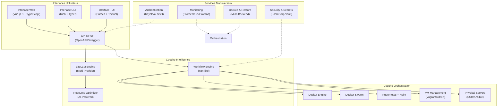

# Vue d'Ensemble - WindFlow

## Qu'est-ce que WindFlow ?

WindFlow est un outil web intelligent de déploiement de containers Docker sur des machines cibles. Il combine une interface utilisateur moderne, un système d'échange de données flexible, et une intelligence artificielle pour automatiser et optimiser les déploiements.

## Vision et Objectifs

### Vision
Simplifier et automatiser le déploiement d'applications containerisées en offrant une plateforme intelligente qui s'adapte aux besoins des équipes de développement et d'opérations, depuis les projets simples jusqu'aux infrastructures enterprise complexes.

### Objectifs Principaux

**🎯 Simplicité d'Utilisation**
- Interface web intuitive avec workflows visuels
- Configuration automatique générée par IA
- One-click deployment de stacks préconfigurées
- CLI/TUI puissants pour l'automatisation

**🔧 Flexibilité Maximale** 
- Support multi-cible : containers, VMs, serveurs physiques
- Orchestration adaptative (Docker, Swarm, Kubernetes)
- Templates personnalisables et marketplace communautaire
- Workflows de déploiement configurables

**🧠 Intelligence Intégrée**
- Optimisation automatique des ressources par IA
- Résolution intelligente des conflits et dépendances
- Suggestions de sécurité et bonnes pratiques
- Diagnostic automatique des erreurs

**📈 Évolutivité Enterprise**
- Architecture multi-tenant avec isolation complète
- Gestion centralisée des utilisateurs et permissions (SSO/2FA)
- Support des environnements hybrides (cloud + on-premise)
- Compliance et audit trail complets

## Proposition de Valeur

### Pour les Développeurs
- **Déploiement simplifié** : Plus besoin de connaître les détails de l'infrastructure cible
- **Environnements cohérents** : Réplication exacte entre dev/test/staging/prod
- **Feedback rapide** : Notifications temps réel et logs centralisés
- **Intégration CI/CD** : Pipelines automatisés avec tests et validations

### Pour les Équipes DevOps
- **Orchestration unifiée** : Gestion centralisée de toutes les cibles de déploiement
- **Automatisation avancée** : Scripts intelligents générés automatiquement
- **Monitoring intégré** : Métriques et alerting pour tous les déploiements
- **Sécurité renforcée** : Politique de sécurité cohérente et audit complet

### Pour les Organisations
- **Réduction des coûts** : Optimisation automatique des ressources
- **Time-to-market accéléré** : Déploiements plus rapides et fiables
- **Conformité simplifiée** : Audit trail et politiques de sécurité automatiques
- **Scalabilité maîtrisée** : Support des architectures complexes et multi-cloud

## Cas d'Usage Principaux

### 🏢 Déploiement Enterprise
- Applications microservices complexes
- Environnements multi-tenant sécurisés
- Conformité réglementaire (RGPD, SOX, HIPAA)
- Intégration avec l'infrastructure existante (LDAP/AD)

### 🚀 Startups et PME
- Déploiement rapide d'applications web
- Scaling automatique selon la demande
- Coûts d'infrastructure optimisés
- Support technique simplifié

### 🎓 Environnements de Développement
- Environnements isolés par équipe/projet
- Provisioning automatique de VMs de développement
- Partage sécurisé de ressources de test
- Templates d'application standardisés

### 🏭 Applications Industrielles
- Déploiement sur serveurs physiques dédiés
- Support des environnements air-gapped
- Intégration avec systèmes legacy
- High availability et disaster recovery

## Différenciateurs Clés

### Intelligence Artificielle Intégrée
- **LiteLLM Integration** : Support de tous les providers LLM (OpenAI, Claude, Ollama, etc.)
- **Optimisation automatique** : Configuration générée selon les contraintes
- **Résolution intelligente** : Détection et correction automatique des conflits
- **Apprentissage continu** : Amélioration des suggestions basée sur l'historique

### Architecture Multi-Cible Unifiée
- **Abstraction complète** : API uniforme pour containers, VMs, et physical
- **Migration transparente** : Bascule automatique entre types de cibles
- **Provisioning intelligent** : Sélection optimale de la cible selon les besoins
- **Hybrid cloud native** : Support seamless du multi-cloud et on-premise

### Expérience Utilisateur Exceptionnelle
- **Interface web moderne** : Vue.js 3 + TypeScript avec composants UX optimisés
- **CLI/TUI complets** : Alternative puissante pour l'automatisation
- **Workflows visuels** : Éditeur drag-and-drop inspiré de n8n
- **Notifications intelligentes** : Alerting multi-canal avec déduplication

### Écosystème Ouvert
- **Marketplace communautaire** : Templates vérifiés et contributions ouvertes
- **Plugin system extensible** : API pour l'ajout de fonctionnalités personnalisées
- **Intégrations natives** : Support built-in des outils DevOps populaires
- **Standards ouverts** : Compatible avec les standards industrie (OCI, CNCF, etc.)

## Architecture de Haut Niveau

## Métriques de Succès

### Métriques Techniques
- **Time-to-Deploy** : Réduction de 70% du temps de déploiement
- **Error Rate** : Réduction de 80% des échecs de déploiement
- **Resource Efficiency** : Optimisation de 40% de l'utilisation des ressources
- **Recovery Time** : Réduction de 90% du temps de récupération

### Métriques Business
- **Developer Productivity** : Augmentation de 50% de la vélocité des équipes
- **Infrastructure Costs** : Réduction de 30% des coûts d'infrastructure
- **Security Incidents** : Réduction de 95% des incidents de sécurité
- **Compliance Score** : 100% de conformité aux standards requis

## Écosystème et Partenaires

### Intégrations Natives
- **Git Providers** : GitHub, GitLab, Bitbucket, Azure DevOps
- **Cloud Providers** : AWS, Azure, GCP, DigitalOcean, OVH
- **Monitoring** : Prometheus, Grafana, DataDog, New Relic
- **Security** : Vault, LDAP/AD, Keycloak, cert-manager

### Standards Supportés
- **Container Standards** : OCI, Docker, Podman
- **Orchestration** : Kubernetes (CNCF), Docker Swarm
- **Infrastructure as Code** : Terraform, Ansible, Helm
- **Observability** : OpenTelemetry, Prometheus, Jaeger

---

**Références :**
- [Architecture Générale](02-architecture.md) - Principes de conception détaillés
- [Stack Technologique](03-technology-stack.md) - Technologies utilisées
- [Fonctionnalités Principales](10-core-features.md) - Fonctionnalités détaillées
- [Roadmap](18-roadmap.md) - Plan de développement
