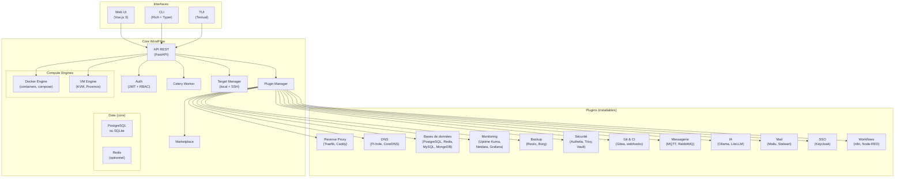

# Vue d'Ensemble - WindFlow

## Qu'est-ce que WindFlow ?

WindFlow est un **gestionnaire d'infrastructure self-hosted léger** pour piloter des conteneurs Docker et des machines virtuelles depuis une interface web unique. Il est conçu pour tourner aussi bien sur un Raspberry Pi que sur un serveur x86 dédié.

Son architecture repose sur un **cœur minimal** — gestion des containers, gestion des VMs, et marketplace de plugins — complété par un **écosystème de plugins installables** qui étendent les capacités à la demande : reverse proxy, bases de données, DNS, monitoring, backups, mail, workflows, IA, et plus encore.

WindFlow s'adresse à toute personne qui veut gérer une petite infrastructure (homelab, serveur perso, petite équipe) sans être sysadmin, tout en gardant un contrôle total sur ses données et ses services.

## Vision et Objectifs

### Vision

Rendre la gestion d'infrastructure accessible à tous en proposant un outil self-hosted qui combine la simplicité d'un Cloudron ou YunoHost, la flexibilité d'un Portainer, et la gestion de VMs d'un Proxmox — le tout dans une interface moderne et extensible par plugins.

### Objectifs Principaux

**Cœur minimal, extensible à l'infini**
- Le core ne fait que trois choses : containers, VMs, marketplace de plugins
- Tout le reste est un plugin installable et désinstallable depuis l'UI
- On n'impose jamais de complexité inutile : un RPi avec 2 Go de RAM ne charge pas Elasticsearch

**Self-hosted et souverain**
- Tourne sur votre matériel, sur votre réseau, sans dépendance cloud
- Pas de vendor lock-in, pas de service externe obligatoire
- Données sous votre contrôle total

**Léger et universel**
- Fonctionne sur Raspberry Pi 4+ (ARM64) comme sur serveur x86
- Mode léger avec SQLite et sans Redis pour les machines contraintes
- Empreinte mémoire core < 512 Mo en mode léger

**Simple à utiliser**
- Interface web moderne et intuitive
- Installation en 5 minutes
- Déploiement d'un premier service en moins de 10 minutes
- CLI/TUI puissants pour ceux qui préfèrent le terminal

## Proposition de Valeur

### Pour le Self-Hoster

- **Un seul outil** pour gérer containers et VMs au lieu de jongler entre Portainer, virt-manager, et des scripts SSH
- **Marketplace de stacks** : installer Nextcloud, Gitea, Jellyfin ou Home Assistant en un clic
- **Plugins à la demande** : ajouter un reverse proxy (Traefik), du monitoring (Uptime Kuma), des backups (Restic) quand on en a besoin, pas avant
- **Tourne sur du matériel modeste** : un Raspberry Pi 4 suffit pour commencer

### Pour la Petite Équipe

- **Gestion multi-machines** : piloter plusieurs serveurs depuis une seule instance WindFlow
- **Environnements séparés** : isoler dev, staging, prod avec des réseaux et permissions distincts
- **Plugins de productivité** : Git auto-deploy, CI/CD basique, plugins bases de données pour gérer PostgreSQL/Redis/MongoDB sans CLI
- **Auth et RBAC** intégrés au core : chaque membre a les permissions adaptées

### Pour l'Administrateur Système

- **VMs et containers côte à côte** : KVM/Proxmox pour les VMs, Docker pour les containers, même interface
- **Console VNC/SPICE** intégrée au navigateur
- **Volume browser** : naviguer, éditer, uploader des fichiers dans les volumes sans accès SSH
- **Terminal WebSocket** dans les containers et les VMs depuis l'UI
- **Extensible par plugins** : si une fonctionnalité manque (DNS, mail, MQTT…), elle s'installe en un clic

## Cas d'Usage

### Homelab

Le cas d'usage principal. Un passionné a un Raspberry Pi ou un mini PC chez lui et veut héberger ses propres services.

- Installer WindFlow en mode léger sur un RPi 4
- Depuis la marketplace, déployer Nextcloud (cloud perso), Immich (photos), Jellyfin (média)
- Installer le plugin Traefik pour exposer les services avec un nom de domaine et du HTTPS automatique
- Installer le plugin Restic pour sauvegarder les données automatiquement
- Tout gérer depuis l'interface web, sans toucher à la ligne de commande

### Petit Serveur Dédié

Un développeur ou une petite équipe loue un serveur dédié (OVH, Hetzner…) et veut y déployer plusieurs projets.

- Installer WindFlow en mode standard sur le serveur
- Gérer les containers Docker pour les applications web
- Utiliser les plugins PostgreSQL et Redis pour administrer les bases de données depuis l'UI
- Plugin Traefik + Let's Encrypt pour le routage et les certificats
- Plugin Gitea + webhook auto-deploy pour du déploiement automatique depuis Git
- Plugin Uptime Kuma pour surveiller la disponibilité des services

### Infrastructure Mixte Containers + VMs

Un admin système gère quelques serveurs avec un mix de VMs et de containers.

- WindFlow sur un serveur principal, connecté à d'autres machines via SSH
- KVM/libvirt pour les VMs (serveurs legacy, Windows, appliances réseau)
- Docker pour les applications modernes
- Console VNC intégrée pour accéder aux VMs sans client lourd
- Vue consolidée de toutes les machines, tous les services, depuis un seul dashboard
- Plugins monitoring (Netdata ou Prometheus+Grafana) pour la visibilité

### Environnement de Développement

Une équipe de développeurs veut des environnements de dev/test rapides à provisionner.

- Templates de stacks pour les environnements types (API + PostgreSQL + Redis)
- Environnements isolés par projet avec réseaux séparés
- Plugin Git pour synchroniser les stacks depuis un dépôt
- Déploiement en un clic depuis la marketplace
- Nettoyage facile des environnements obsolètes

## Architecture de Haut Niveau

### Philosophie : Core + Plugins

```mermaid
flowchart TB
    subgraph "Interfaces"
        WebUI["Web UI\n(Vue.js 3)"]
        CLI["CLI\n(Rich + Typer)"]
        TUI["TUI\n(Textual)"]
    end

    subgraph "Core WindFlow"
        API["API REST\n(FastAPI)"]
        Auth["Auth\n(JWT + RBAC)"]
        PluginMgr["Plugin Manager"]
        Marketplace["Marketplace"]

        subgraph "Compute Engines"
            Docker["Docker Engine\n(containers, compose)"]
            VM["VM Engine\n(KVM, Proxmox)"]
        end

        subgraph "Data (core)"
            DB["PostgreSQL\nou SQLite"]
            Cache["Redis\n(optionnel)"]
        end

        Worker["Celery Worker"]
        Targets["Target Manager\n(local + SSH)"]
    end

    subgraph "Plugins (installables)"
        RP["Reverse Proxy\n(Traefik, Caddy)"]
        DNS["DNS\n(Pi-hole, CoreDNS)"]
        DBPlugins["Bases de données\n(PostgreSQL, Redis,\nMySQL, MongoDB)"]
        Monitoring["Monitoring\n(Uptime Kuma,\nNetdata, Grafana)"]
        Backup["Backup\n(Restic, Borg)"]
        Security["Sécurité\n(Authelia, Trivy,\nVault)"]
        Git["Git & CI\n(Gitea, webhooks)"]
        Messaging["Messagerie\n(MQTT, RabbitMQ)"]
        AI["IA\n(Ollama, LiteLLM)"]
        Mail["Mail\n(Mailu, Stalwart)"]
        SSO["SSO\n(Keycloak)"]
        Workflows["Workflows\n(n8n, Node-RED)"]
    end

    WebUI --> API
    CLI --> API
    TUI --> API

    API --> Auth
    API --> PluginMgr
    API --> Docker
    API --> VM
    API --> Worker
    API --> Targets

    PluginMgr --> Marketplace
    PluginMgr --> RP
    PluginMgr --> DNS
    PluginMgr --> DBPlugins
    PluginMgr --> Monitoring
    PluginMgr --> Backup
    PluginMgr --> Security
    PluginMgr --> Git
    PluginMgr --> Messaging
    PluginMgr --> AI
    PluginMgr --> Mail
    PluginMgr --> SSO
    PluginMgr --> Workflows
```

### Ce qui est Core vs Plugin

| Core (toujours présent) | Plugin (installable à la demande) |
|--------------------------|-----------------------------------|
| API REST (FastAPI) | Reverse proxy (Traefik, Caddy) |
| Auth JWT + RBAC | DNS (Pi-hole, CoreDNS, Cloudflare) |
| Docker : containers, compose, volumes, networks | Certificats TLS (Let's Encrypt) |
| VMs : KVM/libvirt, Proxmox, VirtualBox | Bases de données (PostgreSQL, MySQL, Redis, MongoDB) |
| Plugin Manager + Marketplace | Monitoring (Uptime Kuma, Netdata, Prometheus) |
| Target Manager (local + SSH) | Backup (Restic, Borg) |
| Celery worker (tâches async) | Sécurité (Authelia, Trivy, Vault) |
| PostgreSQL ou SQLite | Git & CI (Gitea, auto-deploy) |
| Redis (optionnel) | Mail (Mailu, Stalwart) |
| Web UI (Vue.js 3) | Workflows (n8n, Node-RED) |
| CLI/TUI | IA (Ollama, LiteLLM) |
| | SSO (Keycloak) |
| | Messagerie (MQTT, RabbitMQ) |

### Profils de Ressources

| Profil | RAM | CPU | Stockage | Machine type |
|--------|-----|-----|----------|--------------|
| **Léger** (core, SQLite, sans Redis) | 512 Mo | 1 core ARM | 2 Go | Raspberry Pi 4 (2 Go) |
| **Standard** (core, PostgreSQL, Redis) | 1.5 Go | 2 cores | 5 Go | RPi 4 (4 Go), mini PC |
| **Complet** (core + 5-10 plugins) | 4 Go | 4 cores | 20 Go | NUC, serveur dédié |

## Différenciateurs

### Core Minimal + Tout Plugin

Contrairement à Portainer, CasaOS ou Coolify qui embarquent leurs fonctionnalités en dur, WindFlow sépare strictement le core (containers + VMs) du reste. Chaque brique additionnelle est un plugin avec son propre cycle de vie. Résultat : une empreinte mémoire minimale, et chaque utilisateur n'a que ce dont il a besoin.

### Containers ET VMs dans la Même Interface

La plupart des outils self-hosted gèrent soit les containers (Portainer, CasaOS), soit les VMs (Proxmox, virt-manager). WindFlow fait les deux. Un Raspberry Pi avec Docker et un serveur avec KVM se gèrent depuis le même dashboard.

### Tourne sur Raspberry Pi

WindFlow est pensé ARM-first. Le core et tous les plugins officiels fournissent des images multi-arch (arm64 + amd64). Le mode léger (SQLite, pas de Redis) permet de tourner avec 512 Mo de RAM.

### Marketplace de Stacks et Plugins

Une marketplace intégrée permet de déployer des applications complètes en un clic (Nextcloud, Gitea, Home Assistant…) et d'étendre les capacités de WindFlow avec des plugins (reverse proxy, monitoring, backup…). Chaque plugin déclare ses dépendances, ses architectures supportées, et ses besoins en ressources.

### Extensible et Ouvert

Le système de plugins est ouvert : un SDK permet de créer ses propres plugins, et un registre communautaire permet de les partager. Les plugins peuvent être des services déployables (stack Docker), des extensions fonctionnelles (ajout de pages UI et d'endpoints API), ou les deux.

## Métriques de Succès

### Expérience Utilisateur

- **Temps d'installation** : < 5 minutes pour le core
- **Temps pour déployer un premier service** : < 10 minutes (installation incluse)
- **Taux de succès des déploiements** : > 95%
- **Empreinte mémoire core (mode léger)** : < 512 Mo

### Écosystème

- **Plugins officiels** : 20+ couvrant les besoins courants du self-hosting
- **Templates marketplace** : 15+ applications one-click
- **Architectures supportées** : ARM64 + x86_64 pour le core et tous les plugins officiels

### Qualité

- **Couverture tests** : > 85%
- **Vulnérabilités critiques** : 0
- **Documentation** : guide d'installation, guide plugins, référence API complète

## Standards et Compatibilité

### Formats et Protocoles

- **Containers** : Docker Engine API, format Docker Compose v3+
- **VMs** : libvirt (KVM/QEMU), API Proxmox VE, VBoxWebSVC
- **Images** : qcow2, raw, vdi, vmdk, ISO, cloud-init
- **Architectures** : linux/amd64, linux/arm64

### Intégrations (via plugins)

- **Git** : GitHub, GitLab, Bitbucket, Gitea (via plugin Git)
- **DNS** : Cloudflare, Pi-hole, CoreDNS (via plugins DNS)
- **Reverse Proxy** : Traefik, Caddy, Nginx Proxy Manager (via plugins)
- **Monitoring** : Prometheus, Grafana, Uptime Kuma, Netdata (via plugins)
- **Backup** : Restic, Borg (via plugins)
- **Auth externe** : Keycloak, LDAP/AD, OIDC (via plugin SSO)

---

**Références :**
- [Architecture Générale](02-architecture.md) - Principes de conception
- [Stack Technologique](03-technology-stack.md) - Technologies utilisées
- [Fonctionnalités Principales](10-core-features.md) - Fonctionnalités détaillées
- [Roadmap](18-roadmap.md) - Plan de développement
