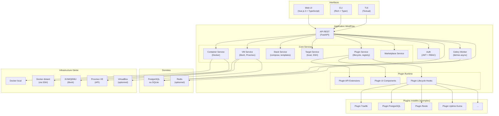
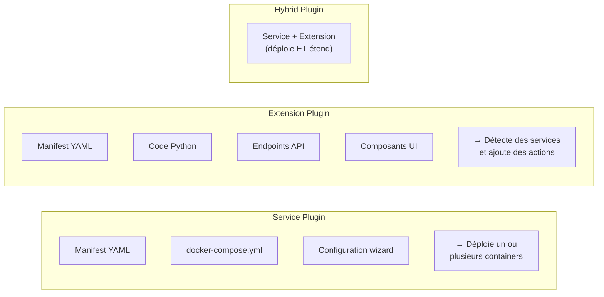
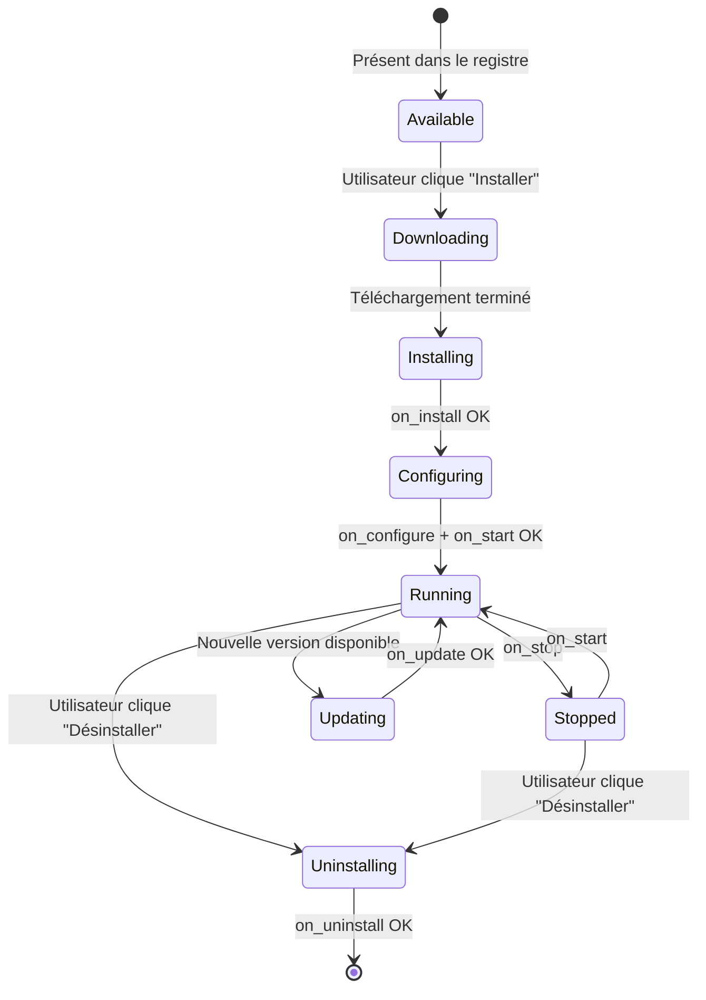
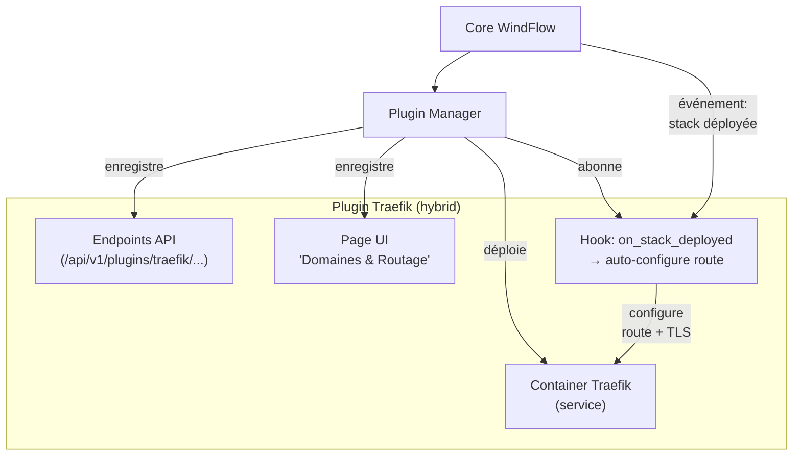
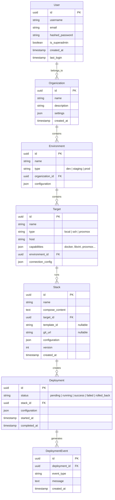
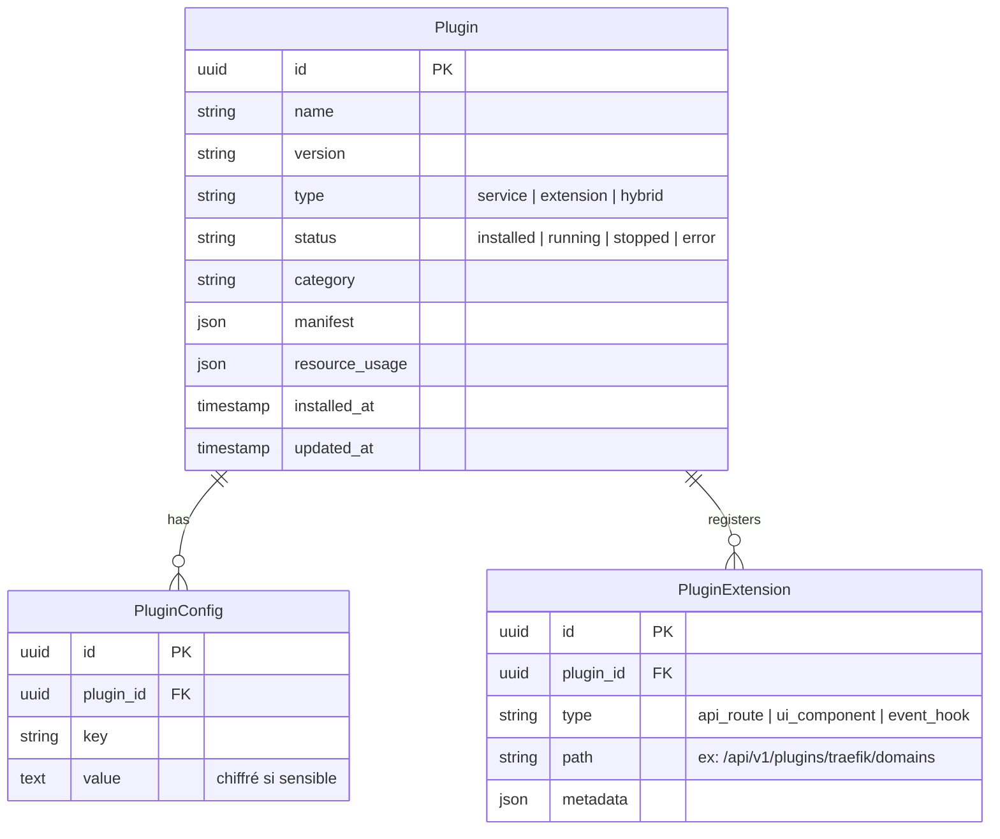

# Architecture Générale - WindFlow

## Principes de Conception

### Philosophie Architecturale

WindFlow est une **application monolithique modulaire** conçue pour être légère, simple à déployer, et extensible par plugins. Ce n'est pas un système distribué de microservices — c'est un outil self-hosted qui doit tourner sur un Raspberry Pi comme sur un serveur dédié.

**Principes Fondamentaux :**

- **Cœur minimal** : Le core ne gère que les containers, les VMs, les plugins et la marketplace. Toute autre fonctionnalité est un plugin.
- **Plugin-first** : L'architecture du système de plugins est aussi importante que le core lui-même. Chaque plugin peut déployer des services, étendre l'API, et ajouter des pages à l'UI.
- **Léger par défaut** : Le core tourne avec 512 Mo de RAM en mode léger. Chaque composant optionnel (Redis, PostgreSQL au lieu de SQLite) est un choix conscient de l'utilisateur.
- **Multi-arch natif** : ARM64 et x86_64 sont des cibles de première classe. Pas de dépendance à une architecture spécifique.
- **API-First** : Toute action disponible dans l'UI est disponible via l'API REST. Le CLI/TUI utilise la même API.

### Ce que WindFlow n'est PAS

Pour garder la conception cohérente, il est utile de définir les frontières :

- **Pas un système distribué** : WindFlow est une seule instance (API + worker + DB). Le multi-node signifie "piloter des machines distantes", pas "distribuer WindFlow sur plusieurs serveurs".
- **Pas cloud-native** : WindFlow tourne sur du matériel physique ou des VMs. Il n'a pas besoin de Kubernetes pour fonctionner.
- **Pas enterprise-first** : Les fonctionnalités enterprise (SSO, Vault, audit avancé) existent en tant que plugins, pas comme prérequis.

## Architecture Globale

### Vue d'Ensemble



### Profils de Déploiement

WindFlow s'adapte au matériel disponible. Le même code tourne dans les trois profils — seule la configuration change.

**Mode Léger (Raspberry Pi, petites machines)**

```
WindFlow API (FastAPI) ─── SQLite (fichier local)
       │
   Celery Worker (1 process)
       │
   Docker Engine (local)
```

- SQLite au lieu de PostgreSQL (pas de service DB séparé)
- Pas de Redis (cache en mémoire, sessions en DB)
- Un seul worker Celery
- Empreinte : ~512 Mo RAM, 1 core

**Mode Standard (mini PC, serveur modeste)**

```
WindFlow API (FastAPI) ─── PostgreSQL ─── Redis
       │
   Celery Worker(s)
       │
   Docker Engine + libvirt (local ou distant)
```

- PostgreSQL pour la persistance
- Redis pour le cache et le broker Celery
- Un ou plusieurs workers
- Empreinte : ~1.5 Go RAM, 2 cores

**Mode Standard + Plugins**

Identique au mode standard, mais les plugins ajoutent des containers et des fonctionnalités :

```
WindFlow (API + Worker + PostgreSQL + Redis)
    │
    ├── Plugin Traefik (container Traefik, intégration reverse proxy)
    ├── Plugin PostgreSQL (extension: gestion DB depuis l'UI)
    ├── Plugin Uptime Kuma (container Uptime Kuma, widget dashboard)
    ├── Plugin Restic (extension: backup planifié)
    └── ...
```

Chaque plugin consomme des ressources supplémentaires. Le Plugin Manager vérifie les ressources disponibles avant installation.

## Architecture du Core

### Structure de l'Application

WindFlow est une application Python monolithique structurée en modules :

```
windflow/
├── main.py                  # Point d'entrée FastAPI
├── config.py                # Configuration (profil léger/standard)
├── auth/                    # JWT, RBAC, sessions
│   ├── jwt_handler.py
│   ├── rbac.py
│   └── models.py
├── containers/              # Gestion Docker
│   ├── docker_service.py    # Docker Engine API
│   ├── compose_service.py   # Docker Compose
│   ├── volume_service.py    # Volumes
│   ├── network_service.py   # Networks
│   └── image_service.py     # Images
├── vms/                     # Gestion VMs
│   ├── libvirt_service.py   # KVM/QEMU via libvirt
│   ├── proxmox_service.py   # Proxmox VE API
│   └── vbox_service.py      # VirtualBox (optionnel)
├── stacks/                  # Stacks et templates
│   ├── stack_service.py
│   ├── template_engine.py   # Jinja2 templates
│   └── models.py
├── targets/                 # Machines cibles
│   ├── target_service.py
│   ├── ssh_manager.py       # Connexion SSH
│   └── discovery.py         # Auto-discovery
├── plugins/                 # Système de plugins
│   ├── plugin_manager.py    # Installation, lifecycle
│   ├── plugin_registry.py   # Registre local + distant
│   ├── plugin_api.py        # API dynamique par plugin
│   ├── plugin_hooks.py      # Hooks lifecycle
│   └── marketplace.py       # Catalogue, recherche
├── tasks/                   # Tâches Celery
│   ├── deployment_tasks.py
│   ├── plugin_tasks.py
│   └── maintenance_tasks.py
├── websocket/               # Temps réel
│   ├── terminal.py          # Terminal interactif
│   ├── logs.py              # Streaming logs
│   └── events.py            # Événements push
└── api/                     # Routes API REST
    ├── v1/
    │   ├── containers.py
    │   ├── vms.py
    │   ├── stacks.py
    │   ├── targets.py
    │   ├── plugins.py
    │   ├── marketplace.py
    │   ├── auth.py
    │   └── system.py
    └── deps.py              # Dépendances FastAPI
```

### Services Core

**Container Service** — Interface avec Docker Engine via le SDK Python Docker. Gère les containers, les stacks Compose, les volumes, les networks, les images. C'est le service le plus utilisé.

**VM Service** — Interface avec les hyperviseurs. Utilise `libvirt` pour KVM/QEMU (API Python native), l'API REST Proxmox pour Proxmox VE, et optionnellement VBoxWebSVC pour VirtualBox. Chaque backend implémente une interface commune `VMBackend`.

**Stack Service** — Gère les stacks (groupes de services) avec versioning, templates Jinja2, et configuration. Les stacks peuvent venir de la marketplace, d'un dépôt Git (plugin), ou être créées manuellement.

**Target Service** — Gère les machines cibles (locale ou distantes via SSH). Fournit l'inventaire des machines et leurs capacités (Docker disponible ? libvirt ? Proxmox ?).

**Plugin Service** — Le cœur de l'extensibilité. Gère le cycle de vie des plugins : installation, configuration, mise à jour, désinstallation. Détaillé dans la section suivante.

**Marketplace Service** — Catalogue de stacks et plugins. Interroge le registre distant pour les fiches, vérifie la compatibilité (architecture, ressources), et déclenche l'installation.

## Architecture du Système de Plugins

Le système de plugins est la pièce maîtresse de l'architecture WindFlow. Il permet d'ajouter des fonctionnalités sans alourdir le core.

### Types de Plugins



**Service Plugin** : Déploie une stack Docker préconfigurée. Exemple : le plugin Uptime Kuma installe un container Uptime Kuma et ajoute un widget au dashboard.

**Extension Plugin** : Ajoute des capacités au core sans déployer de nouveau container. Exemple : le plugin PostgreSQL détecte les containers `postgres` existants et ajoute des actions (créer une DB, un user, backup) dans l'UI.

**Hybrid Plugin** : Les deux. Exemple : le plugin Traefik déploie un container Traefik ET s'intègre au core pour permettre l'association domaine ↔ service depuis l'UI.

### Manifest Plugin

Chaque plugin est décrit par un fichier `windflow-plugin.yml` :

```yaml
name: traefik
version: 1.0.0
type: hybrid                    # service | extension | hybrid
display_name: "Traefik"
description: "Reverse proxy avec TLS automatique"
category: access                # access | dns | database | monitoring | backup | security | ...
icon: traefik.svg
author: "WindFlow Team"
license: MIT

# Compatibilité
architectures:
  - linux/amd64
  - linux/arm64

resources:
  ram_min_mb: 128
  cpu_min_cores: 0.5

# Dépendances
dependencies:
  requires:
    - docker                    # nécessite Docker (pas compatible VM-only)
  conflicts: []
  optional:
    - cloudflare-dns            # pour DNS challenge Let's Encrypt

# Capacités fournies
provides:
  - reverse_proxy
  - tls_certificates

# Ports exposés
ports:
  - 80
  - 443

# Configuration utilisateur (génère un formulaire dans l'UI)
config:
  - key: acme_email
    label: "Email pour Let's Encrypt"
    type: string
    required: true
  - key: dashboard_enabled
    label: "Activer le dashboard Traefik"
    type: boolean
    default: true

# Hooks lifecycle
hooks:
  on_install: scripts/install.sh
  on_configure: scripts/configure.sh
  on_start: scripts/start.sh
  on_stop: scripts/stop.sh
  on_uninstall: scripts/uninstall.sh
  on_update: scripts/update.sh

# Pour les service/hybrid plugins : stack Docker à déployer
compose_file: docker-compose.yml

# Pour les extension/hybrid plugins : code Python à charger
extensions:
  api_module: extensions/api.py       # endpoints FastAPI additionnels
  ui_components: extensions/ui/       # composants Vue.js additionnels
  hooks_module: extensions/hooks.py   # réactions aux événements core
```

### Lifecycle des Plugins



**Installation** : Le Plugin Manager télécharge le plugin depuis le registre, vérifie l'intégrité (checksum), la compatibilité architecture, et les ressources disponibles. Si un `compose_file` est présent, il déploie la stack Docker. Si des `extensions` sont présentes, il charge les modules Python et enregistre les routes API et composants UI.

**Configuration** : Le manifest définit des `config` entries qui génèrent automatiquement un formulaire dans l'UI. Les valeurs sont stockées en base et injectées dans le plugin via variables d'environnement ou fichier de config.

**Événements** : Les extension plugins peuvent s'abonner aux événements du core (container créé, stack déployée, VM démarrée…) via le `hooks_module`. Par exemple, le plugin Traefik écoute l'événement "stack déployée" pour auto-configurer le routage.

### Intégration Plugin ↔ Core



## Modèle de Données

### Entités Core



### Entités Plugin



## Communication et Temps Réel

### API REST

L'API suit les conventions REST classiques avec FastAPI. Toutes les routes sont documentées automatiquement via OpenAPI.

```
GET    /api/v1/containers              # Lister les containers
POST   /api/v1/containers              # Créer un container
GET    /api/v1/containers/{id}         # Détails d'un container
DELETE /api/v1/containers/{id}         # Supprimer un container
POST   /api/v1/containers/{id}/start   # Démarrer
POST   /api/v1/containers/{id}/stop    # Arrêter

GET    /api/v1/vms                     # Lister les VMs
POST   /api/v1/vms                     # Créer une VM
POST   /api/v1/vms/{id}/snapshot       # Snapshot

GET    /api/v1/stacks                  # Lister les stacks
POST   /api/v1/stacks/{id}/deploy      # Déployer une stack

GET    /api/v1/plugins                 # Lister les plugins installés
POST   /api/v1/plugins/install         # Installer un plugin
DELETE /api/v1/plugins/{name}          # Désinstaller

GET    /api/v1/marketplace/catalog     # Catalogue marketplace
GET    /api/v1/marketplace/search      # Recherche

# Routes dynamiques ajoutées par les plugins :
GET    /api/v1/plugins/traefik/domains
POST   /api/v1/plugins/postgresql/databases
GET    /api/v1/plugins/uptime-kuma/status
```

### WebSocket

Le WebSocket est utilisé pour les interactions temps réel qui ne peuvent pas passer par du REST polling :

- **Terminal interactif** : Shell dans un container ou une VM, bidirectionnel
- **Streaming de logs** : Logs de déploiement en temps réel
- **Événements système** : Notifications push (déploiement terminé, alerte, plugin installé)

```
ws://host/ws/terminal/{container_id}    # Terminal container
ws://host/ws/terminal/{vm_id}           # Console VM (VNC via WebSocket)
ws://host/ws/logs/{deployment_id}       # Logs déploiement
ws://host/ws/events                     # Événements globaux
```

### Événements Internes

Les services core et les plugins communiquent via un bus d'événements simple. En mode standard, Redis Pub/Sub est utilisé. En mode léger (sans Redis), un bus en mémoire (asyncio queues) prend le relais.

```python
# Événements émis par le core
"container.created"     # Un container a été créé
"container.started"     # Un container a démarré
"container.stopped"     # Un container s'est arrêté
"stack.deployed"        # Une stack a été déployée
"stack.removed"         # Une stack a été supprimée
"vm.created"            # Une VM a été créée
"vm.started"            # Une VM a démarré
"plugin.installed"      # Un plugin a été installé
"plugin.removed"        # Un plugin a été désinstallé
"target.added"          # Une machine cible a été ajoutée
```

Les plugins s'abonnent aux événements qui les concernent. Par exemple, le plugin Traefik écoute `stack.deployed` et `container.started` pour auto-configurer les routes.

## Sécurité

### Authentification et Autorisation (core)

**JWT** : L'authentification utilise des tokens JWT avec refresh tokens. Pas de dépendance externe — ça marche out of the box.

**RBAC** : Permissions granulaires par organisation, environnement et ressource. Rôles configurables (admin, operator, viewer).

**Chiffrement des secrets** : Les secrets (mots de passe, tokens, clés SSH) sont chiffrés en base avec AES-256-GCM. La clé de chiffrement est dérivée du `SECRET_KEY` de l'instance.

### Sécurité Réseau

**API** : Toutes les routes API nécessitent un token JWT valide (sauf `/auth/login` et `/health`). Rate limiting configurable.

**Docker Socket** : L'accès au socket Docker est le point de sécurité le plus critique. WindFlow est le seul processus à y accéder, et les actions utilisateur passent toujours par l'API avec vérification RBAC.

**SSH** : Les connexions aux machines distantes utilisent des clés SSH. Les clés sont stockées chiffrées en base.

### Sécurité via Plugins (optionnel)

Les fonctionnalités de sécurité avancées sont des plugins :

- **Plugin Authelia** : Authentification 2FA devant les services exposés
- **Plugin Trivy** : Scan de vulnérabilités des images Docker
- **Plugin Vault** : Gestion avancée des secrets avec HashiCorp Vault
- **Plugin Keycloak** : SSO enterprise avec LDAP/AD/OIDC

## Résilience et Fiabilité

### Stratégies Adaptées au Contexte

WindFlow n'est pas un système distribué qui a besoin de patterns comme Saga ou CQRS. Ses stratégies de résilience sont pragmatiques et adaptées au self-hosting :

**Déploiements avec rollback** : Chaque déploiement de stack sauvegarde l'état précédent. En cas d'échec, un rollback automatique restaure la configuration précédente.

**Retry avec backoff** : Les opérations qui interagissent avec des services externes (Docker Engine, libvirt, API Proxmox, machines SSH) utilisent un retry avec exponential backoff. Configurable par target.

**Health checks** : Le core expose `/health` et `/ready`. Les services déployés sont surveillés par des health checks Docker natifs. Les plugins de monitoring (Uptime Kuma, Netdata) ajoutent une couche de surveillance supplémentaire.

**Gestion des erreurs** : Les erreurs sont loggées en base avec contexte complet (stack trace, configuration, état du système). Le frontend affiche des messages d'erreur exploitables.

### Backup et Recovery

Le core fournit un mécanisme de backup basique : export de la base de données et des fichiers de configuration. Pour des backups avancés (volumes, scheduling, offsite), le plugin Restic ou Borg est recommandé.

```bash
# Backup core (intégré)
windflow backup create --output /backup/windflow-$(date +%Y%m%d).tar.gz

# Restore core
windflow backup restore --input /backup/windflow-20260315.tar.gz
```

## Performance

### Optimisations Core

**Base de données** : Index sur les colonnes fréquemment requêtées (status, organization_id, created_at). Requêtes async avec SQLAlchemy 2.0.

**Cache** : En mode standard, Redis cache les sessions, les métadonnées des stacks, et le catalogue marketplace. En mode léger, un cache dict en mémoire remplace Redis avec les mêmes TTL.

**Tâches async** : Les opérations longues (déploiement, pull d'images, snapshot VM) sont exécutées par Celery worker(s) pour ne pas bloquer l'API.

**WebSocket** : Le terminal et le streaming de logs utilisent des connexions WebSocket persistantes pour éviter le polling.

### Benchmarks Cibles

| Métrique | Mode Léger (RPi 4) | Mode Standard |
|----------|---------------------|---------------|
| Temps de réponse API (p95) | < 500 ms | < 200 ms |
| Démarrage de l'application | < 15 s | < 10 s |
| Mémoire au repos (core seul) | < 400 Mo | < 800 Mo |
| Déploiement d'une stack simple | < 30 s | < 15 s |
| Connexions WebSocket simultanées | 10 | 50+ |

---

**Références :**
- [Vue d'Ensemble](01-overview.md) - Vision et contexte du projet
- [Stack Technologique](03-technology-stack.md) - Technologies détaillées
- [Modèle de Données](04-data-model.md) - Structure des données
- [Authentification](05-authentication.md) - Architecture de sécurité
- [Sécurité](13-security.md) - Stratégies de sécurité détaillées
- [Roadmap](18-roadmap.md) - Plan de développement
