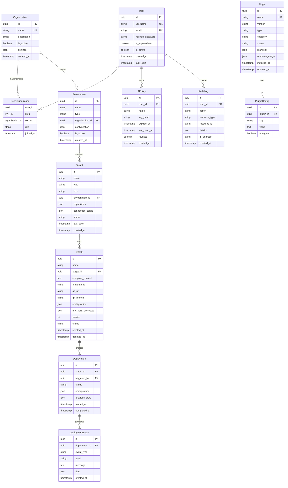

# Modèle de Données - WindFlow

## Vue d'Ensemble

Le modèle de données de WindFlow est conçu pour être simple, adapté au self-hosting, et compatible avec les deux backends de base de données : PostgreSQL (mode standard) et SQLite (mode léger).

### Principes de Conception

- **Simplicité** : Peu de tables, relations claires. Pas d'over-engineering relationnel.
- **Compatibilité SQLite** : Pas de types PostgreSQL spécifiques (CIDR, INET, arrays). Les types complexes utilisent JSON.
- **Extensibilité via JSON** : Les colonnes `configuration` et `metadata` en JSON permettent de stocker des données structurées sans migration pour chaque nouveau champ.
- **Plugins séparés** : Les plugins stockent leurs propres données dans des tables préfixées (`plugin_traefik_*`) ou dans la colonne JSON `metadata` de l'entité concernée. Le modèle core ne contient pas de tables pour le DNS, les domaines, les certificats, le monitoring, etc.

---

## Diagramme Entité-Relations



---

## Entités Core

### User — Utilisateur

```sql
CREATE TABLE users (
    id TEXT PRIMARY KEY,                      -- UUID stocké en TEXT (compatible SQLite)
    username VARCHAR(50) UNIQUE NOT NULL,
    email VARCHAR(255) UNIQUE NOT NULL,
    hashed_password VARCHAR(255) NOT NULL,
    is_superadmin BOOLEAN DEFAULT FALSE,
    is_active BOOLEAN DEFAULT TRUE,
    last_login TIMESTAMP,
    created_at TIMESTAMP DEFAULT CURRENT_TIMESTAMP,
    updated_at TIMESTAMP DEFAULT CURRENT_TIMESTAMP
);

CREATE INDEX idx_users_username ON users(username);
CREATE INDEX idx_users_email ON users(email);
```

### Organization — Organisation

```sql
CREATE TABLE organizations (
    id TEXT PRIMARY KEY,
    name VARCHAR(100) UNIQUE NOT NULL,
    description TEXT,
    is_active BOOLEAN DEFAULT TRUE,
    settings TEXT DEFAULT '{}',               -- JSON : préférences, limites
    created_at TIMESTAMP DEFAULT CURRENT_TIMESTAMP,
    updated_at TIMESTAMP DEFAULT CURRENT_TIMESTAMP
);
```

### UserOrganization — Appartenance avec Rôle

```sql
CREATE TABLE user_organizations (
    user_id TEXT NOT NULL REFERENCES users(id) ON DELETE CASCADE,
    organization_id TEXT NOT NULL REFERENCES organizations(id) ON DELETE CASCADE,
    role VARCHAR(20) NOT NULL DEFAULT 'viewer',  -- viewer, operator, admin
    joined_at TIMESTAMP DEFAULT CURRENT_TIMESTAMP,
    PRIMARY KEY (user_id, organization_id)
);

CREATE INDEX idx_user_org_org ON user_organizations(organization_id);
```

### Environment — Environnement

```sql
CREATE TABLE environments (
    id TEXT PRIMARY KEY,
    name VARCHAR(100) NOT NULL,
    type VARCHAR(20) NOT NULL DEFAULT 'development',  -- development, staging, production, ou libre
    organization_id TEXT NOT NULL REFERENCES organizations(id) ON DELETE CASCADE,
    configuration TEXT DEFAULT '{}',           -- JSON : paramètres réseau, variables partagées
    is_active BOOLEAN DEFAULT TRUE,
    created_at TIMESTAMP DEFAULT CURRENT_TIMESTAMP,
    updated_at TIMESTAMP DEFAULT CURRENT_TIMESTAMP,
    UNIQUE(organization_id, name)
);

CREATE INDEX idx_environments_org ON environments(organization_id);
```

### Target — Machine Cible

Le Target est la représentation d'une machine (locale ou distante) dans WindFlow.

```sql
CREATE TABLE targets (
    id TEXT PRIMARY KEY,
    name VARCHAR(100) NOT NULL,
    type VARCHAR(20) NOT NULL,                -- local, ssh, proxmox
    host VARCHAR(255),                        -- null pour local, IP/hostname pour distant
    environment_id TEXT NOT NULL REFERENCES environments(id) ON DELETE CASCADE,
    capabilities TEXT DEFAULT '{}',           -- JSON : voir ci-dessous
    connection_config TEXT DEFAULT '{}',      -- JSON : SSH key path, Proxmox token, etc. (chiffré)
    status VARCHAR(20) DEFAULT 'unknown',     -- online, offline, unknown, error
    last_seen TIMESTAMP,
    created_at TIMESTAMP DEFAULT CURRENT_TIMESTAMP,
    updated_at TIMESTAMP DEFAULT CURRENT_TIMESTAMP,
    UNIQUE(environment_id, name)
);

CREATE INDEX idx_targets_env ON targets(environment_id);
CREATE INDEX idx_targets_status ON targets(status);
```

**Format capabilities (JSON) :**

```json
{
    "system": {
        "arch": "arm64",
        "os": "Raspberry Pi OS 12",
        "cpu_cores": 4,
        "memory_mb": 4096,
        "disk_gb": 64
    },
    "docker": {
        "version": "24.0.7",
        "compose_version": "2.23.0"
    },
    "libvirt": {
        "hypervisor": "QEMU/KVM",
        "version": "9.0.0"
    },
    "proxmox": null
}
```

### Stack — Groupe de Services

```sql
CREATE TABLE stacks (
    id TEXT PRIMARY KEY,
    name VARCHAR(100) NOT NULL,
    target_id TEXT NOT NULL REFERENCES targets(id) ON DELETE CASCADE,
    compose_content TEXT,                     -- Contenu docker-compose.yml
    template_id VARCHAR(100),                 -- Référence au template marketplace (nullable)
    git_url VARCHAR(500),                     -- URL du dépôt Git (nullable, plugin Git)
    git_branch VARCHAR(100) DEFAULT 'main',
    configuration TEXT DEFAULT '{}',          -- JSON : variables du template
    env_vars_encrypted TEXT DEFAULT '{}',     -- JSON : variables d'env sensibles (chiffrées)
    version INTEGER DEFAULT 1,                -- Incrémenté à chaque modification
    status VARCHAR(20) DEFAULT 'created',     -- created, deploying, deployed, stopped, error
    created_at TIMESTAMP DEFAULT CURRENT_TIMESTAMP,
    updated_at TIMESTAMP DEFAULT CURRENT_TIMESTAMP,
    UNIQUE(target_id, name)
);

CREATE INDEX idx_stacks_target ON stacks(target_id);
CREATE INDEX idx_stacks_status ON stacks(status);
```

### Deployment — Déploiement

```sql
CREATE TABLE deployments (
    id TEXT PRIMARY KEY,
    stack_id TEXT NOT NULL REFERENCES stacks(id) ON DELETE CASCADE,
    triggered_by TEXT NOT NULL REFERENCES users(id),
    status VARCHAR(20) DEFAULT 'pending',     -- pending, running, success, failed, rolled_back
    configuration TEXT DEFAULT '{}',          -- JSON : config utilisée pour ce déploiement
    previous_state TEXT,                      -- JSON : état précédent pour rollback
    started_at TIMESTAMP DEFAULT CURRENT_TIMESTAMP,
    completed_at TIMESTAMP,
    UNIQUE(stack_id, started_at)
);

CREATE INDEX idx_deployments_stack ON deployments(stack_id);
CREATE INDEX idx_deployments_status ON deployments(status);
CREATE INDEX idx_deployments_started ON deployments(started_at);
```

### DeploymentEvent — Événements de Déploiement

```sql
CREATE TABLE deployment_events (
    id TEXT PRIMARY KEY,
    deployment_id TEXT NOT NULL REFERENCES deployments(id) ON DELETE CASCADE,
    event_type VARCHAR(50) NOT NULL,          -- pulling, deploying, health_check, success, error, rollback
    level VARCHAR(10) DEFAULT 'info',         -- debug, info, warning, error
    message TEXT,
    data TEXT DEFAULT '{}',                   -- JSON : données supplémentaires
    created_at TIMESTAMP DEFAULT CURRENT_TIMESTAMP
);

CREATE INDEX idx_deploy_events_deployment ON deployment_events(deployment_id);
CREATE INDEX idx_deploy_events_created ON deployment_events(created_at);
```

---

## Entités Plugin

### Plugin — Plugin Installé

```sql
CREATE TABLE plugins (
    id TEXT PRIMARY KEY,
    name VARCHAR(100) UNIQUE NOT NULL,        -- Identifiant unique (ex: traefik, postgresql-manager)
    version VARCHAR(20) NOT NULL,
    type VARCHAR(20) NOT NULL,                -- service, extension, hybrid
    category VARCHAR(30),                     -- access, dns, database, monitoring, etc.
    status VARCHAR(20) DEFAULT 'installed',   -- installed, running, stopped, error, updating
    manifest TEXT DEFAULT '{}',               -- JSON : manifest complet du plugin
    resource_usage TEXT DEFAULT '{}',         -- JSON : RAM, CPU mesurés
    installed_at TIMESTAMP DEFAULT CURRENT_TIMESTAMP,
    updated_at TIMESTAMP DEFAULT CURRENT_TIMESTAMP
);

CREATE INDEX idx_plugins_status ON plugins(status);
CREATE INDEX idx_plugins_category ON plugins(category);
```

### PluginConfig — Configuration d'un Plugin

```sql
CREATE TABLE plugin_configs (
    id TEXT PRIMARY KEY,
    plugin_id TEXT NOT NULL REFERENCES plugins(id) ON DELETE CASCADE,
    key VARCHAR(100) NOT NULL,
    value TEXT,                                -- Valeur (chiffrée si encrypted=true)
    encrypted BOOLEAN DEFAULT FALSE,
    UNIQUE(plugin_id, key)
);

CREATE INDEX idx_plugin_configs_plugin ON plugin_configs(plugin_id);
```

---

## Entités Auth

### APIKey — Clé API

```sql
CREATE TABLE api_keys (
    id TEXT PRIMARY KEY,
    user_id TEXT NOT NULL REFERENCES users(id) ON DELETE CASCADE,
    name VARCHAR(100) NOT NULL,
    key_hash VARCHAR(255) NOT NULL,           -- Hash bcrypt de la clé (la clé brute n'est jamais stockée)
    expires_at TIMESTAMP,                     -- null = n'expire jamais
    last_used_at TIMESTAMP,
    revoked BOOLEAN DEFAULT FALSE,
    created_at TIMESTAMP DEFAULT CURRENT_TIMESTAMP
);

CREATE INDEX idx_api_keys_user ON api_keys(user_id);
```

### RefreshToken — Token de Rafraîchissement

```sql
CREATE TABLE refresh_tokens (
    id TEXT PRIMARY KEY,
    user_id TEXT NOT NULL REFERENCES users(id) ON DELETE CASCADE,
    token_hash VARCHAR(255) NOT NULL,
    expires_at TIMESTAMP NOT NULL,
    created_at TIMESTAMP DEFAULT CURRENT_TIMESTAMP
);

CREATE INDEX idx_refresh_tokens_user ON refresh_tokens(user_id);
CREATE INDEX idx_refresh_tokens_expires ON refresh_tokens(expires_at);
```

---

## Entités Audit

### AuditLog — Journal d'Audit

```sql
CREATE TABLE audit_logs (
    id TEXT PRIMARY KEY,
    user_id TEXT REFERENCES users(id) ON DELETE SET NULL,
    action VARCHAR(50) NOT NULL,              -- user.login, stack.deploy, plugin.install, etc.
    resource_type VARCHAR(30),                -- stack, target, plugin, user, etc.
    resource_id TEXT,
    details TEXT DEFAULT '{}',                -- JSON : détails de l'action
    ip_address VARCHAR(45),
    created_at TIMESTAMP DEFAULT CURRENT_TIMESTAMP
);

CREATE INDEX idx_audit_user ON audit_logs(user_id);
CREATE INDEX idx_audit_action ON audit_logs(action);
CREATE INDEX idx_audit_resource ON audit_logs(resource_type, resource_id);
CREATE INDEX idx_audit_created ON audit_logs(created_at);
```

---

## Modèle SQLAlchemy

### Exemple d'Implémentation

```python
from sqlalchemy.orm import DeclarativeBase, Mapped, mapped_column, relationship
from sqlalchemy import String, Boolean, DateTime, Integer, Text, ForeignKey, JSON
from uuid import UUID, uuid4
from datetime import datetime

class Base(DeclarativeBase):
    pass

class User(Base):
    __tablename__ = "users"

    id: Mapped[str] = mapped_column(String(36), primary_key=True, default=lambda: str(uuid4()))
    username: Mapped[str] = mapped_column(String(50), unique=True, index=True)
    email: Mapped[str] = mapped_column(String(255), unique=True, index=True)
    hashed_password: Mapped[str] = mapped_column(String(255))
    is_superadmin: Mapped[bool] = mapped_column(Boolean, default=False)
    is_active: Mapped[bool] = mapped_column(Boolean, default=True)
    last_login: Mapped[datetime | None] = mapped_column(DateTime, nullable=True)
    created_at: Mapped[datetime] = mapped_column(DateTime, default=datetime.utcnow)
    updated_at: Mapped[datetime] = mapped_column(DateTime, default=datetime.utcnow, onupdate=datetime.utcnow)

    organizations: Mapped[list["UserOrganization"]] = relationship(back_populates="user")
    api_keys: Mapped[list["APIKey"]] = relationship(back_populates="user")

class Target(Base):
    __tablename__ = "targets"

    id: Mapped[str] = mapped_column(String(36), primary_key=True, default=lambda: str(uuid4()))
    name: Mapped[str] = mapped_column(String(100))
    type: Mapped[str] = mapped_column(String(20))  # local, ssh, proxmox
    host: Mapped[str | None] = mapped_column(String(255), nullable=True)
    environment_id: Mapped[str] = mapped_column(ForeignKey("environments.id"))
    capabilities: Mapped[dict] = mapped_column(JSON, default=dict)
    connection_config: Mapped[dict] = mapped_column(JSON, default=dict)  # chiffré en application
    status: Mapped[str] = mapped_column(String(20), default="unknown")
    last_seen: Mapped[datetime | None] = mapped_column(DateTime, nullable=True)
    created_at: Mapped[datetime] = mapped_column(DateTime, default=datetime.utcnow)

    environment: Mapped["Environment"] = relationship(back_populates="targets")
    stacks: Mapped[list["Stack"]] = relationship(back_populates="target")

class Stack(Base):
    __tablename__ = "stacks"

    id: Mapped[str] = mapped_column(String(36), primary_key=True, default=lambda: str(uuid4()))
    name: Mapped[str] = mapped_column(String(100))
    target_id: Mapped[str] = mapped_column(ForeignKey("targets.id"))
    compose_content: Mapped[str | None] = mapped_column(Text, nullable=True)
    template_id: Mapped[str | None] = mapped_column(String(100), nullable=True)
    git_url: Mapped[str | None] = mapped_column(String(500), nullable=True)
    git_branch: Mapped[str] = mapped_column(String(100), default="main")
    configuration: Mapped[dict] = mapped_column(JSON, default=dict)
    env_vars_encrypted: Mapped[dict] = mapped_column(JSON, default=dict)
    version: Mapped[int] = mapped_column(Integer, default=1)
    status: Mapped[str] = mapped_column(String(20), default="created")
    created_at: Mapped[datetime] = mapped_column(DateTime, default=datetime.utcnow)
    updated_at: Mapped[datetime] = mapped_column(DateTime, default=datetime.utcnow, onupdate=datetime.utcnow)

    target: Mapped["Target"] = relationship(back_populates="stacks")
    deployments: Mapped[list["Deployment"]] = relationship(back_populates="stack")

class Plugin(Base):
    __tablename__ = "plugins"

    id: Mapped[str] = mapped_column(String(36), primary_key=True, default=lambda: str(uuid4()))
    name: Mapped[str] = mapped_column(String(100), unique=True)
    version: Mapped[str] = mapped_column(String(20))
    type: Mapped[str] = mapped_column(String(20))  # service, extension, hybrid
    category: Mapped[str | None] = mapped_column(String(30), nullable=True)
    status: Mapped[str] = mapped_column(String(20), default="installed")
    manifest: Mapped[dict] = mapped_column(JSON, default=dict)
    resource_usage: Mapped[dict] = mapped_column(JSON, default=dict)
    installed_at: Mapped[datetime] = mapped_column(DateTime, default=datetime.utcnow)
    updated_at: Mapped[datetime] = mapped_column(DateTime, default=datetime.utcnow, onupdate=datetime.utcnow)

    configs: Mapped[list["PluginConfig"]] = relationship(back_populates="plugin")
```

---

## Compatibilité SQLite

Le schéma est conçu pour fonctionner sur PostgreSQL et SQLite sans modification. Points clés :

- **UUID en TEXT** : SQLite n'a pas de type UUID natif. On stocke les UUID en `TEXT(36)`. Sur PostgreSQL, ça fonctionne aussi (légère perte de performance vs un vrai UUID, acceptable pour la cible).
- **JSON en TEXT** : SQLite supporte `json()` mais le type natif est TEXT. SQLAlchemy gère la sérialisation/désérialisation automatiquement avec `JSON`.
- **Pas de types PostgreSQL spécifiques** : Pas de CIDR, INET, ARRAY, ou vues matérialisées. Les adresses IP sont stockées en VARCHAR.
- **Pas de procédures stockées** : Toute la logique est dans le code Python (SQLAlchemy), pas dans la base de données.
- **Timestamps sans timezone** : SQLite ne supporte pas `TIMESTAMP WITH TIME ZONE`. Les timestamps sont stockés en UTC.

### Migrations Alembic

Les migrations sont écrites pour être compatibles avec les deux backends :

```python
# Exemple de migration compatible PostgreSQL + SQLite
def upgrade():
    op.create_table(
        "targets",
        sa.Column("id", sa.String(36), primary_key=True),
        sa.Column("name", sa.String(100), nullable=False),
        sa.Column("type", sa.String(20), nullable=False),
        sa.Column("host", sa.String(255), nullable=True),
        sa.Column("environment_id", sa.String(36), sa.ForeignKey("environments.id"), nullable=False),
        sa.Column("capabilities", sa.JSON, default={}),
        sa.Column("connection_config", sa.JSON, default={}),
        sa.Column("status", sa.String(20), default="unknown"),
        sa.Column("last_seen", sa.DateTime, nullable=True),
        sa.Column("created_at", sa.DateTime, default=sa.func.now()),
    )
```

---

## Données des Plugins

Les plugins ne modifient pas le schéma core. Ils ont deux options pour stocker leurs données :

### Option 1 : Tables Préfixées

Les plugins complexes (comme Traefik) peuvent créer leurs propres tables avec un préfixe :

```sql
-- Créées par le plugin Traefik
CREATE TABLE plugin_traefik_routes (
    id TEXT PRIMARY KEY,
    domain VARCHAR(255) NOT NULL,
    service_name VARCHAR(100) NOT NULL,
    stack_id TEXT REFERENCES stacks(id),
    tls_enabled BOOLEAN DEFAULT TRUE,
    certificate_expiry TIMESTAMP,
    created_at TIMESTAMP DEFAULT CURRENT_TIMESTAMP
);
```

Le Plugin Manager gère la création et la suppression de ces tables lors de l'installation/désinstallation du plugin.

### Option 2 : Table PluginConfig

Les plugins simples stockent leur configuration dans la table `plugin_configs` (clé/valeur).

---

## Résumé des Tables

| Table | Entité | Description |
|-------|--------|-------------|
| `users` | User | Utilisateurs du système |
| `organizations` | Organization | Organisations (groupes de travail) |
| `user_organizations` | UserOrganization | Appartenance utilisateur ↔ organisation avec rôle |
| `environments` | Environment | Environnements (dev, staging, prod) |
| `targets` | Target | Machines cibles (locale, SSH, Proxmox) |
| `stacks` | Stack | Groupes de services Docker Compose |
| `deployments` | Deployment | Historique des déploiements |
| `deployment_events` | DeploymentEvent | Événements détaillés par déploiement |
| `plugins` | Plugin | Plugins installés |
| `plugin_configs` | PluginConfig | Configuration clé/valeur des plugins |
| `api_keys` | APIKey | Clés API pour l'authentification non-interactive |
| `refresh_tokens` | RefreshToken | Tokens de rafraîchissement JWT |
| `audit_logs` | AuditLog | Journal d'audit |

**Total : 13 tables core.** Les plugins ajoutent leurs propres tables si nécessaire (préfixées `plugin_{name}_*`).

---

**Références :**
- [Architecture](02-architecture.md) — Architecture et modèle de données conceptuel
- [Stack Technologique](03-technology-stack.md) — SQLAlchemy, PostgreSQL, SQLite
- [RBAC et Permissions](06-rbac-permissions.md) — Rôles et table user_organizations
- [Authentification](05-authentication.md) — API keys, refresh tokens
