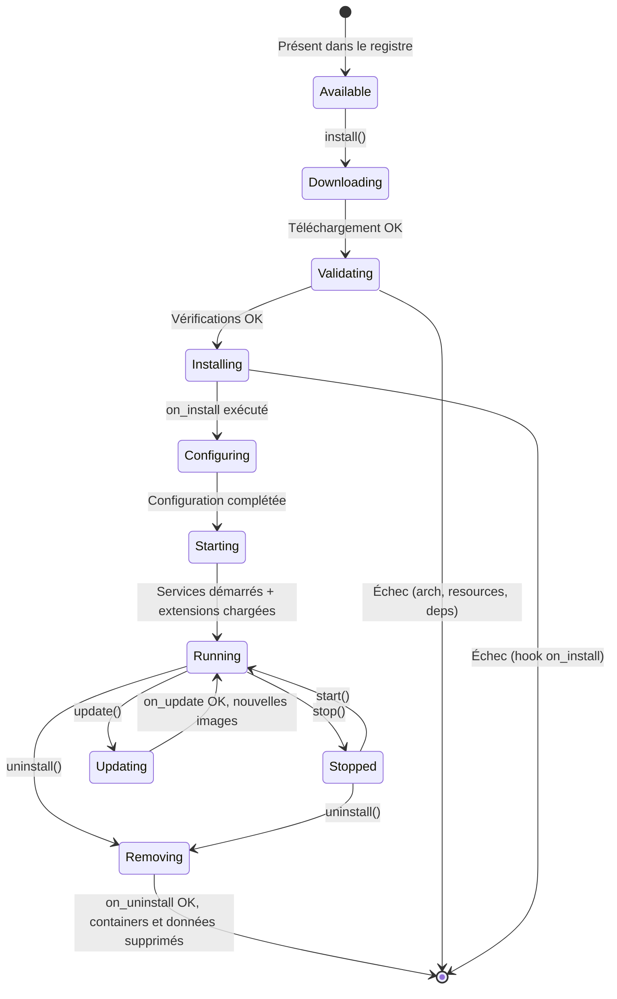

# Architecture Modulaire - WindFlow

## Philosophie

WindFlow repose sur un principe simple : **le core fait le minimum, les plugins font le reste**.

Le core gère les containers Docker, les machines virtuelles, l'authentification, et le système de plugins lui-même. Tout ce qui n'est pas strictement nécessaire pour piloter du compute (reverse proxy, DNS, bases de données, monitoring, backup, IA, mail, workflows, SSO…) est un plugin installable et désinstallable à la demande.

Cette approche a trois avantages concrets :

- **Empreinte minimale** : Un Raspberry Pi avec 2 Go de RAM ne charge que le core (~500 Mo). Les plugins consomment des ressources uniquement quand ils sont installés.
- **Pas de complexité imposée** : Un homelab n'a pas besoin de Keycloak. Un petit serveur n'a pas besoin d'Elasticsearch. L'utilisateur installe uniquement ce dont il a besoin.
- **Extensibilité ouverte** : N'importe qui peut créer un plugin et le distribuer. Le SDK est documenté, le format est ouvert.

### Core vs Plugins — Règle de Décision

Quand une fonctionnalité est envisagée, la question est : "Est-ce que WindFlow est inutilisable sans ?" Si la réponse est non, c'est un plugin.

| Appartient au Core                     | Est un Plugin |
|----------------------------------------|---------------|
| Gestion containers Docker, Podman, K8s | Reverse proxy (Traefik, Caddy) |
| Gestion VMs (KVM, LXD, Incus)          | DNS (Pi-hole, CoreDNS) |
| Auth JWT + RBAC                        | Monitoring (Uptime Kuma, Prometheus) |
| Plugin Manager + Marketplace           | Backup (Restic, Borg) |
| Target Manager (local, SSH)            | Bases de données (PostgreSQL manager, Redis manager) |
| Volumes et networks Docker             | Mail (Mailu, Stalwart) |
| CLI / TUI / Web UI                     | IA (Ollama, LiteLLM) |
|                                        | SSO (Keycloak) |
|                                        | Git auto-deploy |
|                                        | Workflows (n8n, Node-RED) |

---

## Types de Plugins

WindFlow reconnaît trois types de plugins. Le type est déclaré dans le manifest.

### Service Plugin

Un service plugin déploie une **stack Docker préconfigurée**. Il ne modifie pas le core — il ajoute juste un ou plusieurs containers gérés par WindFlow.

**Exemple : Plugin Uptime Kuma**
- Déploie un container Uptime Kuma
- Ajoute un widget sur le dashboard WindFlow (via un iframe ou une API simple)
- L'utilisateur configure Uptime Kuma directement dans son interface native

**Contenu typique :**
```
uptime-kuma/
├── windflow-plugin.yml          # Manifest
├── docker-compose.yml           # Stack à déployer
├── config-schema.yml            # Schéma de configuration (génère le wizard)
├── icon.svg                     # Icône pour la marketplace
└── scripts/
    ├── install.sh               # Hook post-installation
    └── uninstall.sh             # Hook pré-désinstallation
```

### Extension Plugin

Un extension plugin **ajoute des fonctionnalités au core** sans déployer de nouveau container. Il détecte des services existants et enrichit l'interface avec des actions contextuelles.

**Exemple : Plugin PostgreSQL Manager**
- Détecte les containers basés sur l'image `postgres`
- Ajoute des boutons "Créer une DB", "Créer un utilisateur", "Backup" dans l'UI
- Ajoute des endpoints API (`/api/v1/plugins/postgresql/databases`, etc.)
- Ne déploie rien — il interagit avec les containers PostgreSQL déjà présents

**Contenu typique :**
```
postgresql-manager/
├── windflow-plugin.yml          # Manifest
├── config-schema.yml            # Configuration (ex: timeout de connexion)
├── icon.svg
├── extensions/
│   ├── api.py                   # Endpoints FastAPI
│   ├── hooks.py                 # Réactions aux événements core
│   └── ui/                      # Composants UI
│       ├── routes.json          # Pages à ajouter au menu
│       └── components/          # Composants Vue.js
└── scripts/
    └── install.sh
```

### Hybrid Plugin

Un hybrid plugin fait les deux : il **déploie un service ET étend le core**. C'est le type le plus puissant.

**Exemple : Plugin Traefik**
- Déploie un container Traefik (service)
- Ajoute une page "Domaines & Routage" dans l'UI de WindFlow (extension)
- Ajoute des endpoints API pour gérer les routes (extension)
- S'abonne à l'événement `stack.deployed` pour auto-configurer le routage (extension)

**Contenu typique :**
```
traefik/
├── windflow-plugin.yml          # Manifest
├── docker-compose.yml           # Stack Traefik
├── config-schema.yml            # Configuration (email ACME, dashboard, etc.)
├── icon.svg
├── extensions/
│   ├── api.py                   # Endpoints API (gestion domaines, routes)
│   ├── hooks.py                 # Hook on_stack_deployed → auto-route
│   └── ui/
│       ├── routes.json          # Page "Domaines" dans le menu
│       └── components/
│           ├── DomainsPage.vue  # Page de gestion des domaines
│           └── TraefikWidget.vue # Widget dashboard
├── templates/
│   └── traefik-dynamic.yml.j2  # Template de config Traefik dynamique
└── scripts/
    ├── install.sh
    ├── configure.sh
    └── uninstall.sh
```

---

## Manifest Plugin

Chaque plugin contient un fichier `windflow-plugin.yml` à sa racine. C'est le contrat entre le plugin et le Plugin Manager.

### Spécification Complète

```yaml
# ===== Identité =====
name: traefik                          # Identifiant unique (a-z, 0-9, tirets)
version: 1.2.0                         # Semver
display_name: "Traefik"                # Nom affiché dans l'UI
description: "Reverse proxy avec TLS automatique via Let's Encrypt"
long_description: |                    # Description longue (Markdown supporté)
  Traefik est un reverse proxy moderne qui s'intègre nativement
  avec Docker. Ce plugin déploie Traefik et permet d'associer
  des noms de domaine à vos services depuis l'interface WindFlow.
category: access                       # Catégorie marketplace
tags: ["reverse-proxy", "tls", "https", "letsencrypt"]
icon: icon.svg                         # Icône (SVG ou PNG, 128x128 max)
author: "WindFlow Team"
license: MIT
homepage: "https://github.com/windflow/plugin-traefik"

# ===== Type =====
type: hybrid                           # service | extension | hybrid

# ===== Compatibilité =====
architectures:                         # Architectures supportées
  - linux/amd64
  - linux/arm64

windflow_version: ">=1.1.0"            # Version minimum de WindFlow

resources:                             # Ressources nécessaires
  ram_min_mb: 128                      # RAM minimum pour le plugin
  cpu_min_cores: 0.5                   # CPU minimum
  disk_min_mb: 100                     # Espace disque minimum

# ===== Dépendances =====
dependencies:
  requires:                            # Plugins ou capabilities requis
    - docker                           # Nécessite Docker sur le target
  optional:                            # Plugins optionnels qui enrichissent
    - cloudflare-dns                   # Pour DNS challenge Let's Encrypt
  conflicts:                           # Plugins incompatibles
    - nginx-proxy-manager              # Conflit de ports 80/443

# ===== Capabilities =====
provides:                              # Capabilities fournies par ce plugin
  - reverse_proxy                      # D'autres plugins peuvent dépendre de ça
  - tls_certificates

# ===== Ports =====
ports:                                 # Ports exposés par le service
  - port: 80
    protocol: tcp
    description: "HTTP"
  - port: 443
    protocol: tcp
    description: "HTTPS"
  - port: 8080
    protocol: tcp
    description: "Dashboard Traefik"
    optional: true                     # Exposé seulement si dashboard_enabled

# ===== Configuration Utilisateur =====
config:
  - key: acme_email
    label: "Email pour Let's Encrypt"
    description: "Utilisé pour les notifications d'expiration de certificats"
    type: string
    required: true
    validation: "^[^@]+@[^@]+\\.[^@]+$"  # Regex de validation

  - key: dashboard_enabled
    label: "Activer le dashboard Traefik"
    type: boolean
    default: true

  - key: log_level
    label: "Niveau de logs"
    type: select
    options:
      - value: "DEBUG"
        label: "Debug"
      - value: "INFO"
        label: "Info"
      - value: "WARN"
        label: "Warning"
      - value: "ERROR"
        label: "Error"
    default: "INFO"

  - key: custom_entrypoints
    label: "Ports supplémentaires"
    description: "Ports additionnels à ouvrir (ex: 8443 pour HTTPS alternatif)"
    type: string
    required: false

# ===== Fichiers =====
compose_file: docker-compose.yml       # Stack Docker (service et hybrid)
config_schema: config-schema.yml       # Schéma de configuration

extensions:                            # Code d'extension (extension et hybrid)
  api_module: extensions/api.py
  hooks_module: extensions/hooks.py
  ui_routes: extensions/ui/routes.json
  ui_components: extensions/ui/components/

# ===== Hooks Lifecycle =====
hooks:
  on_install: scripts/install.sh       # Après téléchargement, avant premier start
  on_configure: scripts/configure.sh   # Après changement de configuration
  on_start: null                       # Au démarrage (optionnel)
  on_stop: null                        # À l'arrêt (optionnel)
  on_update: scripts/update.sh         # Avant mise à jour
  on_uninstall: scripts/uninstall.sh   # Avant suppression

# ===== Détection Automatique (extension plugins) =====
auto_detect:                           # Détection de services existants
  docker_images:                       # Images Docker qui activent le plugin
    - "traefik"
    - "traefik:*"
```

### Types de Configuration Supportés

| Type | Rendu UI | Exemple |
|------|----------|---------|
| `string` | Champ texte | Email, URL, chemin |
| `password` | Champ masqué (valeur chiffrée en base) | Mots de passe, tokens |
| `boolean` | Toggle | Activer/désactiver une option |
| `integer` | Champ numérique | Port, nombre de workers |
| `select` | Menu déroulant | Niveau de logs, mode |
| `multiline` | Textarea | Configuration custom, certificats |

Options supplémentaires par champ :
- `required` : obligatoire ou non
- `default` : valeur par défaut
- `validation` : regex de validation
- `generate: true` : propose un bouton "Générer" (pour les mots de passe)
- `visible_if` : conditionne l'affichage à une capability ou un autre plugin installé

---

## Plugin Manager

Le Plugin Manager est le module core qui orchestre le cycle de vie des plugins.

### Cycle de Vie



### Étapes d'Installation Détaillées

```
1. DOWNLOAD
   ├── Télécharger le package depuis le registre
   ├── Vérifier le checksum SHA-256
   └── Extraire dans /data/plugins/{name}/

2. VALIDATE
   ├── Parser le manifest windflow-plugin.yml
   ├── Vérifier l'architecture (arm64 / amd64)
   ├── Vérifier les ressources disponibles (RAM, CPU, disque)
   ├── Vérifier les dépendances (plugins requis installés ?)
   ├── Vérifier les conflits (plugins incompatibles ?)
   └── Vérifier la version WindFlow minimale

3. INSTALL
   ├── Exécuter le hook on_install (si défini)
   ├── [Service/Hybrid] Déployer docker-compose.yml
   │   ├── Pull des images Docker
   │   ├── Créer le network plugin si nécessaire
   │   └── docker compose up -d
   └── [Extension/Hybrid] Charger le code Python
       ├── Importer api_module → enregistrer les routes FastAPI
       ├── Importer hooks_module → s'abonner aux événements
       └── Enregistrer ui_routes et ui_components

4. CONFIGURE
   ├── Afficher le wizard de configuration (généré depuis config_schema)
   ├── Stocker les valeurs en base (chiffrées si type=password)
   ├── Injecter la configuration dans le container (env vars ou fichier)
   └── Exécuter le hook on_configure (si défini)

5. RUNNING
   ├── Le plugin est actif
   ├── Les endpoints API sont disponibles
   ├── Les pages UI sont visibles dans le menu
   └── Les hooks événements sont actifs
```

### Gestion des Erreurs

Si une étape échoue, le Plugin Manager effectue un rollback :

- Échec au step INSTALL → supprimer les fichiers téléchargés
- Échec au déploiement Docker → `docker compose down`, nettoyer
- Échec au chargement d'extension → désenregistrer les routes partiellement chargées
- Échec du hook on_install → rollback complet

L'utilisateur voit un message d'erreur explicatif dans l'UI avec la cause et la suggestion de résolution.

### Stockage des Plugins

```
/data/plugins/
├── traefik/
│   ├── windflow-plugin.yml
│   ├── docker-compose.yml
│   ├── extensions/
│   └── scripts/
├── postgresql-manager/
│   ├── windflow-plugin.yml
│   ├── extensions/
│   └── scripts/
└── uptime-kuma/
    ├── windflow-plugin.yml
    ├── docker-compose.yml
    └── scripts/
```

Les données persistantes des plugins (bases de données, fichiers de config générés) sont stockées dans des volumes Docker nommés `windflow-plugin-{name}-data`.

---

## Système d'Événements

Le core émet des événements lors d'actions importantes. Les extension/hybrid plugins peuvent s'y abonner pour réagir automatiquement.

### Événements Disponibles

| Événement | Émis quand | Données |
|-----------|------------|---------|
| `container.created` | Un container est créé | container_id, name, image, target_id |
| `container.started` | Un container démarre | container_id, name, target_id |
| `container.stopped` | Un container s'arrête | container_id, name, target_id |
| `container.removed` | Un container est supprimé | container_id, name, target_id |
| `stack.deployed` | Une stack est déployée | stack_id, name, services[], target_id |
| `stack.updated` | Une stack est mise à jour | stack_id, name, previous_version, new_version |
| `stack.removed` | Une stack est supprimée | stack_id, name, target_id |
| `vm.created` | Une VM est créée | vm_id, name, hypervisor, target_id |
| `vm.started` | Une VM démarre | vm_id, name, target_id |
| `vm.stopped` | Une VM s'arrête | vm_id, name, target_id |
| `deployment.started` | Un déploiement commence | deployment_id, stack_id |
| `deployment.succeeded` | Un déploiement réussit | deployment_id, stack_id, duration |
| `deployment.failed` | Un déploiement échoue | deployment_id, stack_id, error |
| `target.added` | Un target est ajouté | target_id, name, type, capabilities |
| `target.removed` | Un target est supprimé | target_id, name |
| `plugin.installed` | Un plugin est installé | plugin_name, version |
| `plugin.removed` | Un plugin est désinstallé | plugin_name |

### Implémentation des Hooks

Un plugin déclare ses hooks dans un fichier Python :

```python
# extensions/hooks.py

from windflow.plugins.hooks import PluginHooks, on_event

class TraefikHooks(PluginHooks):
    """Hooks du plugin Traefik."""

    def __init__(self, plugin_config: dict, traefik_api):
        self.config = plugin_config
        self.traefik = traefik_api

    @on_event("stack.deployed")
    async def auto_configure_route(self, event):
        """Configure automatiquement une route Traefik quand une stack est déployée."""
        for service in event.data.get("services", []):
            labels = service.get("labels", {})
            domain = labels.get("windflow.domain")
            if domain:
                await self.traefik.add_route(
                    domain=domain,
                    backend=f"http://{service['name']}:{service['port']}",
                    tls=True,
                )

    @on_event("stack.removed")
    async def remove_routes(self, event):
        """Supprime les routes quand une stack est supprimée."""
        await self.traefik.remove_routes_for_stack(event.data["stack_id"])

    @on_event("deployment.failed")
    async def notify_on_failure(self, event):
        """Log l'échec dans le dashboard Traefik."""
        # Optionnel : actions sur échec de déploiement
        pass
```

### Bus d'Événements

En mode standard (avec Redis), les événements passent par Redis Pub/Sub. En mode léger (sans Redis), un bus en mémoire basé sur `asyncio.Queue` est utilisé. L'interface est identique pour les plugins.

```python
# Côté core — émission d'un événement
await event_bus.emit("stack.deployed", {
    "stack_id": stack.id,
    "name": stack.name,
    "services": [{"name": s.name, "port": s.port, "labels": s.labels} for s in stack.services],
    "target_id": target.id,
})

# Côté plugin — réception (géré automatiquement par le Plugin Manager)
# Le Plugin Manager appelle la méthode décorée @on_event du plugin
```

---

## Extension de l'API

Les extension/hybrid plugins peuvent ajouter des endpoints à l'API REST de WindFlow. Les routes sont enregistrées dynamiquement au chargement du plugin.

### Déclaration des Routes

```python
# extensions/api.py

from fastapi import APIRouter, Depends
from windflow.plugins.api import plugin_router
from windflow.auth.deps import get_current_user

router = plugin_router("traefik")  # Préfixe automatique : /api/v1/plugins/traefik

@router.get("/domains")
async def list_domains(user=Depends(get_current_user)):
    """Liste les domaines configurés dans Traefik."""
    return await traefik_service.list_domains()

@router.post("/domains")
async def add_domain(request: AddDomainRequest, user=Depends(get_current_user)):
    """Ajoute un domaine et configure le routage."""
    return await traefik_service.add_domain(request.domain, request.service, request.tls)

@router.delete("/domains/{domain}")
async def remove_domain(domain: str, user=Depends(get_current_user)):
    """Supprime un domaine."""
    return await traefik_service.remove_domain(domain)

@router.get("/status")
async def traefik_status(user=Depends(get_current_user)):
    """Statut du reverse proxy Traefik."""
    return await traefik_service.get_status()
```

Les routes sont automatiquement :
- Préfixées par `/api/v1/plugins/{plugin_name}/`
- Protégées par l'authentification JWT de WindFlow
- Documentées dans OpenAPI (apparaissent dans `/api/docs`)
- Désenregistrées quand le plugin est désinstallé

---

## Extension de l'UI

Les plugins peuvent ajouter des pages et des widgets à l'interface web de WindFlow.

### Déclaration des Routes UI

```json
// extensions/ui/routes.json
{
  "pages": [
    {
      "path": "domains",
      "label": "Domaines & Routage",
      "icon": "globe",
      "component": "DomainsPage.vue",
      "menu_section": "plugins",
      "menu_order": 10
    }
  ],
  "widgets": [
    {
      "id": "traefik-status",
      "component": "TraefikWidget.vue",
      "position": "dashboard",
      "size": "small",
      "refresh_interval": 30
    }
  ]
}
```

### Composants Vue.js

Les composants UI des plugins sont des Single File Components Vue.js standard. Ils ont accès à l'API WindFlow via un client injecté :

```vue
<!-- extensions/ui/components/DomainsPage.vue -->
<template>
  <div>
    <h2>Domaines & Routage</h2>
    <el-table :data="domains" v-loading="loading">
      <el-table-column prop="domain" label="Domaine" />
      <el-table-column prop="service" label="Service" />
      <el-table-column prop="tls" label="TLS">
        <template #default="{ row }">
          <el-tag :type="row.tls ? 'success' : 'warning'">
            {{ row.tls ? 'Actif' : 'Inactif' }}
          </el-tag>
        </template>
      </el-table-column>
      <el-table-column label="Actions">
        <template #default="{ row }">
          <el-button size="small" type="danger" @click="removeDomain(row.domain)">
            Supprimer
          </el-button>
        </template>
      </el-table-column>
    </el-table>
  </div>
</template>

<script setup>
import { ref, onMounted } from 'vue'
import { usePluginApi } from '@windflow/plugin-sdk'

const api = usePluginApi('traefik')
const domains = ref([])
const loading = ref(true)

onMounted(async () => {
  domains.value = await api.get('/domains')
  loading.value = false
})

const removeDomain = async (domain) => {
  await api.delete(`/domains/${domain}`)
  domains.value = domains.value.filter(d => d.domain !== domain)
}
</script>
```

### Chargement Dynamique

Le frontend WindFlow charge les composants des plugins installés au démarrage. Le mécanisme :

1. L'API retourne la liste des plugins installés avec leurs `ui_routes`
2. Le router Vue.js ajoute dynamiquement les routes des plugins
3. Les composants sont chargés en lazy-loading depuis le serveur
4. Les widgets dashboard sont rendus dans les emplacements prévus

Quand un plugin est désinstallé, ses routes et widgets disparaissent au prochain rafraîchissement.

---

## Registre et Marketplace

### Registre de Plugins

Le registre est un **index JSON statique** hébergeable n'importe où : GitHub Pages, serveur web, ou self-hosted. Pas de base de données, pas de service complexe.

**Format du registre :**

```json
{
  "version": 1,
  "updated_at": "2026-06-15T10:00:00Z",
  "plugins": [
    {
      "name": "traefik",
      "display_name": "Traefik",
      "version": "1.2.0",
      "type": "hybrid",
      "category": "access",
      "description": "Reverse proxy avec TLS automatique",
      "author": "WindFlow Team",
      "license": "MIT",
      "architectures": ["linux/amd64", "linux/arm64"],
      "resources": { "ram_min_mb": 128, "cpu_min_cores": 0.5 },
      "windflow_version": ">=1.1.0",
      "download_url": "https://plugins.windflow.io/packages/traefik-1.2.0.tar.gz",
      "checksum": "sha256:a1b2c3d4e5f6...",
      "icon_url": "https://plugins.windflow.io/icons/traefik.svg",
      "homepage": "https://github.com/windflow/plugin-traefik",
      "official": true
    }
  ]
}
```

**Configuration du registre dans WindFlow :**

```bash
# Registre officiel (par défaut)
windflow registry list
# → https://plugins.windflow.io/index.json (officiel)

# Ajouter un registre custom
windflow registry add https://my-company.com/windflow-plugins/index.json

# Rafraîchir le catalogue
windflow marketplace refresh
```

### Registre Self-Hosted

Pour un usage interne ou en réseau isolé, il suffit de servir un fichier JSON et les packages .tar.gz depuis n'importe quel serveur HTTP :

```
my-registry/
├── index.json            # Catalogue
└── packages/
    ├── my-plugin-1.0.0.tar.gz
    └── another-plugin-2.1.0.tar.gz
```

```bash
# Servir avec un simple serveur HTTP
cd my-registry && python -m http.server 8000

# Ajouter dans WindFlow
windflow registry add http://192.168.1.10:8000/index.json
```

### Marketplace (UI)

La marketplace dans l'UI WindFlow agrège les plugins de tous les registres configurés et affiche :

- **Catalogue** avec catégories, recherche, filtres (architecture, officiel/communautaire)
- **Fiche plugin** : description, captures d'écran, ressources requises, changelog
- **Indicateurs de compatibilité** : ✓ compatible / ✗ architecture non supportée / ⚠ ressources insuffisantes
- **Bouton installer** avec wizard de configuration
- **Onglet "Installés"** : plugins actifs, mises à jour disponibles

---

## Guide : Créer un Plugin

### 1. Scaffolding

```bash
# Créer la structure d'un nouveau plugin
windflow plugin create my-plugin --type extension

# Résultat :
# my-plugin/
# ├── windflow-plugin.yml
# ├── config-schema.yml
# ├── icon.svg
# ├── extensions/
# │   ├── api.py
# │   ├── hooks.py
# │   └── ui/
# │       ├── routes.json
# │       └── components/
# │           └── MyPluginPage.vue
# ├── scripts/
# │   ├── install.sh
# │   └── uninstall.sh
# └── README.md
```

### 2. Éditer le Manifest

Remplir `windflow-plugin.yml` avec l'identité, le type, les architectures, les ressources, et la configuration du plugin. Voir la section "Manifest Plugin" ci-dessus.

### 3. Implémenter les Extensions

**API (extensions/api.py)** — Ajouter des endpoints :

```python
from windflow.plugins.api import plugin_router
router = plugin_router("my-plugin")

@router.get("/status")
async def status():
    return {"status": "ok", "message": "Mon plugin fonctionne"}
```

**Hooks (extensions/hooks.py)** — Réagir aux événements :

```python
from windflow.plugins.hooks import PluginHooks, on_event

class MyPluginHooks(PluginHooks):
    @on_event("container.started")
    async def on_container_start(self, event):
        image = event.data.get("image", "")
        if "my-target-image" in image:
            # Faire quelque chose quand un container spécifique démarre
            pass
```

**UI (extensions/ui/)** — Ajouter des pages et widgets Vue.js.

### 4. Tester Localement

```bash
# Installer le plugin en mode développement (lien symbolique)
windflow plugin dev-install ./my-plugin

# Le plugin est chargé dynamiquement — modifier le code et recharger
# Les endpoints API sont immédiatement disponibles
# Les composants UI nécessitent un rafraîchissement du navigateur

# Voir les logs du plugin
windflow plugin logs my-plugin
```

### 5. Packager

```bash
# Créer le package distribuable
windflow plugin pack ./my-plugin
# → my-plugin-1.0.0.tar.gz

# Le package contient tous les fichiers du plugin
# Le checksum SHA-256 est affiché pour l'ajout au registre
```

### 6. Distribuer

Ajouter l'entrée dans un fichier `index.json` de registre et héberger le `.tar.gz` sur un serveur HTTP accessible.

---

## Sécurité des Plugins

### Isolation

- Les **service plugins** tournent dans des containers Docker isolés. Ils n'ont pas accès au filesystem de WindFlow ni à la base de données.
- Les **extension plugins** s'exécutent dans le même processus que le core. Ils ont accès à l'API interne. C'est pourquoi seuls les plugins de confiance (officiels ou audités) devraient être installés comme extensions.

### Vérification d'Intégrité

Chaque package de plugin est vérifié par son checksum SHA-256 au téléchargement. Si le checksum ne correspond pas au registre, l'installation est refusée.

### Secrets des Plugins

Les valeurs de configuration de type `password` sont chiffrées en base avec la même clé que les secrets core (AES-256-GCM dérivée du `SECRET_KEY`). Elles ne sont jamais exposées dans les logs ni dans les réponses API.

### Permissions

Les endpoints API ajoutés par les plugins héritent de l'authentification JWT et du RBAC du core. Un utilisateur avec le rôle "Viewer" ne pourra pas appeler un endpoint d'écriture d'un plugin.

---

## Résumé des Conventions

| Convention | Règle |
|------------|-------|
| Nom de plugin | Minuscules, `a-z`, `0-9`, tirets. Ex : `postgresql-manager` |
| Manifest | `windflow-plugin.yml` à la racine |
| Compose | `docker-compose.yml` à la racine (service et hybrid) |
| Extensions Python | Dans `extensions/` |
| Extensions UI | Dans `extensions/ui/` |
| Scripts lifecycle | Dans `scripts/` |
| Icône | `icon.svg` (SVG ou PNG 128x128) |
| Versioning | Semver (`1.2.3`) |
| Package | `{name}-{version}.tar.gz` |
| Volumes de données | `windflow-plugin-{name}-data` |
| Network | `windflow-plugin-{name}` (si isolé) |
| Préfixe API | `/api/v1/plugins/{name}/` |
| Préfixe routes UI | `/plugins/{name}/` |

---

**Références :**
- [Architecture](general_specs/02-architecture.md) — Architecture globale et vue d'ensemble des plugins
- [Fonctionnalités Principales](general_specs/10-core-features.md) — Features core et exemples de plugins
- [Stack Technologique](general_specs/03-technology-stack.md) — Technologies du Plugin Manager
- [Roadmap](general_specs/18-roadmap.md) — Phases de développement du plugin system
