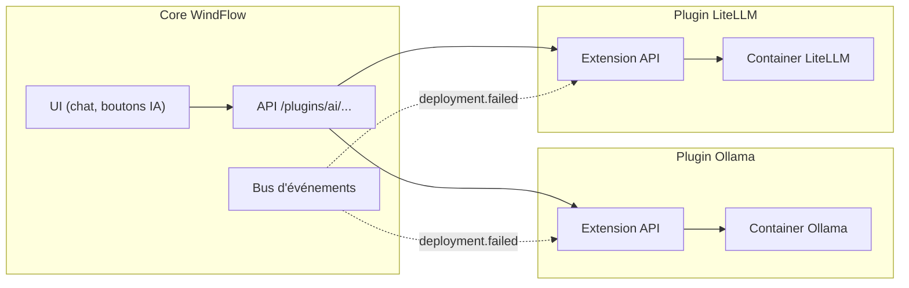

# Intégration LLM - WindFlow

## Vue d'Ensemble

L'intégration LLM dans WindFlow est fournie par les **plugins IA** — ce n'est pas une fonctionnalité du core. Les plugins Ollama et LiteLLM ajoutent des capacités d'intelligence artificielle à WindFlow pour ceux qui en ont besoin et dont la machine le permet.

L'IA dans WindFlow est un assistant, pas un pilier. WindFlow fonctionne parfaitement sans aucun plugin IA. L'IA est là pour ceux qui veulent aller plus vite : générer un docker-compose au lieu de l'écrire, diagnostiquer une erreur à partir de logs, ou obtenir des suggestions d'optimisation.

### Plugins IA Disponibles

| Plugin | Description | Prérequis |
|--------|-------------|-----------|
| **Ollama** | LLM local — pas de clé API, tout tourne sur votre machine | ≥ 8 Go RAM, GPU recommandé |
| **LiteLLM** | Proxy multi-provider — utilise des APIs cloud (OpenAI, Anthropic, etc.) | Clé API du provider choisi |

Les deux plugins peuvent être installés ensemble. Ollama pour le local/hors-ligne, LiteLLM pour les tâches complexes nécessitant un modèle plus puissant.

### Ce que l'IA peut faire dans WindFlow

- **Générer un docker-compose** à partir d'une description en langage naturel
- **Diagnostiquer des erreurs** : analyser les logs d'un déploiement raté et suggérer un fix
- **Suggérer des optimisations** : recommander des ajustements de ressources (CPU, RAM) basés sur l'usage
- **Chat assistant** intégré à l'UI pour poser des questions sur l'infrastructure
- **Suggestions de sécurité** : analyser une configuration et signaler les problèmes potentiels

### Ce que l'IA ne fait PAS

- L'IA ne prend pas de décisions automatiquement — elle suggère, l'utilisateur valide
- L'IA n'a pas accès aux secrets, mots de passe ou données sensibles
- L'IA ne modifie pas les configurations déployées sans action explicite de l'utilisateur

---

## Prérequis et Compatibilité

### Plugin Ollama (LLM local)

Ollama fait tourner un modèle de langage directement sur la machine. C'est la solution la plus simple (pas de clé API, pas de dépendance cloud), mais elle demande des ressources.

**Configuration requise :**

| Ressource | Minimum | Recommandé |
|-----------|---------|------------|
| RAM | 8 Go (modèles 7B) | 16 Go (modèles 13B+) |
| CPU | 4 cores | 8 cores ou GPU |
| Stockage | 5 Go par modèle | 20 Go pour plusieurs modèles |

**Compatibilité ARM :** Ollama supporte ARM64 (Raspberry Pi 5 avec 8 Go, Orange Pi 5). Sur un RPi 4, c'est trop juste — préférer LiteLLM avec une API cloud.

**Modèles recommandés pour WindFlow :**

| Modèle | Taille | RAM nécessaire | Usage |
|--------|--------|----------------|-------|
| `llama3.2:3b` | 2 Go | 4 Go | Chat rapide, questions simples |
| `llama3.1:8b` | 4.7 Go | 8 Go | Génération de configs, diagnostic |
| `codellama:13b` | 7 Go | 16 Go | Génération de docker-compose complexes |
| `mistral:7b` | 4.1 Go | 8 Go | Bon compromis général |

### Plugin LiteLLM (APIs cloud)

LiteLLM est un proxy qui connecte WindFlow à des APIs de LLM cloud. Il nécessite une clé API mais ne consomme quasiment pas de ressources locales.

**Providers supportés :**
- **OpenAI** : GPT-4o, GPT-4o-mini
- **Anthropic** : Claude 4 Sonnet, Claude 4 Haiku
- **Google** : Gemini
- **Groq** : Llama, Mixtral (rapide et peu cher)
- **Mistral AI** : Mistral Large, Mistral Small

**Configuration requise :** Négligeable (~50 Mo RAM). Nécessite une connexion internet et une clé API.

---

## Installation des Plugins IA

### Installer Ollama

```bash
# Depuis la CLI
windflow plugin install ollama

# Configuration
windflow plugin config ollama --set default_model=llama3.1:8b
```

Ou depuis l'UI : **Marketplace > IA > Ollama > Installer**

Le plugin déploie un container Ollama et télécharge le modèle par défaut. Le premier téléchargement peut prendre quelques minutes selon la connexion et la taille du modèle.

### Installer LiteLLM

```bash
# Depuis la CLI
windflow plugin install litellm

# Configuration avec une clé OpenAI
windflow plugin config litellm --set provider=openai --set api_key=sk-...

# Ou avec Anthropic
windflow plugin config litellm --set provider=anthropic --set api_key=sk-ant-...
```

Ou depuis l'UI : **Marketplace > IA > LiteLLM > Installer**

Le wizard de configuration demande le provider et la clé API.

### Utiliser les Deux Ensemble

Si les deux plugins sont installés, WindFlow utilise par défaut le modèle local (Ollama) pour les tâches simples et bascule sur LiteLLM (API cloud) pour les tâches complexes. Ce comportement est configurable.

---

## Fonctionnalités IA

### 1. Génération de Docker Compose

L'utilisateur décrit ce qu'il veut en langage naturel, et l'IA génère un docker-compose.yml complet.

**Depuis l'UI :** Bouton "Générer avec l'IA" dans l'éditeur de stacks.

**Depuis la CLI :**
```bash
windflow ai generate "Un blog WordPress avec une base de données MySQL et phpMyAdmin"
```

**Exemple de prompt interne :**

```python
COMPOSE_GENERATOR_PROMPT = """
Tu es un assistant spécialisé dans la création de fichiers docker-compose.yml.

Contexte WindFlow :
- Machine cible : {target_arch} ({target_os})
- Ressources disponibles : {available_cpu} CPU, {available_ram} Mo RAM
- Plugins installés : {installed_plugins}
- Réseau Docker par défaut : {default_network}

Règles :
- Utilise des images multi-arch (arm64 + amd64) quand possible
- Ajoute des health checks à chaque service
- Utilise des volumes nommés pour la persistance
- Génère des mots de passe aléatoires pour les services
- Si le plugin Traefik est installé, ajoute les labels Traefik
- Adapte les limites de ressources à la machine cible
- Réponds UNIQUEMENT avec un fichier docker-compose.yml valide, sans commentaire avant ou après

Demande utilisateur : {user_description}
"""
```

**Résultat :** Un docker-compose.yml est proposé dans l'éditeur. L'utilisateur peut le modifier avant de déployer. Rien n'est déployé automatiquement.

### 2. Diagnostic d'Erreurs

Quand un déploiement échoue, l'IA peut analyser les logs et la configuration pour identifier la cause et proposer une solution.

**Depuis l'UI :** Bouton "Diagnostiquer avec l'IA" sur un déploiement en erreur.

```python
DIAGNOSTIC_PROMPT = """
Tu es un assistant spécialisé dans le diagnostic d'erreurs de déploiement Docker.

Contexte :
- Stack déployé : {stack_name}
- Configuration docker-compose : 
{compose_content}

- Dernières lignes de logs :
{error_logs}

- État des containers :
{container_states}

Analyse l'erreur et fournis :
1. La cause probable (1-2 phrases)
2. La solution recommandée (étapes concrètes)
3. Comment éviter ce problème à l'avenir

Sois concis et pratique.
"""
```

**Résultat :** Un encart s'affiche avec le diagnostic et les étapes de correction. L'utilisateur peut appliquer la suggestion ou l'ignorer.

### 3. Chat Assistant

Un chat intégré à l'UI permet de poser des questions sur l'infrastructure gérée par WindFlow.

**Exemples de questions :**
- "Combien de RAM utilise ma stack Nextcloud ?"
- "Comment ajouter un volume à mon container PostgreSQL ?"
- "Pourquoi mon container se redémarre en boucle ?"
- "Génère un docker-compose pour un serveur Minecraft"

Le chat a accès au contexte de l'instance WindFlow (liste des containers, stacks, targets, logs récents) mais pas aux secrets.

```python
CHAT_SYSTEM_PROMPT = """
Tu es l'assistant IA de WindFlow, un gestionnaire d'infrastructure self-hosted.

Tu as accès aux informations suivantes sur l'instance de l'utilisateur :
- Targets (machines) : {targets_summary}
- Containers en cours : {containers_summary}
- Stacks déployées : {stacks_summary}
- Plugins installés : {plugins_summary}

Tu peux aider l'utilisateur à :
- Comprendre l'état de son infrastructure
- Résoudre des problèmes de déploiement
- Générer des configurations
- Expliquer des concepts Docker/VM

Tu ne peux PAS :
- Accéder aux mots de passe ou secrets
- Modifier directement l'infrastructure (tu suggères, l'utilisateur agit)
- Accéder à Internet ou à des données externes

Sois concis, pratique et adapté au niveau de l'utilisateur.
"""
```

### 4. Suggestions de Sécurité

L'IA peut analyser les configurations déployées et signaler des problèmes de sécurité courants.

**Vérifications :**
- Containers tournant en root sans nécessité
- Ports exposés inutilement sur 0.0.0.0
- Variables d'environnement avec des secrets en clair
- Images sans tag fixe (`:latest`)
- Absence de health checks
- Volumes montés en lecture-écriture quand lecture seule suffit

**Depuis l'UI :** Bouton "Audit sécurité" sur une stack → l'IA retourne une liste de recommandations triées par sévérité.

### 5. Suggestions d'Optimisation

Pour les stacks en production, l'IA peut analyser l'utilisation des ressources et proposer des ajustements.

**Exemple :** "Votre container PostgreSQL utilise en moyenne 120 Mo de RAM mais a une limite de 2 Go. Vous pourriez réduire la limite à 512 Mo et libérer de la RAM pour d'autres services."

Cette fonctionnalité nécessite un historique de métriques — elle fonctionne mieux avec un plugin de monitoring installé (Netdata, Prometheus).

---

## Architecture Technique

### Comment les Plugins IA s'Intègrent au Core



Les plugins IA sont des **hybrid plugins** : ils déploient un container (Ollama ou LiteLLM) et ajoutent des endpoints API + des composants UI au core.

### Endpoints API Ajoutés par les Plugins IA

```
POST   /api/v1/plugins/ai/generate     # Générer un docker-compose
POST   /api/v1/plugins/ai/diagnose     # Diagnostiquer une erreur
POST   /api/v1/plugins/ai/chat         # Chat assistant
POST   /api/v1/plugins/ai/audit        # Audit sécurité
POST   /api/v1/plugins/ai/optimize     # Suggestions d'optimisation
GET    /api/v1/plugins/ai/models       # Lister les modèles disponibles
PUT    /api/v1/plugins/ai/config       # Configurer le provider/modèle par défaut
```

### Service LLM (dans le plugin)

```python
from litellm import acompletion

class LLMService:
    """Service LLM utilisé par les plugins IA."""

    def __init__(self, config: dict):
        self.provider = config.get("provider", "ollama")
        self.model = config.get("model", "llama3.1:8b")
        self.ollama_url = config.get("ollama_url", "http://ollama:11434")
        self.api_key = config.get("api_key", None)

    async def complete(self, system_prompt: str, user_message: str) -> str:
        """Envoie une requête au LLM configuré."""

        if self.provider == "ollama":
            model = f"ollama/{self.model}"
            # LiteLLM gère la connexion à Ollama automatiquement
        else:
            model = self.model

        response = await acompletion(
            model=model,
            messages=[
                {"role": "system", "content": system_prompt},
                {"role": "user", "content": user_message},
            ],
            temperature=0.1,
            max_tokens=2000,
            api_base=self.ollama_url if self.provider == "ollama" else None,
            api_key=self.api_key if self.api_key else None,
        )

        return response.choices[0].message.content

    async def generate_compose(self, description: str, context: dict) -> str:
        """Génère un docker-compose à partir d'une description."""
        prompt = COMPOSE_GENERATOR_PROMPT.format(
            user_description=description,
            target_arch=context.get("arch", "amd64"),
            target_os=context.get("os", "linux"),
            available_cpu=context.get("cpu", "?"),
            available_ram=context.get("ram_mb", "?"),
            installed_plugins=", ".join(context.get("plugins", [])),
            default_network=context.get("network", "windflow"),
        )
        return await self.complete(COMPOSE_GENERATOR_PROMPT_SYSTEM, prompt)

    async def diagnose_error(self, stack_name: str, compose: str, logs: str, states: str) -> str:
        """Diagnostique une erreur de déploiement."""
        prompt = DIAGNOSTIC_PROMPT.format(
            stack_name=stack_name,
            compose_content=compose,
            error_logs=logs,
            container_states=states,
        )
        return await self.complete("", prompt)
```

### Cache des Réponses

Les réponses de génération et de diagnostic sont mises en cache pour éviter de re-solliciter le LLM pour la même requête. Le cache utilise le système de cache du core (Redis en mode standard, mémoire en mode léger).

```python
import hashlib

class LLMCache:
    """Cache des réponses LLM — utilise le cache core de WindFlow."""

    def __init__(self, cache_backend):
        self.cache = cache_backend  # Redis ou MemoryCache selon le mode
        self.ttl = 3600 * 24  # 24 heures

    def _hash_prompt(self, prompt: str) -> str:
        return hashlib.sha256(prompt.encode()).hexdigest()[:16]

    async def get(self, prompt: str, model: str):
        key = f"llm:{model}:{self._hash_prompt(prompt)}"
        return await self.cache.get(key)

    async def set(self, prompt: str, model: str, response: str):
        key = f"llm:{model}:{self._hash_prompt(prompt)}"
        await self.cache.set(key, response, ttl=self.ttl)
```

---

## Configuration

### Configuration Plugin Ollama

```yaml
# Accessible depuis l'UI : Plugins > Ollama > Configuration
# Ou via CLI : windflow plugin config ollama

default_model: "llama3.1:8b"        # Modèle par défaut
gpu_enabled: false                   # Activer l'accélération GPU (si disponible)
max_concurrent_requests: 2           # Requêtes simultanées max
pull_models_on_install:              # Modèles à télécharger à l'installation
  - "llama3.1:8b"
```

### Configuration Plugin LiteLLM

```yaml
# Accessible depuis l'UI : Plugins > LiteLLM > Configuration
# Ou via CLI : windflow plugin config litellm

provider: "openai"                   # openai, anthropic, groq, mistral, google
api_key: "sk-..."                    # Clé API (stockée chiffrée)
default_model: "gpt-4o-mini"         # Modèle par défaut
fallback_model: "gpt-4o"             # Modèle de repli pour les tâches complexes
max_tokens: 2000                     # Limite de tokens par requête
monthly_budget_usd: 10.0             # Budget mensuel max (0 = illimité)
```

### Configuration Combinée (Ollama + LiteLLM)

Quand les deux sont installés :

```yaml
# windflow plugin config ai

routing:
  simple_tasks: "ollama"             # Questions simples → modèle local
  complex_tasks: "litellm"           # Génération complexe → API cloud
  fallback: "litellm"               # Si Ollama est surchargé → API cloud
```

---

## Limites et Considérations

### Qualité des Réponses

Les LLM peuvent générer des configurations incorrectes ou des diagnostics erronés. WindFlow affiche toujours les suggestions dans un éditeur modifiable — l'utilisateur doit vérifier avant d'appliquer.

Pour la génération de docker-compose, WindFlow valide la syntaxe YAML et vérifie que les images référencées existent. Mais la logique de la configuration (bons ports, bonnes variables d'environnement) reste de la responsabilité de l'utilisateur.

### Vie Privée

- **Ollama** : Tout tourne en local. Aucune donnée ne quitte la machine.
- **LiteLLM** : Les prompts sont envoyés au provider cloud choisi. Les logs et configurations de l'infrastructure sont inclus dans les prompts de diagnostic. Si c'est un problème, utiliser Ollama uniquement.

Les secrets (mots de passe, clés API, tokens) ne sont jamais inclus dans les prompts envoyés au LLM — WindFlow les masque automatiquement.

### Performance sur ARM

- Ollama sur Raspberry Pi 5 (8 Go) : fonctionne avec des modèles 3B-7B, temps de réponse de 10-30 secondes
- Ollama sur Raspberry Pi 4 : non recommandé (trop lent, risque de OOM)
- LiteLLM fonctionne sur n'importe quelle machine (c'est juste un proxy HTTP)

---

**Références :**
- [Vue d'Ensemble](01-overview.md) - Vision du projet
- [Architecture](02-architecture.md) - Système de plugins
- [Stack Technologique](03-technology-stack.md) - Technologies
- [Fonctionnalités Principales](10-core-features.md) - Features core
- [Roadmap](18-roadmap.md) - Plan de développement (plugins IA en Phase 5)
