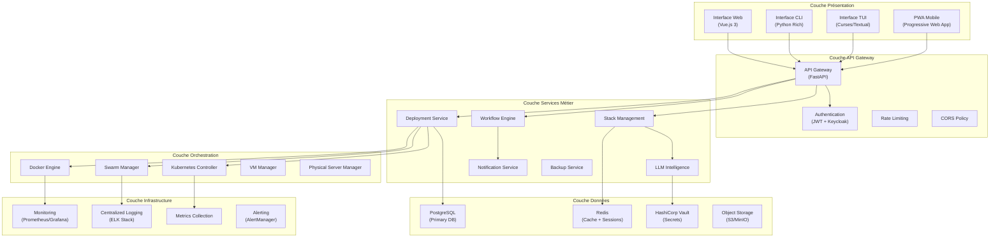
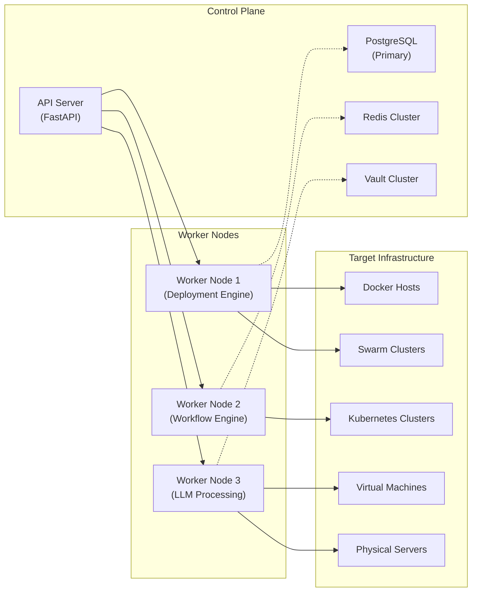
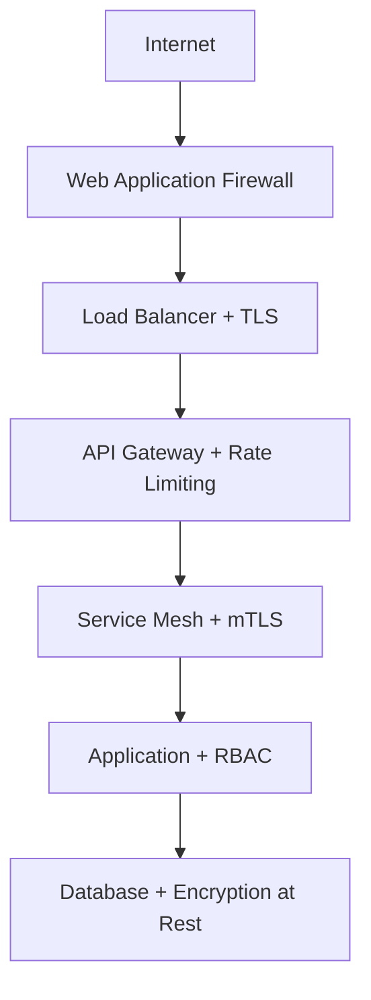

# Architecture Générale - WindFlow

## Principes de Conception

### Philosophie Architecturale

WindFlow est conçu selon les principes d'architecture moderne orientés microservices avec une approche **API-First** et **Cloud-Native**.

**Principes Fondamentaux :**
- **Modularité** : Composants découplés et interchangeables
- **Évolutivité** : Scaling horizontal et vertical transparent
- **Résilience** : Tolérance aux pannes avec auto-récupération
- **Sécurité by Design** : Sécurité intégrée à tous les niveaux
- **Observabilité** : Monitoring et logging natifs

### Architecture en Couches



## Architecture Distribuée

### Modèle de Déploiement Multi-Nœuds



### Patterns Architecturaux

**Event-Driven Architecture**
- Communication asynchrone via messages
- Découplage fort entre services
- Gestion des événements avec Redis Streams
- Pattern CQRS pour la séparation lecture/écriture

**Circuit Breaker Pattern**
- Protection contre les cascades de pannes
- Fallback automatique en cas d'indisponibilité
- Monitoring de la santé des services externes

**Saga Pattern**
- Gestion des transactions distribuées
- Compensation automatique en cas d'échec
- Workflow de déploiement resilient

## Gestion d'État et Données

### Architecture de Données

```mermaid
erDiagram
    User ||--o{ Organization : belongs_to
    Organization ||--o{ Environment : contains
    Environment ||--o{ Element : contains
    Element ||--o{ Stack : manages
    Stack ||--o{ Application : contains
    Application ||--o{ Deployment : creates
    Deployment ||--o{ DeploymentEvent : generates
    
    User {
        uuid id
        string username
        string email
        string hashed_password
        boolean is_superadmin
        timestamp created_at
        timestamp last_login
    }
    
    Organization {
        uuid id
        string name
        string description
        json settings
        timestamp created_at
    }
    
    Environment {
        uuid id
        string name
        string environment_type
        uuid organization_id
        json configuration
        timestamp created_at
    }
    
    Stack {
        uuid id
        string name
        string template_id
        uuid element_id
        json configuration
        boolean llm_optimized
        timestamp created_at
    }
    
    Deployment {
        uuid id
        string status
        uuid stack_id
        json configuration
        timestamp started_at
        timestamp completed_at
        text logs
    }
```



### Stratégie de Cache

**Redis Multi-Level Caching**
- **L1 Cache** : Configuration des applications (TTL: 15 min)
- **L2 Cache** : Métadonnées des stacks (TTL: 1 heure)
- **L3 Cache** : Templates marketplace (TTL: 24 heures)
- **Session Cache** : Sessions utilisateur (TTL: 7 jours)

**Cache Invalidation Strategy**
- Invalidation par tags pour les mises à jour atomiques
- Write-through cache pour les données critiques
- Lazy loading pour les données volumineuses

## Communication Inter-Services

### API Design Patterns

**RESTful APIs avec HATEOAS**
```python
# Exemple de réponse API avec hypermedia
{
    "id": "stack-123",
    "name": "web-application",
    "status": "deployed",
    "_links": {
        "self": "/api/v1/stacks/stack-123",
        "applications": "/api/v1/stacks/stack-123/applications",
        "logs": "/api/v1/stacks/stack-123/logs",
        "rollback": "/api/v1/stacks/stack-123/rollback"
    },
    "_actions": {
        "scale": {
            "href": "/api/v1/stacks/stack-123/scale",
            "method": "POST",
            "schema": {"replicas": "integer"}
        }
    }
}
```

**WebSocket pour Temps Réel**
- Notifications push des événements de déploiement
- Streaming des logs en temps réel
- Mises à jour de statut live
- Collaboration multi-utilisateur

**GraphQL pour Queries Complexes**
- API unifiée pour les dashboards complexes
- Optimisation des requêtes avec DataLoader
- Subscriptions pour les mises à jour temps réel

### Message Queuing

**Architecture Pub/Sub avec Redis Streams**
```python
# Exemple de structure d'événement
deployment_event = {
    "event_type": "deployment.started",
    "deployment_id": "deploy-456",
    "stack_id": "stack-123",
    "timestamp": "2025-01-15T14:30:00Z",
    "metadata": {
        "user_id": "user-789",
        "environment": "production",
        "target_type": "kubernetes"
    }
}
```

**Event Streaming Topics**
- `deployments.*` : Événements de déploiement
- `workflows.*` : Exécution des workflows
- `monitoring.*` : Métriques et alertes
- `notifications.*` : Notifications utilisateur

## Sécurité Architecturale

### Security by Design

**Zero Trust Architecture**
- Authentification continue à tous les niveaux
- Chiffrement end-to-end pour toutes les communications
- Validation et autorisation granulaire
- Audit trail complet et immutable

**Defense in Depth**


### Gestion des Secrets

**HashiCorp Vault Integration**
- Stockage sécurisé de tous les credentials
- Rotation automatique des secrets
- Audit complet des accès
- Dynamic secrets pour les services temporaires

**Secret Injection Pattern**
- Injection au runtime via variables d'environnement
- Mount de volumes secrets pour les fichiers
- API sécurisée pour la récupération des secrets
- Chiffrement en transit et au repos

## Monitoring et Observabilité

### Three Pillars of Observability

**Metrics (Prometheus)**
- Métriques applicatives : latence, throughput, erreurs
- Métriques infrastructure : CPU, RAM, disque, réseau
- Métriques business : déploiements réussis, utilisateurs actifs
- Alerting automatique basé sur les seuils

**Logging (ELK Stack)**
- Logs structurés en JSON
- Centralisation avec Elasticsearch
- Visualisation avec Kibana
- Corrélation avec trace IDs

**Tracing (Jaeger)**
- Distributed tracing pour les requêtes complexes
- Performance profiling des workflows
- Détection des goulots d'étranglement
- Analyse des dépendances entre services

### Dashboards et Alerting

**Grafana Dashboards**
- Dashboard global : vue d'ensemble du système
- Dashboard par service : métriques détaillées
- Dashboard utilisateur : KPIs métier
- Dashboard infrastructure : santé des ressources

**AlertManager Configuration**
```yaml
# Exemple de règle d'alerte
groups:
- name: windflow-alerts
  rules:
  - alert: DeploymentFailureRate
    expr: rate(deployment_failures_total[5m]) > 0.1
    for: 2m
    labels:
      severity: warning
    annotations:
      summary: "High deployment failure rate"
      description: "Deployment failure rate is {{ $value }} failures/second"
```

## Patterns de Résilience

### Circuit Breaker Implementation

```python
from circuitbreaker import circuit

@circuit(failure_threshold=5, recovery_timeout=30)
async def deploy_to_kubernetes(deployment_config):
    """
    Déploiement avec circuit breaker pour éviter
    les cascades de pannes vers Kubernetes
    """
    try:
        return await k8s_client.deploy(deployment_config)
    except K8sConnectionError:
        # Fallback vers Docker Swarm si disponible
        return await swarm_client.deploy(deployment_config)
```

### Retry Policies

**Exponential Backoff with Jitter**
- Retry automatique avec délai croissant
- Jitter aléatoire pour éviter le thundering herd
- Maximum retry count configurable
- Dead letter queue pour les échecs persistants

### Health Checks

**Multi-Level Health Checks**
- **Liveness Probe** : Service basique fonctionnel
- **Readiness Probe** : Service prêt à recevoir du trafic
- **Startup Probe** : Service en cours de démarrage
- **Dependency Health** : Vérification des dépendances externes

## Scalabilité et Performance

### Horizontal Scaling Strategy

**Auto-Scaling Basé sur les Métriques**
- CPU/RAM utilization > 70% → Scale up
- Queue depth > 100 messages → Scale workers
- Response time > 2s → Scale API instances
- Custom metrics pour scaling business-driven

### Optimisations Performance

**Database Optimizations**
- Index optimisés pour les requêtes fréquentes
- Connection pooling avec pgbouncer
- Read replicas pour les requêtes analytiques
- Partitioning des tables de logs

**Caching Strategy**
- CDN pour les assets statiques
- Redis cluster pour les sessions
- Application-level caching pour les computations
- Database query result caching

---

**Références :**
- [Vue d'Ensemble](01-overview.md) - Contexte général du projet
- [Stack Technologique](03-technology-stack.md) - Technologies détaillées
- [Modèle de Données](04-data-model.md) - Structure des données
- [Authentification](05-authentication.md) - Architecture de sécurité
- [Sécurité](13-security.md) - Stratégies de sécurité détaillées
