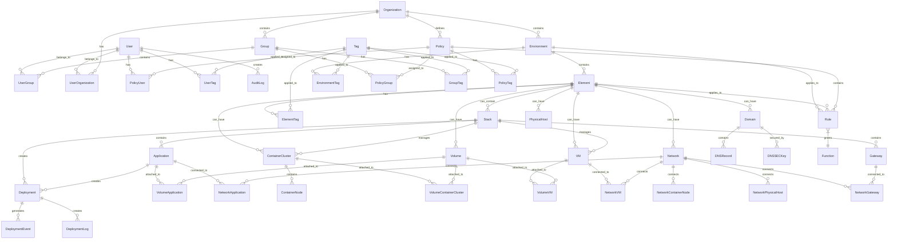

# Modèle de Données - WindFlow

## Vue d'Ensemble

Le modèle de données de WindFlow est conçu pour supporter une architecture multi-tenant flexible avec des relations complexes entre les entités de déploiement, d'infrastructure et de gestion des utilisateurs.

### Principes de Conception

**Principes Fondamentaux :**
- **Multi-tenant** : Isolation complète des données par organisation
- **Évolutivité** : Support de millions d'entités avec performance
- **Flexibilité** : Schema extensible avec métadonnées JSON
- **Auditabilité** : Traçabilité complète de toutes les modifications
- **Cohérence** : Intégrité référentielle stricte

## Architecture Relationnelle Complète

### Diagramme Entité-Relations Principal



## Entités Principales

### Gestion des Utilisateurs et Organisations

#### User - Utilisateur du Système
```sql
CREATE TABLE users (
    id UUID PRIMARY KEY DEFAULT gen_random_uuid(),
    username VARCHAR(50) UNIQUE NOT NULL,
    email VARCHAR(255) UNIQUE NOT NULL,
    hashed_password VARCHAR(255) NOT NULL,
    is_superadmin BOOLEAN DEFAULT FALSE,
    is_active BOOLEAN DEFAULT TRUE,
    email_verified BOOLEAN DEFAULT FALSE,
    last_login TIMESTAMP WITH TIME ZONE,
    created_at TIMESTAMP WITH TIME ZONE DEFAULT NOW(),
    updated_at TIMESTAMP WITH TIME ZONE DEFAULT NOW(),
    
    -- Métadonnées utilisateur extensibles
    profile JSONB DEFAULT '{}',
    preferences JSONB DEFAULT '{}',
    
    -- Index pour performances
    CONSTRAINT users_username_check CHECK (length(username) >= 3),
    CONSTRAINT users_email_check CHECK (email ~* '^[A-Za-z0-9._%+-]+@[A-Za-z0-9.-]+\.[A-Za-z]{2,}$')
);

CREATE INDEX idx_users_username ON users(username);
CREATE INDEX idx_users_email ON users(email);
CREATE INDEX idx_users_active ON users(is_active);
CREATE INDEX idx_users_profile ON users USING GIN(profile);
```

#### Organization - Organisation Multi-Tenant
```sql
CREATE TABLE organizations (
    id UUID PRIMARY KEY DEFAULT gen_random_uuid(),
    name VARCHAR(100) UNIQUE NOT NULL,
    description TEXT,
    is_active BOOLEAN DEFAULT TRUE,
    
    -- Configuration organisation
    settings JSONB DEFAULT '{}',
    quotas JSONB DEFAULT '{}',
    
    -- Métadonnées de facturation
    billing_info JSONB DEFAULT '{}',
    
    created_at TIMESTAMP WITH TIME ZONE DEFAULT NOW(),
    updated_at TIMESTAMP WITH TIME ZONE DEFAULT NOW(),
    
    CONSTRAINT org_name_check CHECK (length(name) >= 2)
);

CREATE INDEX idx_organizations_name ON organizations(name);
CREATE INDEX idx_organizations_active ON organizations(is_active);
CREATE INDEX idx_organizations_settings ON organizations USING GIN(settings);
```

#### UserOrganization - Relation Utilisateur-Organisation
```sql
CREATE TABLE user_organizations (
    id UUID PRIMARY KEY DEFAULT gen_random_uuid(),
    user_id UUID NOT NULL REFERENCES users(id) ON DELETE CASCADE,
    organization_id UUID NOT NULL REFERENCES organizations(id) ON DELETE CASCADE,
    role VARCHAR(50) NOT NULL DEFAULT 'member',
    is_default BOOLEAN DEFAULT FALSE,
    joined_at TIMESTAMP WITH TIME ZONE DEFAULT NOW(),
    
    -- Permissions spécifiques à l'organisation
    permissions JSONB DEFAULT '[]',
    
    UNIQUE(user_id, organization_id),
    CONSTRAINT user_org_role_check CHECK (role IN ('owner', 'admin', 'member', 'viewer'))
);

CREATE INDEX idx_user_org_user ON user_organizations(user_id);
CREATE INDEX idx_user_org_org ON user_organizations(organization_id);
CREATE INDEX idx_user_org_role ON user_organizations(role);
```

### Infrastructure et Environnements

#### Environment - Environnement de Déploiement
```sql
CREATE TABLE environments (
    id UUID PRIMARY KEY DEFAULT gen_random_uuid(),
    name VARCHAR(100) NOT NULL,
    description TEXT,
    organization_id UUID NOT NULL REFERENCES organizations(id) ON DELETE CASCADE,
    environment_type VARCHAR(20) NOT NULL DEFAULT 'development',
    is_active BOOLEAN DEFAULT TRUE,
    
    -- Configuration spécifique à l'environnement
    configuration JSONB DEFAULT '{}',
    
    -- Limites de ressources
    resource_limits JSONB DEFAULT '{}',
    
    created_at TIMESTAMP WITH TIME ZONE DEFAULT NOW(),
    updated_at TIMESTAMP WITH TIME ZONE DEFAULT NOW(),
    
    UNIQUE(organization_id, name),
    CONSTRAINT env_type_check CHECK (environment_type IN ('development', 'testing', 'staging', 'production', 'disaster_recovery'))
);

CREATE INDEX idx_environments_org ON environments(organization_id);
CREATE INDEX idx_environments_type ON environments(environment_type);
CREATE INDEX idx_environments_active ON environments(is_active);
```

#### Element - Élément d'Infrastructure
```sql
CREATE TABLE elements (
    id UUID PRIMARY KEY DEFAULT gen_random_uuid(),
    name VARCHAR(100) NOT NULL,
    description TEXT,
    environment_id UUID NOT NULL REFERENCES environments(id) ON DELETE CASCADE,
    element_type VARCHAR(30) NOT NULL,
    status VARCHAR(20) DEFAULT 'inactive',
    
    -- Configuration de l'élément
    configuration JSONB DEFAULT '{}',
    
    -- Métadonnées de monitoring
    monitoring_config JSONB DEFAULT '{}',
    last_health_check TIMESTAMP WITH TIME ZONE,
    
    created_at TIMESTAMP WITH TIME ZONE DEFAULT NOW(),
    updated_at TIMESTAMP WITH TIME ZONE DEFAULT NOW(),
    
    UNIQUE(environment_id, name),
    CONSTRAINT element_type_check CHECK (element_type IN (
        'container_cluster', 'vm', 'physical_host', 'domain', 'network', 'volume', 'gateway'
    )),
    CONSTRAINT element_status_check CHECK (status IN (
        'inactive', 'provisioning', 'active', 'error', 'maintenance', 'terminated'
    ))
);

CREATE INDEX idx_elements_env ON elements(environment_id);
CREATE INDEX idx_elements_type ON elements(element_type);
CREATE INDEX idx_elements_status ON elements(status);
CREATE INDEX idx_elements_config ON elements USING GIN(configuration);
```

### Stacks et Applications

#### Stack - Conteneur Logique de Services
```sql
CREATE TABLE stacks (
    id UUID PRIMARY KEY DEFAULT gen_random_uuid(),
    name VARCHAR(100) NOT NULL,
    description TEXT,
    element_id UUID NOT NULL REFERENCES elements(id) ON DELETE CASCADE,
    template_id VARCHAR(100),
    
    -- Configuration du stack
    configuration JSONB DEFAULT '{}',
    
    -- Optimisations IA
    llm_optimized BOOLEAN DEFAULT FALSE,
    llm_optimization_version VARCHAR(20),
    
    -- Workflow associé
    workflow_id UUID,
    
    -- Status et déploiement
    status VARCHAR(20) DEFAULT 'draft',
    last_deployed_at TIMESTAMP WITH TIME ZONE,
    
    created_at TIMESTAMP WITH TIME ZONE DEFAULT NOW(),
    updated_at TIMESTAMP WITH TIME ZONE DEFAULT NOW(),
    
    UNIQUE(element_id, name),
    CONSTRAINT stack_status_check CHECK (status IN (
        'draft', 'validating', 'ready', 'deploying', 'deployed', 'error', 'archived'
    ))
);

CREATE INDEX idx_stacks_element ON stacks(element_id);
CREATE INDEX idx_stacks_template ON stacks(template_id);
CREATE INDEX idx_stacks_status ON stacks(status);
CREATE INDEX idx_stacks_llm ON stacks(llm_optimized);
```

#### Application - Application Déployable
```sql
CREATE TABLE applications (
    id UUID PRIMARY KEY DEFAULT gen_random_uuid(),
    name VARCHAR(100) NOT NULL,
    description TEXT,
    stack_id UUID NOT NULL REFERENCES stacks(id) ON DELETE CASCADE,
    
    -- Configuration de l'application
    application_type VARCHAR(20) NOT NULL,
    plugin_name VARCHAR(50),
    plugin_version VARCHAR(20),
    
    -- Configuration déploiement
    deployment_config JSONB DEFAULT '{}',
    
    -- Status de déploiement
    deployment_status VARCHAR(20) DEFAULT 'pending',
    
    -- Ressources allouées
    allocated_resources JSONB DEFAULT '{}',
    
    created_at TIMESTAMP WITH TIME ZONE DEFAULT NOW(),
    updated_at TIMESTAMP WITH TIME ZONE DEFAULT NOW(),
    
    UNIQUE(stack_id, name),
    CONSTRAINT app_type_check CHECK (application_type IN ('container', 'vm', 'physical')),
    CONSTRAINT deployment_status_check CHECK (deployment_status IN (
        'pending', 'deploying', 'deployed', 'failed', 'stopped', 'scaling', 'updating'
    ))
);

CREATE INDEX idx_applications_stack ON applications(stack_id);
CREATE INDEX idx_applications_type ON applications(application_type);
CREATE INDEX idx_applications_status ON applications(deployment_status);
CREATE INDEX idx_applications_plugin ON applications(plugin_name, plugin_version);
```

### Orchestration et Clusters

#### ContainerCluster - Cluster de Containers
```sql
CREATE TABLE container_clusters (
    id UUID PRIMARY KEY DEFAULT gen_random_uuid(),
    name VARCHAR(100) NOT NULL,
    element_id UUID NOT NULL REFERENCES elements(id) ON DELETE CASCADE,
    cluster_mode VARCHAR(20) NOT NULL DEFAULT 'docker',
    version VARCHAR(20),
    
    -- Configuration haute disponibilité
    ha_enabled BOOLEAN DEFAULT FALSE,
    
    -- Endpoint de connexion
    endpoint JSONB DEFAULT '{}',
    
    -- Configuration du cluster
    cluster_config JSONB DEFAULT '{}',
    
    -- Status et métriques
    status VARCHAR(20) DEFAULT 'initializing',
    node_count INTEGER DEFAULT 0,
    
    created_at TIMESTAMP WITH TIME ZONE DEFAULT NOW(),
    updated_at TIMESTAMP WITH TIME ZONE DEFAULT NOW(),
    
    UNIQUE(element_id, name),
    CONSTRAINT cluster_mode_check CHECK (cluster_mode IN ('docker', 'swarm', 'kubernetes')),
    CONSTRAINT cluster_status_check CHECK (status IN (
        'initializing', 'healthy', 'degraded', 'unhealthy', 'maintenance'
    ))
);

CREATE INDEX idx_container_clusters_element ON container_clusters(element_id);
CREATE INDEX idx_container_clusters_mode ON container_clusters(cluster_mode);
CREATE INDEX idx_container_clusters_status ON container_clusters(status);
```

#### ContainerNode - Nœud de Cluster
```sql
CREATE TABLE container_nodes (
    id UUID PRIMARY KEY DEFAULT gen_random_uuid(),
    name VARCHAR(100) NOT NULL,
    cluster_id UUID NOT NULL REFERENCES container_clusters(id) ON DELETE CASCADE,
    
    -- Informations du nœud
    hostname VARCHAR(255),
    ip_address INET,
    
    -- Rôle dans le cluster
    node_role VARCHAR(20) DEFAULT 'worker',
    
    -- Ressources
    cpu_cores INTEGER,
    memory_gb DECIMAL(6,2),
    disk_gb DECIMAL(8,2),
    
    -- Status et santé
    status VARCHAR(20) DEFAULT 'joining',
    last_heartbeat TIMESTAMP WITH TIME ZONE,
    
    -- Configuration du nœud
    node_config JSONB DEFAULT '{}',
    
    created_at TIMESTAMP WITH TIME ZONE DEFAULT NOW(),
    updated_at TIMESTAMP WITH TIME ZONE DEFAULT NOW(),
    
    UNIQUE(cluster_id, name),
    CONSTRAINT node_role_check CHECK (node_role IN ('master', 'worker', 'manager')),
    CONSTRAINT node_status_check CHECK (status IN (
        'joining', 'ready', 'not_ready', 'unknown', 'terminated'
    ))
);

CREATE INDEX idx_container_nodes_cluster ON container_nodes(cluster_id);
CREATE INDEX idx_container_nodes_role ON container_nodes(node_role);
CREATE INDEX idx_container_nodes_status ON container_nodes(status);
CREATE INDEX idx_container_nodes_ip ON container_nodes(ip_address);
```

### Machines Virtuelles

#### VM - Machine Virtuelle
```sql
CREATE TABLE vms (
    id UUID PRIMARY KEY DEFAULT gen_random_uuid(),
    name VARCHAR(100) NOT NULL,
    element_id UUID NOT NULL REFERENCES elements(id) ON DELETE CASCADE,
    stack_id UUID REFERENCES stacks(id) ON DELETE SET NULL,
    
    -- Spécifications hardware
    cpu_cores INTEGER NOT NULL,
    memory_gb DECIMAL(6,2) NOT NULL,
    disk_gb DECIMAL(8,2) NOT NULL,
    
    -- Configuration OS
    os_type VARCHAR(20) NOT NULL,
    os_version VARCHAR(50),
    
    -- Configuration réseau
    ip_address INET,
    hostname VARCHAR(255),
    
    -- Status et métadonnées
    status VARCHAR(20) DEFAULT 'creating',
    hypervisor_type VARCHAR(20),
    
    -- Configuration VM
    vm_config JSONB DEFAULT '{}',
    
    created_at TIMESTAMP WITH TIME ZONE DEFAULT NOW(),
    updated_at TIMESTAMP WITH TIME ZONE DEFAULT NOW(),
    
    UNIQUE(element_id, name),
    CONSTRAINT vm_os_type_check CHECK (os_type IN ('linux', 'windows', 'freebsd', 'other')),
    CONSTRAINT vm_status_check CHECK (status IN (
        'creating', 'starting', 'running', 'stopping', 'stopped', 'error', 'destroyed'
    ))
);

CREATE INDEX idx_vms_element ON vms(element_id);
CREATE INDEX idx_vms_stack ON vms(stack_id);
CREATE INDEX idx_vms_status ON vms(status);
CREATE INDEX idx_vms_os ON vms(os_type);
CREATE INDEX idx_vms_ip ON vms(ip_address);
```

### Infrastructure Réseau

#### Network - Réseau Overlay
```sql
CREATE TABLE networks (
    id UUID PRIMARY KEY DEFAULT gen_random_uuid(),
    name VARCHAR(100) NOT NULL,
    element_id UUID NOT NULL REFERENCES elements(id) ON DELETE CASCADE,
    
    -- Configuration réseau
    network_type VARCHAR(20) NOT NULL DEFAULT 'overlay',
    subnet CIDR,
    gateway INET,
    
    -- Sécurité
    encryption_enabled BOOLEAN DEFAULT TRUE,
    cross_cluster BOOLEAN DEFAULT FALSE,
    
    -- Configuration avancée
    network_config JSONB DEFAULT '{}',
    
    -- Status
    status VARCHAR(20) DEFAULT 'creating',
    
    created_at TIMESTAMP WITH TIME ZONE DEFAULT NOW(),
    updated_at TIMESTAMP WITH TIME ZONE DEFAULT NOW(),
    
    UNIQUE(element_id, name),
    CONSTRAINT network_type_check CHECK (network_type IN ('overlay', 'bridge', 'host', 'macvlan')),
    CONSTRAINT network_status_check CHECK (status IN (
        'creating', 'active', 'error', 'deleting'
    ))
);

CREATE INDEX idx_networks_element ON networks(element_id);
CREATE INDEX idx_networks_type ON networks(network_type);
CREATE INDEX idx_networks_status ON networks(status);
CREATE INDEX idx_networks_subnet ON networks(subnet);
```

#### Gateway - Passerelle Load Balancer
```sql
CREATE TABLE gateways (
    id UUID PRIMARY KEY DEFAULT gen_random_uuid(),
    name VARCHAR(100) NOT NULL,
    stack_id UUID NOT NULL REFERENCES stacks(id) ON DELETE CASCADE,
    
    -- Configuration gateway
    gateway_type VARCHAR(10) NOT NULL,
    
    -- SSL/TLS automatique
    auto_ssl BOOLEAN DEFAULT TRUE,
    ssl_config JSONB DEFAULT '{}',
    
    -- Load balancing
    load_balancing_strategy VARCHAR(20) DEFAULT 'round_robin',
    
    -- Rate limiting
    rate_limiting BOOLEAN DEFAULT FALSE,
    rate_limit_config JSONB DEFAULT '{}',
    
    -- Configuration complète
    gateway_config JSONB DEFAULT '{}',
    
    -- Status
    status VARCHAR(20) DEFAULT 'configuring',
    
    created_at TIMESTAMP WITH TIME ZONE DEFAULT NOW(),
    updated_at TIMESTAMP WITH TIME ZONE DEFAULT NOW(),
    
    UNIQUE(stack_id, name),
    CONSTRAINT gateway_type_check CHECK (gateway_type IN ('http', 'tcp', 'udp')),
    CONSTRAINT lb_strategy_check CHECK (load_balancing_strategy IN (
        'round_robin', 'least_conn', 'ip_hash', 'weighted', 'health_based'
    )),
    CONSTRAINT gateway_status_check CHECK (status IN (
        'configuring', 'active', 'error', 'updating'
    ))
);

CREATE INDEX idx_gateways_stack ON gateways(stack_id);
CREATE INDEX idx_gateways_type ON gateways(gateway_type);
CREATE INDEX idx_gateways_status ON gateways(status);
```

### Stockage et Volumes

#### Volume - Volume de Stockage
```sql
CREATE TABLE volumes (
    id UUID PRIMARY KEY DEFAULT gen_random_uuid(),
    name VARCHAR(100) NOT NULL,
    element_id UUID NOT NULL REFERENCES elements(id) ON DELETE CASCADE,
    
    -- Configuration volume
    volume_type VARCHAR(20) NOT NULL,
    size_gb DECIMAL(10,2) NOT NULL,
    
    -- Options de sauvegarde
    backup_enabled BOOLEAN DEFAULT TRUE,
    backup_schedule VARCHAR(50),
    
    -- Partage
    shared BOOLEAN DEFAULT FALSE,
    access_mode VARCHAR(20) DEFAULT 'read_write_once',
    
    -- Configuration stockage
    storage_config JSONB DEFAULT '{}',
    
    -- Status
    status VARCHAR(20) DEFAULT 'creating',
    
    created_at TIMESTAMP WITH TIME ZONE DEFAULT NOW(),
    updated_at TIMESTAMP WITH TIME ZONE DEFAULT NOW(),
    
    UNIQUE(element_id, name),
    CONSTRAINT volume_type_check CHECK (volume_type IN (
        'local_ssd', 'local_hdd', 'nfs', 'ceph', 's3', 'azure_blob', 'gcs', 'glusterfs'
    )),
    CONSTRAINT access_mode_check CHECK (access_mode IN (
        'read_write_once', 'read_only_many', 'read_write_many'
    )),
    CONSTRAINT volume_status_check CHECK (status IN (
        'creating', 'available', 'bound', 'error', 'deleting'
    ))
);

CREATE INDEX idx_volumes_element ON volumes(element_id);
CREATE INDEX idx_volumes_type ON volumes(volume_type);
CREATE INDEX idx_volumes_status ON volumes(status);
CREATE INDEX idx_volumes_size ON volumes(size_gb);
```

### DNS et Domaines

#### Domain - Domaine DNS
```sql
CREATE TABLE domains (
    id UUID PRIMARY KEY DEFAULT gen_random_uuid(),
    fqdn VARCHAR(255) UNIQUE NOT NULL,
    element_id UUID NOT NULL REFERENCES elements(id) ON DELETE CASCADE,
    
    -- Configuration DNSSEC
    dnssec_enabled BOOLEAN DEFAULT FALSE,
    dnssec_status VARCHAR(20) DEFAULT 'disabled',
    
    -- SSL automatique
    auto_ssl BOOLEAN DEFAULT TRUE,
    wildcard_support BOOLEAN DEFAULT FALSE,
    
    -- Configuration DNS
    dns_config JSONB DEFAULT '{}',
    
    -- Status
    status VARCHAR(20) DEFAULT 'configuring',
    
    created_at TIMESTAMP WITH TIME ZONE DEFAULT NOW(),
    updated_at TIMESTAMP WITH TIME ZONE DEFAULT NOW(),
    
    CONSTRAINT dnssec_status_check CHECK (dnssec_status IN (
        'disabled', 'unsigned', 'signed', 'error'
    )),
    CONSTRAINT domain_status_check CHECK (status IN (
        'configuring', 'active', 'error', 'suspended'
    ))
);

CREATE INDEX idx_domains_fqdn ON domains(fqdn);
CREATE INDEX idx_domains_element ON domains(element_id);
CREATE INDEX idx_domains_dnssec ON domains(dnssec_enabled);
CREATE INDEX idx_domains_status ON domains(status);
```

## Relations et Tables de Liaison

### Relations Many-to-Many

#### Relations Volume-Application
```sql
CREATE TABLE volume_applications (
    id UUID PRIMARY KEY DEFAULT gen_random_uuid(),
    volume_id UUID NOT NULL REFERENCES volumes(id) ON DELETE CASCADE,
    application_id UUID NOT NULL REFERENCES applications(id) ON DELETE CASCADE,
    mount_path VARCHAR(255) NOT NULL,
    mount_options JSONB DEFAULT '{}',
    
    created_at TIMESTAMP WITH TIME ZONE DEFAULT NOW(),
    
    UNIQUE(volume_id, application_id, mount_path)
);

CREATE INDEX idx_vol_app_volume ON volume_applications(volume_id);
CREATE INDEX idx_vol_app_application ON volume_applications(application_id);
```

#### Relations Network-Application
```sql
CREATE TABLE network_applications (
    id UUID PRIMARY KEY DEFAULT gen_random_uuid(),
    network_id UUID NOT NULL REFERENCES networks(id) ON DELETE CASCADE,
    application_id UUID NOT NULL REFERENCES applications(id) ON DELETE CASCADE,
    ip_address INET,
    connection_config JSONB DEFAULT '{}',
    
    created_at TIMESTAMP WITH TIME ZONE DEFAULT NOW(),
    
    UNIQUE(network_id, application_id)
);

CREATE INDEX idx_net_app_network ON network_applications(network_id);
CREATE INDEX idx_net_app_application ON network_applications(application_id);
CREATE INDEX idx_net_app_ip ON network_applications(ip_address);
```

### Déploiements et Historique

#### Deployment - Déploiement
```sql
CREATE TABLE deployments (
    id UUID PRIMARY KEY DEFAULT gen_random_uuid(),
    stack_id UUID NOT NULL REFERENCES stacks(id) ON DELETE CASCADE,
    application_id UUID REFERENCES applications(id) ON DELETE SET NULL,
    
    -- Métadonnées du déploiement
    deployment_version VARCHAR(50),
    deployment_type VARCHAR(20) DEFAULT 'standard',
    
    -- Configuration utilisée
    deployment_config JSONB NOT NULL,
    
    -- Status et timing
    status VARCHAR(20) DEFAULT 'pending',
    started_at TIMESTAMP WITH TIME ZONE DEFAULT NOW(),
    completed_at TIMESTAMP WITH TIME ZONE,
    
    -- Utilisateur ayant déclenché le déploiement
    triggered_by UUID NOT NULL REFERENCES users(id),
    
    -- Logs et résultats
    logs TEXT,
    result JSONB DEFAULT '{}',
    
    -- Rollback
    parent_deployment_id UUID REFERENCES deployments(id),
    
    created_at TIMESTAMP WITH TIME ZONE DEFAULT NOW(),
    
    CONSTRAINT deployment_type_check CHECK (deployment_type IN (
        'standard', 'blue_green', 'canary', 'rolling', 'rollback'
    )),
    CONSTRAINT deployment_status_check CHECK (status IN (
        'pending', 'running', 'completed', 'failed', 'cancelled', 'rolled_back'
    ))
);

CREATE INDEX idx_deployments_stack ON deployments(stack_id);
CREATE INDEX idx_deployments_app ON deployments(application_id);
CREATE INDEX idx_deployments_status ON deployments(status);
CREATE INDEX idx_deployments_triggered_by ON deployments(triggered_by);
CREATE INDEX idx_deployments_started_at ON deployments(started_at);
```

#### DeploymentEvent - Événements de Déploiement
```sql
CREATE TABLE deployment_events (
    id UUID PRIMARY KEY DEFAULT gen_random_uuid(),
    deployment_id UUID NOT NULL REFERENCES deployments(id) ON DELETE CASCADE,
    
    -- Type et détails de l'événement
    event_type VARCHAR(50) NOT NULL,
    event_data JSONB DEFAULT '{}',
    
    -- Timing
    occurred_at TIMESTAMP WITH TIME ZONE DEFAULT NOW(),
    
    -- Message descriptif
    message TEXT,
    
    -- Niveau de l'événement
    level VARCHAR(10) DEFAULT 'info'
);

CREATE INDEX idx_deployment_events_deployment ON deployment_events(deployment_id);
CREATE INDEX idx_deployment_events_type ON deployment_events(event_type);
CREATE INDEX idx_deployment_events_occurred_at ON deployment_events(occurred_at);
CREATE INDEX idx_deployment_events_level ON deployment_events(level);
```

## Vues et Requêtes Complexes

### Vues Matérialisées pour Performance

#### Vue des Déploiements Actifs
```sql
CREATE MATERIALIZED VIEW active_deployments AS
SELECT 
    d.id,
    d.stack_id,
    s.name as stack_name,
    d.status,
    d.started_at,
    s.element_id,
    e.name as element_name,
    e.environment_id,
    env.name as environment_name,
    env.organization_id,
    org.name as organization_name
FROM deployments d
JOIN stacks s ON d.stack_id = s.id
JOIN elements e ON s.element_id = e.id
JOIN environments env ON e.environment_id = env.id
JOIN organizations org ON env.organization_id = org.id
WHERE d.status IN ('running', 'pending', 'deploying')
AND s.status = 'deployed'
AND e.status = 'active'
AND env.is_active = true
AND org.is_active = true;

CREATE UNIQUE INDEX idx_active_deployments_id ON active_deployments(id);
CREATE INDEX idx_active_deployments_org ON active_deployments(organization_id);
CREATE INDEX idx_active_deployments_env ON active_deployments(environment_id);
```

#### Vue des Ressources par Organisation
```sql
CREATE MATERIALIZED VIEW organization_resources AS
SELECT 
    org.id as organization_id,
    org.name as organization_name,
    COUNT(DISTINCT env.id) as environment_count,
    COUNT(DISTINCT e.id) as element_count,
    COUNT(DISTINCT s.id) as stack_count,
    COUNT(DISTINCT a.id) as application_count,
    COUNT(DISTINCT d.id) FILTER (WHERE d.status = 'running') as active_deployments,
    SUM(v.size_gb) as total_storage_gb,
    COUNT(DISTINCT cc.id) as cluster_count,
    COUNT(DISTINCT vm.id) as vm_count
FROM organizations org
LEFT JOIN environments env ON org.id = env.organization_id AND env.is_active = true
LEFT JOIN elements e ON env.id = e.environment_id AND e.status = 'active'
LEFT JOIN stacks s ON e.id = s.element_id
LEFT JOIN applications a ON s.id = a.stack_id
LEFT JOIN deployments d ON s.id = d.stack_id
LEFT JOIN volumes v ON e.id = v.element_id
LEFT JOIN container_clusters cc ON e.id = cc.element_id
LEFT JOIN vms vm ON e.id = vm.element_id
WHERE org.is_active = true
GROUP BY org.id, org.name;

CREATE UNIQUE INDEX idx_org_resources_id ON organization_resources(organization_id);
```

## Procédures Stockées et Fonctions

### Fonctions de Gestion des Déploiements

```sql
-- Fonction pour créer un déploiement avec validation
CREATE OR REPLACE FUNCTION create_deployment(
    p_stack_id UUID,
    p_user_id UUID,
    p_config JSONB,
    p_deployment_type VARCHAR DEFAULT 'standard'
) RETURNS UUID AS $$
DECLARE
    v_deployment_id UUID;
    v_stack_status VARCHAR;
    v_user_permissions JSONB;
BEGIN
    -- Vérifier que le stack est déployable
    SELECT status INTO v_stack_status FROM stacks WHERE id = p_stack_id;
    
    IF v_stack_status NOT IN ('ready', 'deployed') THEN
        RAISE EXCEPTION 'Stack status % is not deployable', v_stack_status;
    END IF;
    
    -- Vérifier les permissions utilisateur
    -- (logique de vérification des permissions)
    
    -- Créer le déploiement
    INSERT INTO deployments (
        stack_id,
        triggered_by,
        deployment_config,
        deployment_type,
        status
    ) VALUES (
        p_stack_id,
        p_user_id,
        p_config,
        p_deployment_type,
        'pending'
    ) RETURNING id INTO v_deployment_id;
    
    -- Logger l'événement
    INSERT INTO deployment_events (
        deployment_id,
        event_type,
        message,
        level
    ) VALUES (
        v_deployment_id,
        'deployment.created',
        'Deployment created by user
