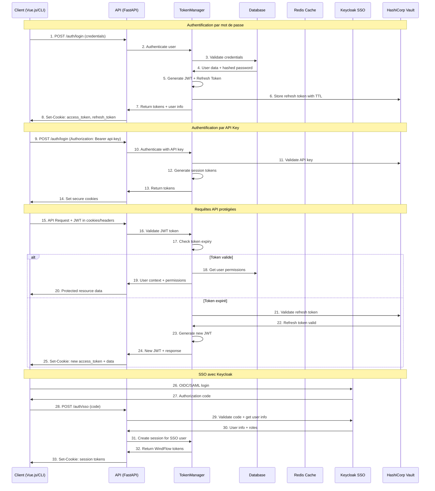

# Authentification - WindFlow

## Vue d'Ensemble

WindFlow intègre un système d'authentification sophistiqué inspiré de VesselHarbor CLI, offrant une sécurité robuste et une expérience utilisateur fluide pour tous les types d'interfaces (Web, CLI, TUI).

### Architecture d'Authentification Avancée

**Composants Principaux :**
- **TokenManager** : Gestionnaire centralisé des tokens avec refresh automatique
- **AuthenticationService** : Service unifié pour tous les types d'authentification
- **CookieManager** : Gestion sécurisée des cookies HTTP pour les tokens
- **SessionManager** : Gestion des sessions utilisateur avec persistance
- **PermissionResolver** : Résolution granulaire des permissions utilisateur

## Types d'Authentification Supportés

### 1. Authentification par Mot de Passe

**Flow Standard avec JWT**
```python
# Service d'authentification par mot de passe
class PasswordAuthenticationService:
    def __init__(self, db: Database, vault: VaultService):
        self.db = db
        self.vault = vault
        self.password_hasher = BCryptPasswordHasher()
        
    async def authenticate(self, username: str, password: str) -> AuthResult:
        """Authentification par nom d'utilisateur et mot de passe."""
        
        # Récupération utilisateur depuis la base
        user = await self.db.get_user_by_username(username)
        if not user or not user.is_active:
            raise AuthenticationError("Invalid credentials")
            
        # Vérification du mot de passe
        if not self.password_hasher.verify(password, user.hashed_password):
            await self._log_failed_attempt(user.id, "invalid_password")
            raise AuthenticationError("Invalid credentials")
            
        # Vérification 2FA si activé
        if user.two_factor_enabled:
            return AuthResult(
                success=False,
                requires_2fa=True,
                user_id=user.id,
                temp_token=self._generate_temp_token(user.id)
            )
            
        # Génération des tokens
        access_token = self._generate_access_token(user)
        refresh_token = self._generate_refresh_token(user)
        
        # Stockage du refresh token
        await self.vault.store_refresh_token(user.id, refresh_token)
        
        return AuthResult(
            success=True,
            access_token=access_token,
            refresh_token=refresh_token,
            user_info=self._build_user_info(user)
        )
```

### 2. Authentification par API Key

**API Keys avec Scopes et Expiration**
```python
class APIKeyAuthenticationService:
    def __init__(self, db: Database, vault: VaultService):
        self.db = db
        self.vault = vault
        
    async def authenticate(self, api_key: str) -> AuthResult:
        """Authentification par clé API."""
        
        # Validation format de la clé
        if not self._validate_api_key_format(api_key):
            raise AuthenticationError("Invalid API key format")
            
        # Récupération de la clé depuis Vault
        key_data = await self.vault.get_api_key(api_key)
        if not key_data or key_data.get('revoked'):
            raise AuthenticationError("Invalid or revoked API key")
            
        # Vérification expiration
        if key_data.get('expires_at') and datetime.now() > key_data['expires_at']:
            raise AuthenticationError("API key expired")
            
        # Récupération utilisateur
        user = await self.db.get_user_by_id(key_data['user_id'])
        if not user or not user.is_active:
            raise AuthenticationError("User account disabled")
            
        # Génération tokens de session
        access_token = self._generate_access_token(user, scopes=key_data.get('scopes', []))
        
        return AuthResult(
            success=True,
            access_token=access_token,
            user_info=self._build_user_info(user),
            scopes=key_data.get('scopes', [])
        )
```

### 3. SSO via Keycloak

**Intégration OIDC/SAML Complète**
```python
class KeycloakSSOService:
    def __init__(self, config: KeycloakConfig):
        self.config = config
        self.client = KeycloakOpenID(
            server_url=config.server_url,
            client_id=config.client_id,
            realm_name=config.realm,
            client_secret_key=config.client_secret
        )
        
    async def authenticate(self, authorization_code: str) -> AuthResult:
        """Authentification SSO via code d'autorisation Keycloak."""
        
        try:
            # Échange du code contre des tokens
            token_response = self.client.token(
                grant_type='authorization_code',
                code=authorization_code,
                redirect_uri=self.config.redirect_uri
            )
            
            # Validation et décodage du token ID
            user_info = self.client.decode_token(
                token_response['id_token'],
                validate=True
            )
            
            # Récupération ou création utilisateur
            user = await self._get_or_create_user(user_info)
            
            # Mapping des rôles Keycloak vers WindFlow
            roles = self._map_keycloak_roles(user_info.get('realm_access', {}).get('roles', []))
            
            # Génération tokens WindFlow
            access_token = self._generate_access_token(user, roles=roles)
            refresh_token = self._generate_refresh_token(user)
            
            return AuthResult(
                success=True,
                access_token=access_token,
                refresh_token=refresh_token,
                user_info=self._build_user_info(user),
                sso_provider="keycloak"
            )
            
        except KeycloakError as e:
            raise AuthenticationError(f"SSO authentication failed: {e}")
```

### 4. Authentification 2FA (TOTP/SMS)

**Double Authentification Sécurisée**
```python
class TwoFactorAuthService:
    def __init__(self, vault: VaultService, sms_service: SMSService):
        self.vault = vault
        self.sms_service = sms_service
        
    async def setup_totp(self, user_id: str) -> TotpSetupResult:
        """Configuration initiale TOTP pour un utilisateur."""
        
        # Génération secret TOTP
        secret = pyotp.random_base32()
        
        # Stockage temporaire du secret
        await self.vault.store_temp_totp_secret(user_id, secret)
        
        # Génération QR code
        totp = pyotp.TOTP(secret)
        provisioning_uri = totp.provisioning_uri(
            name=f"user_{user_id}@windflow",
            issuer_name="WindFlow"
        )
        
        qr_code = qrcode.make(provisioning_uri)
        
        return TotpSetupResult(
            secret=secret,
            qr_code=qr_code,
            backup_codes=self._generate_backup_codes(user_id)
        )
        
    async def verify_totp(self, user_id: str, token: str, temp_token: str) -> AuthResult:
        """Vérification du token TOTP."""
        
        # Validation du token temporaire
        if not self._validate_temp_token(user_id, temp_token):
            raise AuthenticationError("Invalid temporary token")
            
        # Récupération secret TOTP
        secret = await self.vault.get_totp_secret(user_id)
        if not secret:
            raise AuthenticationError("TOTP not configured")
            
        # Vérification du token
        totp = pyotp.TOTP(secret)
        if not totp.verify(token, valid_window=1):
            # Vérifier si c'est un code de backup
            if not await self._verify_backup_code(user_id, token):
                raise AuthenticationError("Invalid TOTP token")
                
        # Finalisation de l'authentification
        user = await self.db.get_user_by_id(user_id)
        access_token = self._generate_access_token(user)
        refresh_token = self._generate_refresh_token(user)
        
        return AuthResult(
            success=True,
            access_token=access_token,
            refresh_token=refresh_token,
            user_info=self._build_user_info(user)
        )
```

## Flux d'Authentification Détaillé

### Séquence d'Authentification Complète



## Architecture du TokenManager

### Gestionnaire Avancé des Tokens

```python
class TokenManager:
    """Gestionnaire avancé des tokens d'authentification."""
    
    def __init__(self, config: TokenConfig, vault: VaultService):
        self.config = config
        self.vault = vault
        self.access_token = None
        self.refresh_token = None
        self.user_info = None
        self.permissions_cache = TTLCache(maxsize=1000, ttl=300)
        
    async def login_with_password(self, username: str, password: str) -> AuthResult:
        """Authentification par mot de passe avec gestion complète des cookies."""
        auth_data = {
            "username": username,
            "password": password,
            "grant_type": "password"
        }
        
        response = await self._make_auth_request("/auth/login", data=auth_data)
        return await self._process_auth_response(response)
    
    async def login_with_api_key(self, api_key: str) -> AuthResult:
        """Authentification par API key avec génération de tokens de session."""
        headers = {"Authorization": f"Bearer {api_key}"}
        response = await self._make_auth_request("/auth/login-key", headers=headers)
        return await self._process_auth_response(response)
    
    async def refresh_authentication(self) -> bool:
        """Refresh automatique des tokens avec fallback."""
        if not self.refresh_token:
            return False
            
        try:
            headers = {"Authorization": f"Bearer {self.refresh_token}"}
            response = await self._make_auth_request("/auth/refresh", headers=headers)
            
            if response.status_code == 200:
                result = await self._process_auth_response(response)
                return result.success
            else:
                # Fallback: tenter re-login avec credentials stockés
                return await self._fallback_authentication()
                
        except AuthenticationError:
            # Token refresh échoué, reset de l'état
            self._reset_auth_state()
            return False
    
    async def _process_auth_response(self, response) -> AuthResult:
        """Traitement unifié des réponses d'authentification."""
        if response.json().get('status') != 'success':
            raise AuthenticationError("Authentication failed")
            
        # Extraction des tokens depuis les cookies HTTP
        cookies = self._parse_set_cookie_header(response.headers.get('set-cookie'))
        
        self.access_token = cookies.get('access_token')
        self.refresh_token = cookies.get('refresh_token')
        
        # Validation des tokens reçus
        if not self.access_token or not self.refresh_token:
            raise AuthenticationError("Missing required tokens in response")
            
        # Extraction des informations utilisateur
        self.user_info = self._decode_jwt_payload(self.access_token)
        
        return AuthResult(
            success=True,
            access_token=self.access_token,
            refresh_token=self.refresh_token,
            user_info=self.user_info
        )
    
    def get_auth_headers(self) -> Dict[str, str]:
        """Génération des headers d'authentification pour les requêtes API."""
        if not self.access_token:
            raise AuthenticationError("No valid access token available")
            
        return {
            "Authorization": f"Bearer {self.access_token}",
            "X-User-Context": json.dumps({
                "user_id": self.user_info.get("user_id"),
                "org_id": self.user_info.get("current_org_id"),
                "roles": self.user_info.get("roles", [])
            })
        }
    
    @cached_property
    def is_superadmin(self) -> bool:
        """Vérification du statut super-administrateur."""
        return self.user_info.get("is_superadmin", False) if self.user_info else False
    
    def can_access_organization(self, org_id: str) -> bool:
        """Vérification de l'accès à une organisation."""
        if self.is_superadmin:
            return True
        
        user_orgs = self.user_info.get("organizations", []) if self.user_info else []
        return org_id in [org.get("id") for org in user_orgs]
    
    async def get_user_permissions(self, resource: str = None) -> List[str]:
        """Récupération des permissions utilisateur avec cache intelligent."""
        cache_key = f"permissions:{self.user_info.get('user_id')}:{resource or 'global'}"
        
        if cache_key in self.permissions_cache:
            return self.permissions_cache[cache_key]
        
        # Récupération depuis l'API
        headers = self.get_auth_headers()
        params = {"resource": resource} if resource else {}
        
        response = await self._make_request("/auth/permissions", headers=headers, params=params)
        permissions = response.json().get("data", [])
        
        # Mise en cache
        self.permissions_cache[cache_key] = permissions
        return permissions
```

## Gestion Sécurisée des Cookies

### Configuration des Cookies de Sécurité

```python
# Configuration des cookies sécurisés pour les tokens
SECURE_COOKIE_CONFIG = {
    "access_token": {
        "httponly": True,      # Protection contre XSS
        "secure": True,        # HTTPS uniquement
        "samesite": "Strict",  # Protection CSRF
        "max_age": 900,        # 15 minutes
        "path": "/api"         # Limitation du scope
    },
    "refresh_token": {
        "httponly": True,
        "secure": True,
        "samesite": "Strict", 
        "max_age": 604800,     # 7 jours
        "path": "/auth"        # Limité aux endpoints auth
    }
}

class CookieManager:
    """Gestionnaire sécurisé des cookies d'authentification."""
    
    def __init__(self, config: CookieConfig):
        self.config = config
        
    def set_auth_cookies(self, response: Response, tokens: AuthTokens):
        """Définit les cookies d'authentification sécurisés."""
        
        # Cookie access token
        response.set_cookie(
            key="access_token",
            value=tokens.access_token,
            **self.config.access_token
        )
        
        # Cookie refresh token
        response.set_cookie(
            key="refresh_token", 
            value=tokens.refresh_token,
            **self.config.refresh_token
        )
        
    def clear_auth_cookies(self, response: Response):
        """Supprime les cookies d'authentification."""
        response.delete_cookie("access_token", path="/api")
        response.delete_cookie("refresh_token", path="/auth")
```

## Authentification CLI Sécurisée

### Architecture CLI Authentication

```python
class CLIAuthenticator:
    """Authentification spécialisée pour l'interface CLI."""
    
    def __init__(self):
        self.config_dir = Path.home() / ".windflow"
        self.token_file = self.config_dir / "auth_tokens"
        self.config_file = self.config_dir / "config.yaml"
        
    async def cli_login(self, method: str = "interactive") -> bool:
        """Login CLI avec plusieurs méthodes supportées."""
        if method == "interactive":
            return await self._interactive_login()
        elif method == "api_key":
            return await self._api_key_login()
        elif method == "sso":
            return await self._sso_login()
        else:
            raise ValueError(f"Méthode d'authentification non supportée: {method}")
    
    async def _interactive_login(self) -> bool:
        """Login interactif avec saisie sécurisée."""
        import getpass
        
        username = input("Username: ")
        password = getpass.getpass("Password: ")
        
        token_mgr = TokenManager()
        result = await token_mgr.login_with_password(username, password)
        
        if result.success:
            await self._store_tokens_securely(result)
            return True
        return False
    
    async def _store_tokens_securely(self, auth_result: AuthResult):
        """Stockage sécurisé des tokens pour CLI."""
        # Chiffrement des tokens avant stockage
        encrypted_data = self._encrypt_tokens({
            "access_token": auth_result.access_token,
            "refresh_token": auth_result.refresh_token,
            "user_info": auth_result.user_info,
            "timestamp": time.time()
        })
        
        # Stockage avec permissions restrictives (600)
        self.config_dir.mkdir(exist_ok=True)
        self.token_file.write_bytes(encrypted_data)
        self.token_file.chmod(0o600)
```

## Configuration Keycloak SSO

### Configuration SSO Complète

```yaml
# Configuration Keycloak pour WindFlow
keycloak:
  server_url: "https://auth.windflow.local"
  realm: "windflow"
  client_id: "windflow-app"
  client_secret: "${KEYCLOAK_CLIENT_SECRET}"
  
  # Configuration OIDC
  oidc:
    scopes: ["openid", "profile", "email", "windflow-roles"]
    response_type: "code"
    redirect_uri: "https://app.windflow.local/auth/callback"
    
  # Mapping des rôles
  role_mapping:
    keycloak_admin: "windflow_superadmin"
    org_admin: "windflow_org_admin"
    developer: "windflow_developer"
    viewer: "windflow_viewer"
    
  # Configuration des providers externes
  identity_providers:
    - name: "ldap_corporate"
      type: "ldap"
      enabled: true
    - name: "google_sso"
      type: "oidc"
      enabled: true
    - name: "github_oauth"
      type: "oauth2"
      enabled: false
```

---

**Références :**
- [Vue d'Ensemble](01-overview.md) - Contexte du projet
- [Architecture](02-architecture.md) - Principes architecturaux
- [Sécurité](13-security.md) - Stratégies de sécurité détaillées
- [Interface CLI](08-cli-interface.md) - Utilisation CLI
- [API Design](07-api-design.md) - Endpoints d'authentification
