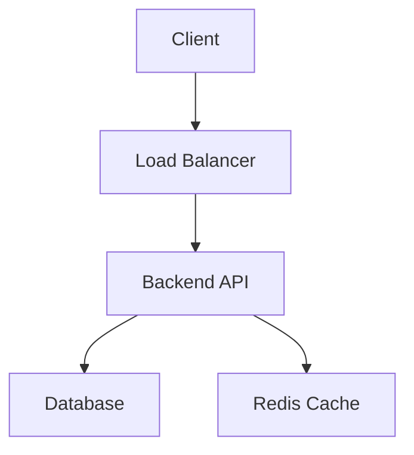
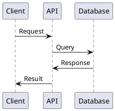

# Workflow de Documentation - WindFlow

## Vue d'Ensemble

Ce document décrit le processus de création, maintenance et publication de la documentation pour WindFlow, basé sur les meilleures pratiques observées et adapté aux besoins d'un projet de déploiement de containers.

## Types de Documentation

### 📚 Documentation Technique
- **Architecture** : Design system, patterns, décisions techniques
- **API Reference** : Documentation OpenAPI automatique
- **Development Guides** : Setup, contribution, workflows
- **Code Documentation** : Docstrings, commentaires inline

### 👥 Documentation Utilisateur
- **Getting Started** : Installation, première utilisation
- **User Guides** : Guides étape par étape par fonctionnalité
- **Tutorials** : Tutoriels complets avec exemples
- **Troubleshooting** : FAQ, résolution de problèmes

### 🔧 Documentation Opérationnelle
- **Deployment Guides** : Installation production
- **Configuration Reference** : Variables, paramètres
- **Monitoring & Alerting** : Setup observabilité
- **Backup & Recovery** : Procédures de sauvegarde

### 📖 Documentation Processus
- **Workflows** : Développement, test, release
- **Standards** : Coding rules, conventions
- **Policies** : Sécurité, contribution, support
- **Runbooks** : Procédures d'urgence

## Structure de Documentation

### Organisation Hiérarchique
```
doc/
├── README.md                     # Point d'entrée principal
├── spec/                         # Spécifications techniques
│   ├── README.md                # Index des spécifications
│   ├── 01-overview.md           # Vue d'ensemble
│   ├── 02-architecture.md       # Architecture système
│   └── ...                      # Autres spécifications
├── workflows/                   # Processus de développement
│   ├── README.md               # Index des workflows
│   ├── development-workflow.md # Développement quotidien
│   └── ...                     # Autres workflows
├── guides/                     # Guides utilisateur
│   ├── getting-started.md      # Guide de démarrage
│   ├── user-manual.md          # Manuel utilisateur
│   └── tutorials/              # Tutoriels détaillés
├── api/                        # Documentation API
│   ├── openapi.yaml           # Spécification OpenAPI
│   └── endpoints/             # Documentation endpoints
└── deployment/                 # Guides de déploiement
    ├── installation.md        # Installation
    ├── configuration.md       # Configuration
    └── troubleshooting.md     # Dépannage
```

## Processus de Création

### 1. Planification Documentation

#### Identification des Besoins
```bash
# Audit documentation existante
make doc-audit

# Analyse gaps
make doc-gap-analysis

# Priorisation contenus
make doc-priority-matrix
```

#### Documentation Requirements
- **Audience** : Développeurs, utilisateurs, ops
- **Format** : Markdown, diagrammes, vidéos
- **Maintenance** : Fréquence de mise à jour
- **Validation** : Process de review

### 2. Rédaction et Création

#### Standards Markdown
```markdown
# Titre Principal (H1)

## Section Principale (H2)

### Sous-section (H3)

#### Détails (H4)

## Conventions

### Code Blocks
```bash
# Commandes avec commentaires
make setup  # Installation environnement
```

### Liens
- [Lien interne](../general_specs/architecture.md)
- [Lien externe](https://fastapi.tiangolo.com/)

### Admonitions
> **Note** : Information importante

> **Warning** : Attention requise

> **Tip** : Conseil pratique

### Tables
| Commande | Description | Exemple |
|----------|-------------|---------|
| `make setup` | Installation | `make setup` |
| `make test` | Tests | `make test` |
```

#### Diagrammes et Visuels
```markdown
# Architecture avec Mermaid


# Séquence avec PlantUML

```

### 3. Documentation API Automatique

#### OpenAPI Generation
```python
# windflow/main.py
from fastapi import FastAPI
from fastapi.openapi.docs import get_swagger_ui_html
from fastapi.openapi.utils import get_openapi

app = FastAPI(
    title="WindFlow API",
    description="Intelligent container deployment platform",
    version="1.0.0",
    docs_url="/docs",
    redoc_url="/redoc"
)

def custom_openapi():
    if app.openapi_schema:
        return app.openapi_schema
    
    openapi_schema = get_openapi(
        title="WindFlow API",
        version="1.0.0",
        description="Complete API documentation for WindFlow",
        routes=app.routes,
    )
    
    # Enrichissement avec exemples
    openapi_schema["info"]["x-logo"] = {
        "url": "https://windflow.dev/logo.png"
    }
    
    app.openapi_schema = openapi_schema
    return app.openapi_schema

app.openapi = custom_openapi
```

#### Documentation Endpoints
```python
from typing import List
from fastapi import APIRouter, Depends, HTTPException, status
from pydantic import BaseModel, Field

router = APIRouter(prefix="/api/v1/deployments", tags=["deployments"])

class DeploymentCreate(BaseModel):
    """Modèle pour créer un déploiement.
    
    Attributes:
        name: Nom unique du déploiement
        target_type: Type de cible (docker, kubernetes, vm)
        configuration: Configuration spécifique à la cible
    """
    name: str = Field(..., description="Nom du déploiement", example="web-app-prod")
    target_type: str = Field(..., description="Type de cible", example="docker")
    configuration: dict = Field(..., description="Configuration", example={"image": "nginx:latest"})

@router.post(
    "/",
    response_model=DeploymentResponse,
    status_code=status.HTTP_201_CREATED,
    summary="Créer un déploiement",
    description="""
    Crée un nouveau déploiement sur la cible spécifiée.
    
    ## Exemples d'utilisation
    
    ### Déploiement Docker
    ```json
    {
        "name": "web-app",
        "target_type": "docker",
        "configuration": {
            "image": "nginx:latest",
            "ports": ["80:80"],
            "environment": {
                "ENV": "production"
            }
        }
    }
    ```
    
    ### Déploiement Kubernetes
    ```json
    {
        "name": "api-service",
        "target_type": "kubernetes", 
        "configuration": {
            "namespace": "production",
            "replicas": 3,
            "image": "myapp:v1.0.0"
        }
    }
    ```
    """,
    responses={
        201: {"description": "Déploiement créé avec succès"},
        400: {"description": "Données invalides"},
        409: {"description": "Déploiement existe déjà"}
    }
)
async def create_deployment(
    deployment: DeploymentCreate,
    current_user: User = Depends(get_current_user)
) -> DeploymentResponse:
    """Crée un nouveau déploiement."""
    pass
```

### 4. Génération Automatique

#### Scripts de Documentation
```bash
#!/bin/bash
# dev/scripts/generation/generate-docs.py

"""
Script de génération automatique de documentation.
Génère la documentation API, les guides, et les références.
"""

import subprocess
import os
from pathlib import Path

def generate_api_docs():
    """Génère la documentation API depuis OpenAPI."""
    print("🔧 Génération documentation API...")
    
    # Export OpenAPI spec
    subprocess.run([
        "python", "-c",
        "from windflow.main import app; import json; print(json.dumps(app.openapi(), indent=2))"
    ], stdout=open("doc/api/openapi.json", "w"))
    
    # Génération documentation avec redoc-cli
    subprocess.run([
        "npx", "redoc-cli", "build", "doc/api/openapi.json",
        "--output", "doc/api/index.html",
        "--title", "WindFlow API Documentation"
    ])

def generate_code_docs():
    """Génère la documentation depuis les docstrings."""
    print("📚 Génération documentation code...")
    
    # Backend documentation avec Sphinx
    subprocess.run([
        "sphinx-apidoc", "-o", "doc/code/backend", "windflow/",
        "--force", "--module-first"
    ])
    
    subprocess.run([
        "sphinx-build", "-b", "html", "doc/code/backend", "doc/code/backend/_build"
    ])

def generate_cli_docs():
    """Génère la documentation CLI."""
    print("⌨️ Génération documentation CLI...")
    
    # Documentation Typer avec typer-cli
    subprocess.run([
        "typer", "cli.main", "utils", "docs",
        "--output", "doc/cli/commands.md",
        "--name", "windflow"
    ])

def update_readme():
    """Met à jour les README avec liens documentation."""
    print("📝 Mise à jour README...")
    
    # Génération automatique des liens
    docs_links = []
    for doc_file in Path("doc").rglob("*.md"):
        if doc_file.name != "README.md":
            relative_path = doc_file.relative_to(".")
            title = doc_file.stem.replace("-", " ").title()
            docs_links.append(f"- [{title}]({relative_path})")
    
    # Mise à jour README principal
    readme_content = f"""
# WindFlow Documentation

## 📚 Documentation Available

{chr(10).join(docs_links)}

## 🚀 Quick Start

See [Getting Started](doc/guides/getting-started.md) for installation and setup.

## 🔗 Links

- [API Documentation](doc/api/index.html)
- [User Guides](doc/guides/)
- [Development Workflows](doc/workflows/)
"""
    
    with open("doc/README.md", "w") as f:
        f.write(readme_content)

if __name__ == "__main__":
    generate_api_docs()
    generate_code_docs()
    generate_cli_docs()
    update_readme()
    print("✅ Documentation générée avec succès!")
```

## Processus de Review

### 1. Review Technique

#### Checklist Documentation
- [ ] **Exactitude** : Information correcte et à jour
- [ ] **Complétude** : Tous les aspects couverts
- [ ] **Clarté** : Language clair et accessible
- [ ] **Structure** : Organisation logique
- [ ] **Exemples** : Cas d'usage concrets
- [ ] **Links** : Liens internes/externes valides

#### Review Process
```bash
# 1. Création branch documentation
git checkout -b docs/update-api-guide

# 2. Rédaction/modification
# ... édition des fichiers ...

# 3. Validation liens
make doc-check-links

# 4. Validation format
make doc-lint

# 5. Génération preview
make doc-build-preview

# 6. PR avec review
git add doc/
git commit -m "docs: update API integration guide"
git push origin docs/update-api-guide
```

### 2. Review Utilisateur

#### Feedback Utilisateur
- **Surveys** : Questionnaires satisfaction documentation
- **Analytics** : Métriques usage (pages vues, temps lecture)
- **Support Tickets** : Questions récurrentes documentation
- **Community Feedback** : Issues GitHub, discussions

#### User Testing
```markdown
# User Testing Session - Documentation

## Objectif
Tester l'efficacité du guide "Getting Started"

## Participants
- 3 développeurs débutants WindFlow
- 2 développeurs expérimentés autres outils
- 1 ops/admin système

## Scenario
Installer WindFlow et déployer première application

## Métriques
- Temps completion
- Nombre d'erreurs
- Points de friction
- Satisfaction (1-10)

## Feedback
- Sections confuses
- Informations manquantes
- Suggestions amélioration
```

## Maintenance et Mise à Jour

### 1. Maintenance Continue

#### Documentation Lifecycle
```bash
# Audit mensuel documentation
make doc-audit-monthly

# Mise à jour automatique versions
make doc-update-versions

# Validation liens mensuels
make doc-check-all-links

# Métriques usage
make doc-analytics-report
```

#### Triggers de Mise à Jour
- **Code Changes** : Nouvelles features, API changes
- **Bug Fixes** : Corrections procédures, troubleshooting
- **User Feedback** : Amélioration clarté, ajout exemples
- **Version Releases** : Mise à jour guides installation

### 2. Versioning Documentation

#### Documentation Versions
```
docs/
├── v1.0/           # Documentation stable v1.0
├── v1.1/           # Documentation v1.1
├── latest/         # Documentation développement
└── archived/       # Versions archivées
```

#### Synchronisation Code-Docs
```yaml
# .github/workflows/docs-sync.yml
name: Documentation Sync

on:
  push:
    branches: [main, develop]
    paths:
      - 'windflow/**/*.py'
      - 'frontend/src/**/*.ts'
      - 'doc/**/*.md'

jobs:
  sync-docs:
    runs-on: ubuntu-latest
    steps:
      - uses: actions/checkout@v3
      
      - name: Generate API Docs
        run: make generate-api-docs
        
      - name: Update Code Documentation
        run: make generate-code-docs
        
      - name: Check Documentation Coverage
        run: make doc-coverage-check
        
      - name: Deploy Documentation
        if: github.ref == 'refs/heads/main'
        run: make deploy-docs
```

## Publication et Distribution

### 1. Documentation Website

#### Structure Site
```
docs-site/
├── src/
│   ├── pages/
│   │   ├── index.md         # Page d'accueil
│   │   ├── guides/          # Guides utilisateur
│   │   ├── api/             # Référence API
│   │   └── workflows/       # Processus développement
│   ├── assets/
│   │   ├── images/          # Screenshots, diagrammes
│   │   └── videos/          # Vidéos tutoriels
│   └── config/
│       └── navigation.yml   # Structure navigation
├── theme/                   # Thème personnalisé
└── deploy/                  # Scripts déploiement
```

#### Générateur de Site (MkDocs)
```yaml
# mkdocs.yml
site_name: WindFlow Documentation
site_description: Intelligent container deployment platform
site_url: https://docs.windflow.dev

theme:
  name: material
  custom_dir: theme/
  palette:
    primary: blue
    accent: orange
  features:
    - navigation.tabs
    - navigation.sections
    - navigation.expand
    - search.highlight
    - search.share

plugins:
  - search
  - mermaid2
  - git-revision-date-localized
  - minify:
      minify_html: true

nav:
  - Home: index.md
  - Getting Started:
    - Installation: guides/installation.md
    - Quick Start: guides/quick-start.md
    - First Deployment: guides/first-deployment.md
  - User Guide:
    - Concepts: guides/concepts.md
    - Deployments: guides/deployments.md
    - Monitoring: guides/monitoring.md
  - API Reference:
    - Overview: api/overview.md
    - Authentication: api/auth.md
    - Deployments: api/deployments.md
  - Development:
    - Contributing: workflows/contribution-workflow.md
    - Development: workflows/development-workflow.md
    - Testing: workflows/testing-workflow.md

markdown_extensions:
  - admonition
  - codehilite
  - footnotes
  - toc:
      permalink: true
  - pymdownx.superfences:
      custom_fences:
        - name: mermaid
          class: mermaid
          format: !!python/name:mermaid2.fence_mermaid
```

### 2. Distribution Multi-Canal

#### Channels de Publication
1. **Website Principal** : https://docs.windflow.dev
2. **GitHub Wiki** : Documentation collaborative
3. **In-App Help** : Aide contextuelle
4. **PDF/eBook** : Guides téléchargeables
5. **Video Tutorials** : YouTube, Vimeo

#### Automation Publication
```bash
#!/bin/bash
# scripts/deploy-docs.sh

set -e

echo "📚 Déploiement documentation WindFlow"

# Build documentation
echo "🔨 Build documentation..."
mkdocs build

# Deploy to GitHub Pages
echo "🚀 Deploy to GitHub Pages..."
mkdocs gh-deploy --force

# Update search index
echo "🔍 Update search index..."
curl -X POST "https://api.algolia.com/1/indexes/windflow_docs/clear" \
  -H "X-Algolia-API-Key: $ALGOLIA_API_KEY" \
  -H "X-Algolia-Application-Id: $ALGOLIA_APP_ID"

# Generate PDF
echo "📄 Generate PDF documentation..."
mkdocs-with-pdf --output-dir=dist/pdf

# Update in-app help
echo "📱 Update in-app help..."
python scripts/sync-in-app-help.py

echo "✅ Documentation déployée avec succès!"
```

## Métriques et Analytics

### 1. Métriques Documentation

#### Analytics Tracking
```javascript
// Google Analytics 4 pour documentation
gtag('config', 'GA_MEASUREMENT_ID', {
  // Tracking documentation specific events
  custom_map: {
    'custom_parameter_1': 'page_category',
    'custom_parameter_2': 'content_type'
  }
});

// Tracking page views
gtag('event', 'page_view', {
  page_category: 'documentation',
  content_type: 'guide',
  page_location: window.location.href
});

// Tracking search queries
function trackSearch(query, results_count) {
  gtag('event', 'search', {
    search_term: query,
    search_results: results_count
  });
}

// Tracking downloads
function trackDownload(file_name, file_type) {
  gtag('event', 'file_download', {
    file_name: file_name,
    file_type: file_type
  });
}
```

#### Métriques Clés
- **Page Views** : Pages les plus visitées
- **Time on Page** : Temps de lecture moyen
- **Bounce Rate** : Taux de rebond par section
- **Search Queries** : Requêtes recherche populaires
- **Download Stats** : PDF, guides téléchargés
- **User Paths** : Parcours utilisateur type

### 2. Dashboard Documentation
```yaml
# Grafana Dashboard - Documentation Metrics
dashboard:
  title: "WindFlow Documentation Analytics"
  panels:
    - title: "Page Views by Section"
      type: "bar"
      target: "docs.pageviews.by_section"
      
    - title: "Search Success Rate"
      type: "stat"
      target: "docs.search.success_rate"
      
    - title: "User Satisfaction Score"
      type: "gauge"
      target: "docs.satisfaction.average"
      
    - title: "Most Searched Terms"
      type: "table"
      target: "docs.search.top_terms"
```

## Outils et Technologies

### 1. Outils de Rédaction
- **MkDocs** : Générateur site documentation
- **Mermaid** : Diagrammes et flowcharts
- **PlantUML** : Diagrammes UML avancés
- **Draw.io** : Diagrammes architecture
- **Loom/OBS** : Enregistrement vidéos

### 2. Outils de Validation
- **markdownlint** : Validation Markdown
- **markdown-link-check** : Vérification liens
- **vale** : Vérification style prose
- **grammarly** : Correction orthographe
- **hemingway** : Lisibilité texte

### 3. Automation Tools
```bash
# Makefile targets for documentation
doc-build: ## Build documentation
	mkdocs build

doc-serve: ## Serve documentation locally
	mkdocs serve --dev-addr=localhost:8001

doc-deploy: ## Deploy documentation
	mkdocs gh-deploy --force

doc-lint: ## Lint documentation
	markdownlint doc/**/*.md
	vale doc/

doc-check-links: ## Check all links
	markdown-link-check doc/**/*.md

doc-stats: ## Generate documentation statistics
	python scripts/doc-stats.py

doc-pdf: ## Generate PDF documentation
	mkdocs-with-pdf --output-dir=dist/pdf
```

## Bonnes Pratiques

### 1. Rédaction Efficace

#### Principes CLEAR
- **Concise** : Information essentielle seulement
- **Logical** : Structure logique et progressive
- **Explicit** : Pas d'assumptions implicites
- **Actionable** : Étapes concrètes et réalisables
- **Relevant** : Pertinent pour l'audience cible

#### Style Guide
```markdown
## Style Guide Documentation WindFlow

### Tone de Voice
- **Professionnel** mais accessible
- **Positif** et encourageant
- **Précis** et technique quand nécessaire
- **Empathique** envers les difficultés utilisateur

### Conventions
- **Commandes** : `make setup`
- **Fichiers** : `config.yaml`
- **Variables** : `DATABASE_URL`
- **UI Elements** : **Bold** pour boutons, *Italic* pour champs

### Structure Type
1. **Overview** : Qu'est-ce que c'est?
2. **Prerequisites** : Ce qu'il faut avant
3. **Steps** : Étapes détaillées
4. **Verification** : Comment vérifier succès
5. **Troubleshooting** : Problèmes courants
6. **Next Steps** : Que faire ensuite
```

### 2. Maintenance Préventive

#### Documentation Debt
```python
# scripts/doc-debt-check.py
"""
Script de détection de dette technique documentation.
Identifie la documentation obsolète, manquante, ou mal maintenue.
"""

import os
import re
from datetime import datetime, timedelta
from pathlib import Path

def check_doc_freshness():
    """Vérifie la fraîcheur de la documentation."""
    stale_docs = []
    threshold = datetime.now() - timedelta(days=90)  # 3 mois
    
    for doc_file in Path("doc").rglob("*.md"):
        stat = doc_file.stat()
        modified = datetime.fromtimestamp(stat.st_mtime)
        
        if modified < threshold:
            stale_docs.append({
                "file": str(doc_file),
                "last_modified": modified,
                "age_days": (datetime.now() - modified).days
            })
    
    return stale_docs

def check_missing_docs():
    """Identifie la documentation manquante."""
    # Vérifier correspondance code <-> docs
    missing_docs = []
    
    # Nouveaux endpoints sans documentation
    api_files = Path("windflow/api").rglob("*.py")
    for api_file in api_files:
        # Logic to check if API endpoints have corresponding docs
        pass
    
    return missing_docs

def generate_doc_health_report():
    """Génère un rapport de santé documentation."""
    report = {
        "stale_docs": check_doc_freshness(),
        "missing_docs": check_missing_docs(),
        "generated_at": datetime.now().isoformat()
    }
    
    with open("doc-health-report.json", "w") as f:
        json.dump(report, f, indent=2)
    
    return report
```

---

**Rappel** : Une bonne documentation est un investissement dans la réussite du projet et la satisfaction des utilisateurs.
