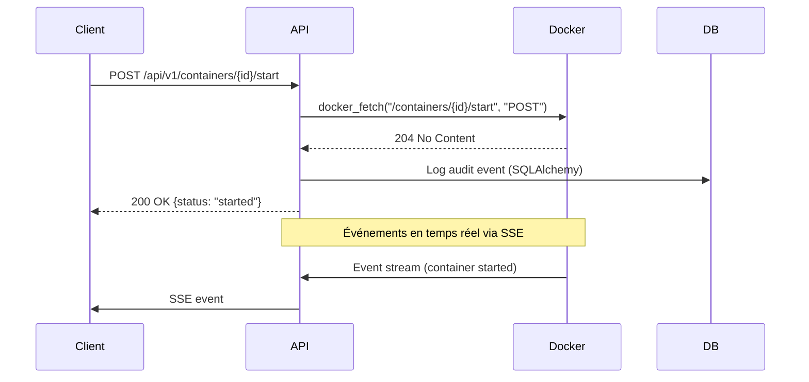
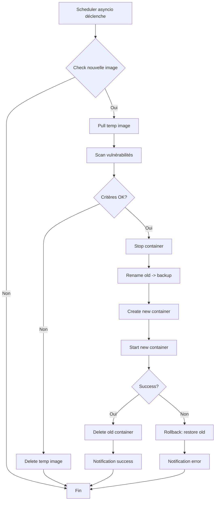
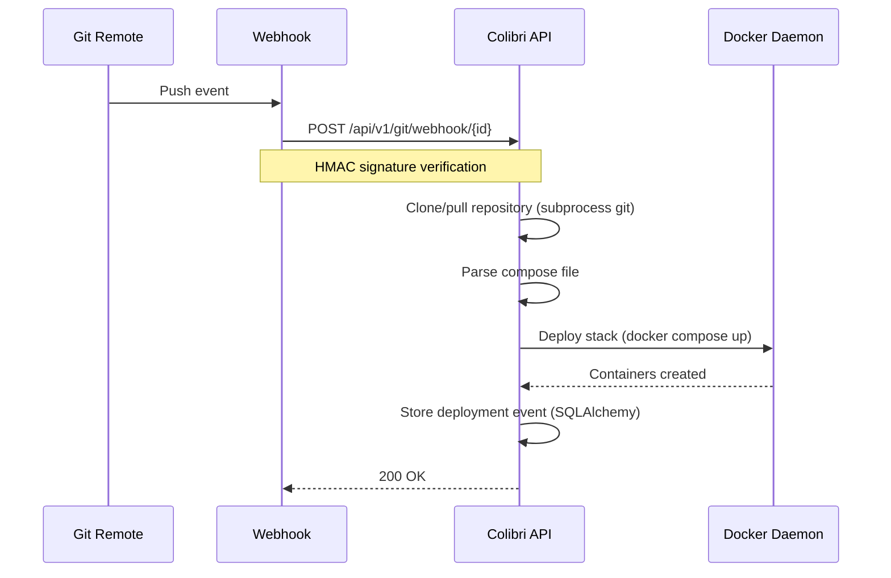
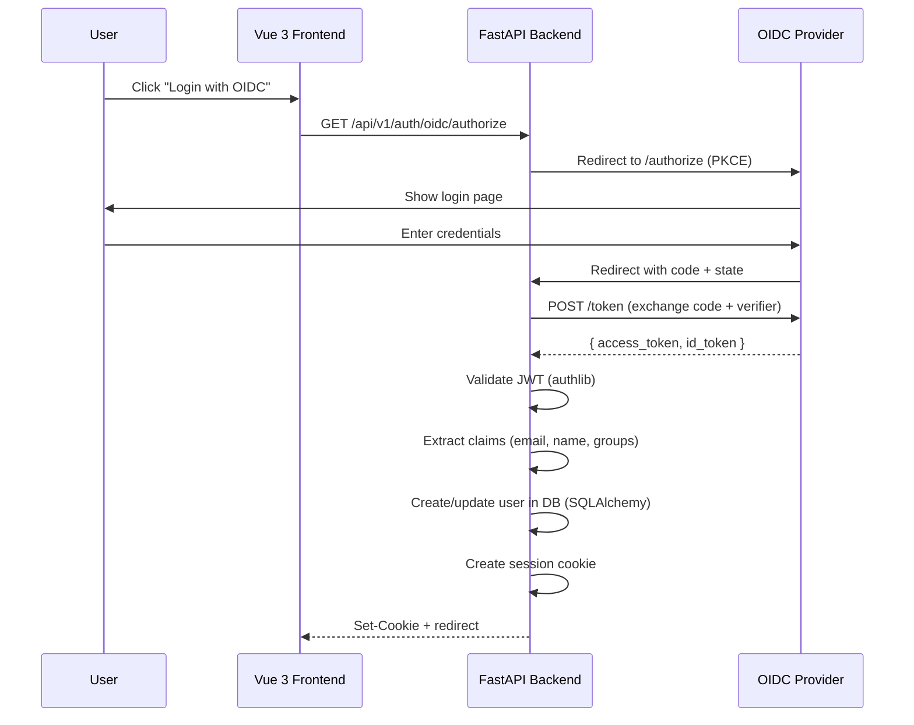

# Architecture du projet Colibri

[← Retour](00-OVERVIEW.md) | [Suivant : Module Docker →](02-DOCKER-API-MODULE.md)

## 🏛️ Architecture globale

### Vue d'ensemble des couches

```
┌────────────────────────────────────────────────────────────┐
│                    CLIENT (Browser)                         │
│  ┌──────────────┐  ┌──────────────┐  ┌──────────────┐    │
│  │     Vue 3    │  │  WebSocket   │  │   xterm.js   │    │
│  │  Components  │  │   (Events)   │  │  (Terminal)  │    │
│  └──────┬───────┘  └──────┬───────┘  └──────┬───────┘    │
└─────────┼──────────────────┼──────────────────┼────────────┘
          │                  │                  │
          │ HTTP/SSE         │ WS              │ WS
          │                  │                  │
┌─────────▼──────────────────▼──────────────────▼────────────┐
│               Python FastAPI (Uvicorn)                      │
│  ┌────────────────────────────────────────────────────┐    │
│  │              API Routes (/api/v1/*)                 │    │
│  │  ┌──────┐  ┌──────┐  ┌──────┐  ┌──────┐          │    │
│  │  │Docker│  │Images│  │Stacks│  │ Auth │          │    │
│  │  └───┬──┘  └───┬──┘  └───┬──┘  └───┬──┘          │    │
│  └──────┼─────────┼─────────┼─────────┼──────────────┘    │
│  ┌──────▼─────────▼─────────▼─────────▼──────────────┐    │
│  │           Services / Modules backend                │    │
│  │  ┌────────────────────────────────────────────┐   │    │
│  │  │  docker_service.py (API Docker native)     │   │    │
│  │  │  - docker_fetch()                          │   │    │
│  │  │  - Container operations                    │   │    │
│  │  │  - Image operations                        │   │    │
│  │  │  - Volume/Network management               │   │    │
│  │  └────────────────────────────────────────────┘   │    │
│  │  ┌────────────────────────────────────────────┐   │    │
│  │  │  auth_service.py (Multi-provider auth)     │   │    │
│  │  │  - Local (Argon2id via argon2-cffi)        │   │    │
│  │  │  - LDAP/AD (via ldap3)                     │   │    │
│  │  │  - OIDC/OAuth2 (via authlib)               │   │    │
│  │  │  - MFA TOTP (via pyotp)                    │   │    │
│  │  └────────────────────────────────────────────┘   │    │
│  │  ┌────────────────────────────────────────────┐   │    │
│  │  │  database.py (SQLAlchemy 2.0 async)        │   │    │
│  │  │  hawser_service.py (WebSocket proxy)       │   │    │
│  │  │  git_service.py (Git integration)          │   │    │
│  │  │  scheduler.py (asyncio background tasks)   │   │    │
│  │  └────────────────────────────────────────────┘   │    │
│  └────────────────────────────────────────────────────┘    │
└────────────┬──────────────────┬──────────────────┬─────────┘
             │                  │                  │
    ┌────────▼────────┐  ┌──────▼──────┐  ┌──────▼──────┐
    │  Background     │  │  Database   │  │   Docker    │
    │  Tasks asyncio  │  │  SQLite/PG  │  │   Daemon    │
    │  - Metrics      │  │ (SQLAlchemy)│  │             │
    │  - Events       │  │             │  │             │
    └─────────────────┘  └─────────────┘  └─────────────┘
```

## 🔄 Flux de données

### 1. Gestion de conteneur (exemple)



### 2. Auto-update avec scan de vulnérabilités



### 3. Intégration Git avec webhook



## 🗄️ Architecture de la base de données

### Schéma relationnel simplifié

```
┌─────────────┐         ┌──────────────┐
│   users     │1       *│user_roles    │
│  - id       ├─────────┤  - user_id   │
│  - username │         │  - role_id   │
│  - password │         │  - env_id    │
└─────────────┘         └──────┬───────┘
                               │
                        ┌──────▼───────┐
                        │   roles      │
                       *│  - id        │
┌──────────────┐        │  - name      │
│ environments │        │  - perms     │
│  - id        │        └──────────────┘
│  - name      │
│  - host      │        ┌─────────────────┐
│  - conn_type │       *│  audit_logs     │
└──────┬───────┘        │  - user_id      │
       │                │  - action       │
       │1               │  - entity_type  │
       │                │  - env_id       │
       │                └─────────────────┘
       │*
┌──────▼──────────┐    ┌─────────────────┐
│  git_stacks     │    │  auto_update    │
│  - stack_name   │    │  - container    │
│  - env_id       │    │  - enabled      │
│  - repo_id      │    │  - cron         │
│  - last_sync    │    │  - vuln_crit    │
└─────────────────┘    └─────────────────┘

┌─────────────────┐    ┌─────────────────┐
│  host_metrics   │    │ container_events│
│  - env_id       │    │  - env_id       │
│  - cpu_percent  │    │  - action       │
│  - mem_percent  │    │  - timestamp    │
│  - timestamp    │    └─────────────────┘
└─────────────────┘
```

## 🔌 Modes de connexion Docker

### 1. Socket Unix (Local)

```python
# backend/app/services/docker_service.py
import httpx

async def docker_fetch_unix(path: str, method: str = "GET", **kwargs) -> httpx.Response:
    """Requête Docker via Unix socket avec httpx"""
    transport = httpx.AsyncHTTPTransport(uds="/var/run/docker.sock")
    
    async with httpx.AsyncClient(transport=transport) as client:
        url = f"http://localhost{path}"
        response = await client.request(method, url, **kwargs)
        response.raise_for_status()
        return response

# Usage
async def list_containers():
    response = await docker_fetch_unix("/containers/json?all=true")
    return response.json()
```

### 2. HTTP/HTTPS avec TLS

```python
# backend/app/services/docker_service.py
import httpx
from pathlib import Path
import tempfile

async def docker_fetch_tls(
    host: str,
    port: int,
    path: str,
    ca_cert: str,
    client_cert: str,
    client_key: str
) -> httpx.Response:
    """Requête Docker via HTTPS avec mTLS"""
    
    # Écrire les certificats dans des fichiers temporaires
    with tempfile.NamedTemporaryFile(suffix=".crt", delete=False) as ca_f:
        ca_f.write(ca_cert.encode())
        ca_path = ca_f.name
    
    with tempfile.NamedTemporaryFile(suffix=".crt", delete=False) as cert_f:
        cert_f.write(client_cert.encode())
        cert_path = cert_f.name
    
    with tempfile.NamedTemporaryFile(suffix=".key", delete=False) as key_f:
        key_f.write(client_key.encode())
        key_path = key_f.name
    
    try:
        async with httpx.AsyncClient(
            verify=ca_path,
            cert=(cert_path, key_path)
        ) as client:
            url = f"https://{host}:{port}{path}"
            response = await client.get(url)
            return response
    finally:
        for p in [ca_path, cert_path, key_path]:
            Path(p).unlink(missing_ok=True)
```

### 3. Hawser Edge (WebSocket)

```python
# backend/app/services/hawser_service.py
import asyncio
import websockets
import json
import uuid
from typing import Dict, Any, Optional

class HawserEdgeClient:
    """Client pour Hawser Edge via WebSocket bidirectionnel"""
    
    def __init__(self):
        # Connexions actives : env_id -> websocket
        self.connections: Dict[int, Any] = {}
        # Requêtes en attente : request_id -> asyncio.Future
        self.pending: Dict[str, asyncio.Future] = {}
    
    async def send_request(
        self,
        env_id: int,
        method: str,
        path: str,
        body: Optional[dict] = None
    ) -> dict:
        """Envoyer une requête Docker via l'agent Hawser"""
        ws = self.connections.get(env_id)
        if not ws:
            raise RuntimeError(f"Hawser agent not connected for env {env_id}")
        
        request_id = str(uuid.uuid4())
        loop = asyncio.get_event_loop()
        future = loop.create_future()
        self.pending[request_id] = future
        
        message = {
            "type": "request",
            "requestId": request_id,
            "method": method,
            "path": path,
            "body": body
        }
        
        await ws.send(json.dumps(message))
        
        try:
            return await asyncio.wait_for(future, timeout=30.0)
        finally:
            self.pending.pop(request_id, None)
    
    async def handle_message(self, env_id: int, raw_message: str):
        """Traiter un message reçu de l'agent"""
        msg = json.loads(raw_message)
        
        if msg["type"] == "response":
            future = self.pending.get(msg["requestId"])
            if future and not future.done():
                future.set_result(msg)
        
        elif msg["type"] == "pong":
            # Heartbeat reçu
            pass

# Singleton global
hawser_client = HawserEdgeClient()
```

## 📦 Architecture des modules principaux

### Structure backend (FastAPI)

```
backend/app/
├── api/
│   └── v1/
│       ├── containers.py    # GET/POST /api/v1/containers
│       ├── images.py        # GET/POST /api/v1/images
│       ├── stacks.py        # GET/POST /api/v1/stacks
│       ├── auth.py          # POST /api/v1/auth/login|logout
│       ├── git.py           # GET/POST /api/v1/git/stacks
│       ├── environments.py  # CRUD /api/v1/environments
│       └── websockets.py    # WS  /ws/terminal/{id}
├── services/
│   ├── docker_service.py    # Client Docker API (httpx)
│   ├── auth_service.py      # Authentification multi-provider
│   ├── git_service.py       # Clone/pull/webhook Git
│   ├── hawser_service.py    # Proxy WebSocket Hawser
│   ├── scanner_service.py   # Grype/Trivy integration
│   └── notif_service.py     # Notifications email/webhook
├── models/
│   ├── user.py              # User, Session, Role, UserRole
│   ├── environment.py       # Environment, HostMetric
│   ├── git.py               # GitCredential, GitRepository, GitStack
│   └── audit.py             # AuditLog, AuthSettings
├── schemas/
│   ├── user.py              # Pydantic schemas pour users
│   ├── container.py         # Pydantic schemas pour containers
│   └── ...
├── core/
│   ├── database.py          # Engine SQLAlchemy, get_db()
│   ├── security.py          # Password hashing, JWT
│   └── config.py            # Settings (pydantic-settings)
├── tasks/
│   ├── metrics_collector.py # Collecte CPU/RAM asyncio
│   └── events_collector.py  # Stream événements Docker
└── main.py                  # FastAPI app, lifespan, routers
```

### Structure frontend (Vue 3 / Vite)

```
frontend/src/
├── components/
│   ├── ContainerList.vue    # Liste des conteneurs
│   ├── ContainerCard.vue    # Carte conteneur
│   ├── Terminal.vue         # Terminal xterm.js
│   ├── LogViewer.vue        # Viewer de logs
│   └── ...
├── composables/
│   ├── useDocker.ts         # Logique containers
│   ├── useAuth.ts           # Authentification
│   └── useWebSocket.ts      # WebSocket générique
├── stores/
│   ├── auth.ts              # Pinia: user, session
│   ├── environment.ts       # Pinia: env sélectionné
│   └── docker.ts            # Pinia: containers cache
├── services/
│   ├── api.ts               # Axios instance + interceptors
│   ├── container.service.ts # Appels API containers
│   └── image.service.ts     # Appels API images
├── views/
│   ├── Dashboard.vue
│   ├── Containers.vue
│   └── Settings.vue
├── router/
│   └── index.ts             # Vue Router
└── main.ts                  # Point d'entrée Vite/Vue
```

## 🔐 Architecture de sécurité

### Couches de sécurité

```
┌────────────────────────────────────────────────┐
│  1. Auth Layer (Multi-provider)                │
│     - Local (Argon2id via argon2-cffi)         │
│     - LDAP/AD (bind + search via ldap3)        │
│     - OIDC (JWT validation via authlib)        │
│     - MFA (TOTP via pyotp)                     │
└────────────────┬───────────────────────────────┘
                 │
┌────────────────▼───────────────────────────────┐
│  2. Session Management (FastAPI cookies)       │
│     - Cookie-based (httpOnly, secure, sameSite)│
│     - Expiration (24h default)                 │
│     - Cleanup automatique (asyncio task)       │
└────────────────┬───────────────────────────────┘
                 │
┌────────────────▼───────────────────────────────┐
│  3. RBAC (Role-Based Access Control)           │
│     - Permissions par ressource                │
│     - Environment-specific roles              │
│     - Admin vs User vs Viewer                  │
└────────────────┬───────────────────────────────┘
                 │
┌────────────────▼───────────────────────────────┐
│  4. Audit Logging (SQLAlchemy)                 │
│     - Toutes actions utilisateur               │
│     - IP + User-Agent                          │
│     - Timestamp précis                         │
│     - Retention configurable                   │
└────────────────┬───────────────────────────────┘
                 │
┌────────────────▼───────────────────────────────┐
│  5. Secret Encryption                          │
│     - AES-256-GCM (via cryptography lib)       │
│     - Key derivation (scrypt)                  │
│     - Rotation automatique                     │
└────────────────────────────────────────────────┘
```

### Flux d'authentification OIDC



## 🔄 Tâches en arrière-plan (asyncio)

### Architecture asyncio tasks

```
┌──────────────────────────────────────────┐
│       Main FastAPI Process               │
│  - Web Server (Uvicorn)                  │
│  - API Routes                            │
│  - WebSocket handling                    │
└────────┬─────────────────────┬───────────┘
         │ asyncio.create_task  │
    ┌────▼─────┐        ┌─────▼──────┐
    │ Metrics  │        │  Events    │
    │Collector │        │ Collector  │
    │(asyncio) │        │ (asyncio)  │
    └────┬─────┘        └─────┬──────┘
         │                     │
    ┌────▼─────┐        ┌─────▼──────┐
    │ SQLAlch. │        │ SQLAlch.   │
    │ host_    │        │ container_ │
    │ metrics  │        │ events     │
    └──────────┘        └────────────┘
         │                     │
         └──────────┬──────────┘
                    │ SSE broadcast
         ┌──────────▼──────────┐
         │   FastAPI SSE       │
         │   /api/v1/events    │
         └─────────────────────┘
```

### Metrics Collector (Python asyncio)

```python
# backend/app/tasks/metrics_collector.py
import asyncio
import psutil
from datetime import datetime
from sqlalchemy.ext.asyncio import AsyncSession
from app.models.environment import HostMetric
from app.services.docker_service import DockerService

class MetricsCollector:
    """Collecteur de métriques Docker - tâche asyncio longue durée"""
    
    def __init__(self, docker_service: DockerService, db_session_factory):
        self.docker = docker_service
        self.db_factory = db_session_factory
        self.interval = 30  # secondes
        self._running = False
    
    async def collect_host_metrics(self, env_id: int) -> dict:
        """Collecter métriques système"""
        return {
            "cpu_percent": psutil.cpu_percent(interval=1),
            "memory_percent": psutil.virtual_memory().percent,
            "memory_used": psutil.virtual_memory().used,
            "memory_total": psutil.virtual_memory().total,
            "timestamp": datetime.utcnow()
        }
    
    async def save_metrics(self, env_id: int, data: dict):
        """Persister en base avec SQLAlchemy async"""
        async with self.db_factory() as session:
            metric = HostMetric(
                environment_id=env_id,
                cpu_percent=data["cpu_percent"],
                memory_percent=data["memory_percent"],
                memory_used=data["memory_used"],
                memory_total=data["memory_total"],
                timestamp=data["timestamp"]
            )
            session.add(metric)
            await session.commit()
    
    async def run(self):
        """Boucle principale (tâche asyncio longue durée)"""
        self._running = True
        while self._running:
            try:
                # Collecter pour tous les environnements actifs
                for env_id in await self._get_active_env_ids():
                    data = await self.collect_host_metrics(env_id)
                    await self.save_metrics(env_id, data)
            except Exception as e:
                print(f"Metrics collection error: {e}")
            
            await asyncio.sleep(self.interval)
    
    def stop(self):
        self._running = False

# Démarrage dans le lifespan FastAPI (main.py)
@asynccontextmanager
async def lifespan(app: FastAPI):
    collector = MetricsCollector(docker_service, AsyncSessionLocal)
    task = asyncio.create_task(collector.run())
    yield
    collector.stop()
    task.cancel()
```

## 🎯 Points clés de l'architecture

1. **Découplage** : Modules indépendants (services, models, schemas, api)
2. **Async partout** : FastAPI + SQLAlchemy 2.0 async + httpx async
3. **Scalabilité** : Support multi-environnements sans limite
4. **Résilience** : Retry logic, reconnexion WebSocket, fallbacks
5. **Performance** : Cache intelligent, stream processing, async/await
6. **Sécurité** : Defence in depth, encryption at rest, audit trail
7. **Maintenabilité** : Code modulaire, Pydantic schemas, typing strict

---

[← Retour](00-OVERVIEW.md) | [Suivant : Module Docker →](02-DOCKER-API-MODULE.md)
